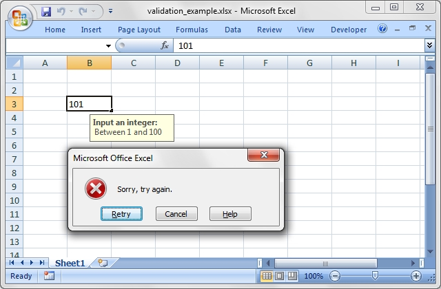

### <a name="data_validation" class="anchor" href="#data_validation"></a>DATA VALIDATION IN EXCEL

Data validation is a feature of Excel which allows you to restrict the data
that a users enters in a cell and to display help and warning messages.
It also allows you to restrict input to values in a drop down list.

A typical use case might be to restrict data in a cell to integer values in a
certain range, to provide a help message to indicate the required value and
to issue a warning if the input data doesn't meet the stated criteria.
In WriteXLSX we could do that as follows:

    worksheet.data_validation('B3',
        {
            :validate        => 'integer',
            :criteria        => 'between',
            :minimum         => 1,
            :maximum         => 100,
            :input_title     => 'Input an integer:',
            :input_message   => 'Between 1 and 100',
            :error_message   => 'Sorry, try again.'
        })

The output from the above example

For more information on data validation see the following Microsoft support
article "Description and examples of data validation in Excel":
http://support.microsoft.com/kb/211485.

The following sections describe how to use the `data_validation()`
method and its various options.

#### <a name="data_validation" class="anchor" href="#data_validation"></a>data_validation(row, col, { parameter => 'value', ... })

The `data_validation()` method is used to construct an Excel data validation.

It can be applied to a single cell or a range of cells.
You can pass 3 parameters such as (row, col, \{...\}) or 5 parameters such as (first_row, first_col, last_row, last_col, \{...\}).
You can also use A1 style notation. For example:

    worksheet.data_validation(0, 0,       {...})
    worksheet.data_validation(0, 0, 4, 1, {...})

    # Which are the same as:

    worksheet.data_validation('A1',       {...})
    worksheet.data_validation('A1:B5',    {...})

See also the note about [CELL NOTATION][] for more information.

The last parameter in `data_validation()` must be a hash ref containing the
parameters that describe the type and style of the data validation.
The allowable parameters are:

    :validate
    :criteria
    :value | minimum | source
    :maximum
    :ignore_blank
    :dropdown

    :input_title
    :input_message
    :show_input

    :error_title
    :error_message
    :error_type
    :show_error

These parameters are explained in the following sections.
Most of the parameters are optional, however,
you will generally require the three main options validate, criteria and value.

    worksheet.data_validation('B3',
        {
            :validate => 'integer',
            :criteria => '>',
            :value    => 100
        })

The data_validation method returns:

     0 for success.
    -1 for insufficient number of arguments.
    -2 for row or column out of bounds.
    -3 for incorrect parameter or value.

##### :validate

This parameter is passed in a hash ref to `data_validation()`.

The validate parameter is used to set the type of data that you wish to
validate. It is always required and it has no default value.
Allowable values are:

    any
    integer
    decimal
    list
    date
    time
    length
    custom

any is used to specify that the type of data is unrestricted.
This is the same as not applying a data validation.
It is only provided for completeness and isn't used very often
in the context of WriteXLSX.

*integer* restricts the cell to integer values.
Excel refers to this as 'whole number'.

    :validate => 'integer',
    :criteria => '>',
    :value    => 100,

*decimal* restricts the cell to decimal values.

    :validate => 'decimal',
    :criteria => '>',
    :value    => 38.6,

*list* restricts the cell to a set of user specified values.
These can be passed in an array ref or as a cell range
(named ranges aren't currently supported):

    :validate => 'list',
    :value    => ['open', 'high', 'close'],
    # Or like this:
    :value    => 'B1:B3',

Excel requires that range references are only to cells on the same worksheet.

*date* restricts the cell to date values.
Dates in Excel are expressed as integer values but you can also pass an ISO8601
style string as used in [write_date_time()][].
See also [DATES AND TIME IN EXCEL][] for more information about working
with Excel's dates.

    :validate => 'date',
    :criteria => '>',
    :value    => 39653, # 24 July 2008
    # Or like this:
    :value    => '2008-07-24T',

*time* restricts the cell to time values.
Times in Excel are expressed as decimal values but you can also pass an
ISO8601 style string as used in [write_date_time()][].
See also [DATES AND TIME IN EXCEL][] for more information about working
with Excel's times.

    :validate => 'time',
    :criteria => '>',
    :value    => 0.5, # Noon
    # Or like this:
    :value    => 'T12:00:00',

*length* restricts the cell data based on an integer string length.
Excel refers to this as 'Text length'.

    :validate => 'length',
    :criteria => '>',
    :value    => 10,

*custom* restricts the cell based on an external Excel formula
that returns a TRUE/FALSE value.

    :validate => 'custom',
    :value    => '=IF(A10>B10,TRUE,FALSE)',

##### <a name="criteria" class="anchor" href="#criteria"></a>:criteria

This parameter is passed in a hash ref to `data_validation()`.

The criteria parameter is used to set the criteria by which the data in the cell
is validated.
It is almost always required except for the list and custom validate options.
It has no default value. Allowable values are:

    'between'
    'not between'
    'equal to'                  |  '=='  |  '='
    'not equal to'              |  '!='  |  '<>'
    'greater than'              |  '>'
    'less than'                 |  '<'
    'greater than or equal to'  |  '>='
    'less than or equal to'     |  '<='

You can either use Excel's textual description strings, in the first column
above, or the more common symbolic alternatives. The following are
equivalent:

    :validate => 'integer',
    :criteria => 'greater than',
    :value    => 100,

    :validate => 'integer',
    :criteria => '>',
    :value    => 100,

The list and custom validate options don't require a criteria.
If you specify one it will be ignored.

    :validate => 'list',
    :value    => ['open', 'high', 'close'],

    :validate => 'custom',
    :value    => '=IF(A10>B10,TRUE,FALSE)',

##### <a name="value_minimum_source" class="anchor" href="#value_minimum_source"></a>:value | :minimum | :source

This parameter is passed in a hash ref to `data_validation()`.

The value parameter is used to set the limiting value to which the criteria
is applied.
It is always required and it has no default value. You can also use the synonyms
minimum or source to make the validation a little clearer and closer to Excel's
description of the parameter:

    # Use 'value'
    :validate => 'integer',
    :criteria => '>',
    :value    => 100,

    # Use 'minimum'
    :validate => 'integer',
    :criteria => 'between',
    :minimum  => 1,
    :maximum  => 100,

    # Use 'source'
    :validate => 'list',
    :source   => '$B$1:$B$3',

##### <a name="maximum" class="anchor" href="#maximum"></a>:maximum

This parameter is passed in a hash ref to `data_validation()`.

The maximum parameter is used to set the upper limiting value when the criteria
is either 'between' or 'not between':

    :validate => 'integer',
    :criteria => 'between',
    :minimum  => 1,
    :maximum  => 100,

##### <a name="ignore_blank" class="anchor" href="#ignore_blank"></a>:ignore_blank

This parameter is passed in a hash ref to `data_validation()`.

The ignore_blank parameter is used to toggle on and off the 'Ignore blank'
option in the Excel data validation dialog.
When the option is on the data validation is not applied to blank data in the
cell. It is on by default.

    :ignore_blank => 0,  # Turn the option off

##### <a name="dropdown" class="anchor" href="#dropdown"></a>:dropdown

This parameter is passed in a hash ref to `data_validation()`.

The dropdown parameter is used to toggle on and off the 'In-cell dropdown'
option in the Excel data validation dialog.
When the option is on a dropdown list will be shown for list validations.
It is on by default.

    :dropdown => 0,      # Turn the option off

##### <a name="input_title" class="anchor" href="#input_title"></a>:input_title

This parameter is passed in a hash ref to `data_validation()`.

The input_title parameter is used to set the title of the input message that is
displayed when a cell is entered. It has no default value and is only displayed
if the input message is displayed. See the input_message parameter below.

    :input_title   => 'This is the input title',

The maximum title length is 32 characters.

##### <a name="input_message" class="anchor" href="#input_message"></a>:input_message

This parameter is passed in a hash ref to `data_validation()`.

The input_message parameter is used to set the input message that is displayed
when a cell is entered. It has no default value.

    :validate      => 'integer',
    :criteria      => 'between',
    :minimum       => 1,
    :maximum       => 100,
    :input_title   => 'Enter the applied discount:',
    :input_message => 'between 1 and 100',

The message can be split over several lines using newlines, "\n" in double
quoted strings.

    :input_message => "This is\na test.",

The maximum message length is 255 characters.

##### <a name="show_input" class="anchor" href="#show_input"></a>:show_input

This parameter is passed in a hash ref to `data_validation()`.

The show_input parameter is used to toggle on and off the 'Show input message
when cell is selected' option in the Excel data validation dialog.
When the option is off an input message is not displayed even
if it has been set using input_message. It is on by default.

    :show_input => 0,      # Turn the option off

##### <a name="error_title" class="anchor" href="#error_title"></a>:error_title

This parameter is passed in a hash ref to `data_validation()`.

The error_title parameter is used to set the title of the error message
that is displayed when the data validation criteria is not met.
The default error title is 'Microsoft Excel'.

    :error_title   => 'Input value is not valid',

The maximum title length is 32 characters.

##### <a name="error_message" class="anchor" href="#error_message"></a>:error_message

This parameter is passed in a hash ref to `data_validation()`.

The error_message parameter is used to set the error message that is
displayed when a cell is entered.
The default error message is "The value you entered is not valid.\n
A user has restricted values that can be entered into the cell.".

    :validate      => 'integer',
    :criteria      => 'between',
    :minimum       => 1,
    :maximum       => 100,
    :error_title   => 'Input value is not valid',
    :error_message => 'It should be an integer between 1 and 100',

The message can be split over several lines using newlines,
"\n" in double quoted strings.

    :input_message => "This is\na test.",

The maximum message length is 255 characters.

##### <a name="error_type" class="anchor" href="#error_type"></a>:error_type

This parameter is passed in a hash ref to `data_validation()`.

The error_type parameter is used to specify the type of error dialog
that is displayed. There are 3 options:

    'stop'
    'warning'
    'information'

The default is 'stop'.

##### <a name="show_error" class="anchor" href="#show_error"></a>:show_error

This parameter is passed in a hash ref to `data_validation()`.

The show_error parameter is used to toggle on and off the
'Show error alert after invalid data is entered' option in the Excel
data validation dialog.
When the option is off an error message is not displayed even if it has been
set using error_message. It is on by default.

    :show_error => 0,      # Turn the option off

#### <a name="data_validation_examples" class="anchor" href="#data_validation_examples"></a>Data Validation Examples

Example 1. Limiting input to an integer greater than a fixed value.

    worksheet.data_validation('A1',
        {
            :validate        => 'integer',
            :criteria        => '>',
            :value           => 0,
        })

Example 2. Limiting input to an integer greater than a fixed value where the value is referenced from a cell.

    worksheet.data_validation('A2',
        {
            :validate        => 'integer',
            :criteria        => '>',
            :value           => '=E3',
        })

Example 3. Limiting input to a decimal in a fixed range.

    worksheet.data_validation('A3',
        {
            :validate        => 'decimal',
            :criteria        => 'between',
            :minimum         => 0.1,
            :maximum         => 0.5,
        })

Example 4. Limiting input to a value in a dropdown list.

    worksheet.data_validation('A4',
        {
            :validate        => 'list',
            :source          => ['open', 'high', 'close'],
        })

Example 5. Limiting input to a value in a dropdown list where the list is specified as a cell range.

    worksheet.data_validation('A5',
        {
            :validate        => 'list',
            :source          => '=$E$4:$G$4',
        })

Example 6. Limiting input to a date in a fixed range.

    worksheet.data_validation('A6',
        {
            :validate        => 'date',
            :criteria        => 'between',
            :minimum         => '2008-01-01T',
            :maximum         => '2008-12-12T',
        })

Example 7. Displaying a message when the cell is selected.

    worksheet.data_validation('A7',
        {
            :validate      => 'integer',
            :criteria      => 'between',
            :minimum       => 1,
            :maximum       => 100,
            :input_title   => 'Enter an integer:',
            :input_message => 'between 1 and 100',
        })

See also the
[`data_validate.rb`](examples.html#data_validate)
program in the examples directory of the distro.

[CELL NOTATION]: worksheet.html#cell-notation
[CELL FORMATTING]: cell_formatting.html#cell_formatting
[COLOURS IN EXCEL]: colors.html#colors
[DATA VALIDATION IN EXCEL]: data_validation.html#data_validation
[DATES AND TIME IN EXCEL]: dates_and_time.html#dates_and_time
[Chart Documentation]: chart.html#chart
[FORMULAS AND FUNCTIONS IN EXCEL]: formulas_and_functions.html#formulas_and_functions
[CONDITIONAL FORMATTING IN EXCEL]: conditional_formatting.html#conditional_formatting
[SPARKLINES IN EXCEL]: sparklines.html#sparklines
[TABLES IN EXCEL]: tables.html#tables
[insert_chart()]: worksheet.html#insert_chart
[write_date_time()]: worksheet.html#write_date_time
