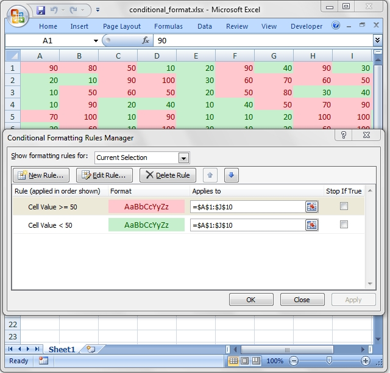

### <a name="conditional_format" class="anchor" href="#conditional_format"></a>CONDITIONAL FORMATTING IN EXCEL

Conditional formatting is a feature of Excel which allows you to apply a format
to a cell or a range of cells based on a certain criteria.

For example the following criteria is used to highlight cells >= 50 in red in the
[`conditional_format.rb`](examples.html#conditional_format)
example from the distro:

    # Write a conditional format over a range.
    worksheet.conditional_formatting('B3:K12',
        {
            type:     'cell',
            criteria: '>=',
            value:    50,
            format:   format1
        }
    )

#### <a name="conditional_formatting" class="anchor" href="#conditional_formatting"></a>conditional_formatting(row, col, { parameter: 'value', ... } )

The `conditional_formatting()` method is used to apply formatting based on user
defined criteria to an WriteXLSX file.

It can be applied to a single cell or a range of cells.
You can pass 3 parameters such as (row, col, \{...\}) or 5 parameters such as (first_row, first_col, last_row, last_col, \{...\}).
You can also use A1 style notation. For example:

    worksheet.conditional_formatting(0, 0,       {...})
    worksheet.conditional_formatting(0, 0, 4, 1, {...})

    # Which are the same as:

    worksheet.conditional_formatting('A1',       {...})
    worksheet.conditional_formatting('A1:B5',    {...})

See also the note about
["Cell notation"](worksheet.html#cell-notation)
for more information.

Using A1 style notation is also possible to specify non-contiguous ranges,
separated by a comma. For example:

    worksheet.conditional_formatting('A1:D5,A8:D12', {...})

The last parameter in `conditional_formatting()` must be a hash containing
the parameters that describe the type and style of the data validation.
The main parameters are:

    :type
    :format
    :criteria
    :value
    :minimum
    :maximum

Other, less commonly used parameters are:

    :min_type
    :mid_type
    :max_type
    :min_value
    :mid_value
    :max_value
    :min_color
    :mid_color
    :max_color
    :bar_color
    :bar_only
    :bar_solid
    :bar_negative_color
    :bar_negative_border_color
    :bar_negative_color_same
    :bar_negative_border_color_same
    :bar_no_border
    :bar_direction
    :bar_axis_position
    :bar_axis_color
    :data_bar_2010
    :icon_style
    :icons
    :reverse_icons
    :icons_only
    :stop_if_true
    :multi_range

Additional parameters which are used for specific conditional format types
are shown in the relevant sections below.

##### <a name="type" class="anchor" href="#type"></a>:type

This parameter is passed in a hash to `conditional_formatting()`.

The `:type` parameter is used to set the type of conditional formatting that
you wish to apply. It is always required and it has no default value.
Allowable type values and their associated parameters are:

    Type            Parameters
    ====            ==========
    cell            criteria
                    value
                    minimum
                    maximum
                    format

    date            criteria
                    value
                    minimum
                    maximum
                    format

    time_period     criteria
                    format

    text            criteria
                    value
                    format

    average         criteria
                    format

    duplicate       format

    unique          format

    top             criteria
                    value
                    format

    bottom          criteria
                    value
                    format

    blanks          format

    no_blanks       format

    errors          format

    no_errors       format

    formula         criteria
                    format

    2_color_scale   min_type
                    max_type
                    min_value
                    max_value
                    min_color
                    max_color

    3_color_scale   min_type
                    mid_type
                    max_type
                    min_value
                    mid_value
                    max_value
                    min_color
                    mid_color
                    max_color

    data_bar        min_type
                    max_type
                    min_value
                    max_value
                    bar_only
                    bar_color
                    bar_solid*
                    bar_negative_color*
                    bar_negative_border_color*
                    bar_negative_color_same*
                    bar_negative_border_color_same*
                    bar_no_border*
                    bar_direction*
                    bar_axis_position*
                    bar_axis_color*
                    data_bar_2010*

    icon_set        icon_style
                    reverse_icons
                    icons
                    icons_only

Data bar parameters marked wth (*) are only available in Excel 2010 and later. Files that use these properties can still be opened in Excel 2007 but the data bars will be displayed without them.

##### <a name="type_cell" class="anchor" href="#type_cell"></a>type: 'cell'

This is the most common conditional formatting type.
It is used when a format is applied to a cell based on a simple criterion.
For example:

    worksheet.conditional_formatting('A1',
        {
            type:     'cell',
            criteria: 'greater than',
            value:    5,
            format:   red_format,
        }
    )

Or, using the between criteria:

    worksheet.conditional_formatting('C1:C4',
        {
            type:     'cell',
            criteria: 'between',
            minimum:  20,
            maximum:  30,
            format:   green_format,
        }
    )

##### <a name="criteria" class="anchor" href="#criteria"></a>:criteria

The `criteria` parameter is used to set the criteria by which the cell data
will be evaluated. It has no default value. The most common criteria as
applied to `{ type: 'cell' }` are:

    'between'
    'not between'
    'equal to'                  |  '=='  |  '='
    'not equal to'              |  '!='  |  '<>'
    'greater than'              |  '>'
    'less than'                 |  '<'
    'greater than or equal to'  |  '>='
    'less than or equal to'     |  '<='

You can either use Excel's textual description strings,
in the first column above, or the more common symbolic alternatives.

Additional criteria which are specific to other conditional format types
are shown in the relevant sections below.

##### <a name="value" class="anchor" href="#"></a>:value

The value is generally used along with the criteria parameter to set the rule by which the cell data will be evaluated.

    type:     'cell',
    criteria: '>',
    value:    5
    format:   format,

The value property can also be an cell reference.

    type:     'cell',
    criteria: '>',
    value:    '$C$1',
    format:   format,

##### <a name="format" class="anchor" href="#format"></a>:format

The `format` parameter is used to specify the format that will be applied to
the cell when the conditional formatting criterion is met.
The format is created using the `add_format()` method in the same way as cell
formats:

    format = workbook.add_format(bold: 1, italic: 1)

    worksheet.conditional_formatting('A1',
        {
            type:     'cell',
            criteria: '>',
            value:    5
            format:   format,
        }
    )

The conditional format follows the same rules as in Excel:
it is superimposed over the existing cell format and not all font and border
properties can be modified.
Font properties that can't be modified are font name,
font size, superscript and subscript.
The border property that cannot be modified is diagonal borders.

Excel specifies some default formats to be used with conditional formatting.
You can replicate them using the following WriteXLSX formats:

    # Light red fill with dark red text.

    format1 = workbook.add_format(
        bg_color: '#FFC7CE',
        color:    '#9C0006',
    )

    # Light yellow fill with dark yellow text.

    format2 = workbook.add_format(
        bg_color: '#FFEB9C',
        color:    '#9C6500',
    )

    # Green fill with dark green text.

    format3 = workbook.add_format(
        bg_color: '#C6EFCE',
        color:    '#006100',
    )

##### <a name="minimum" class="anchor" href="#minimum"></a>:minimum

The `minimum` parameter is used to set the lower limiting value when the
criteria is either 'between' or 'not between':

    validate: 'integer',
    criteria: 'between',
    minimum:  1,
    maximum:  100,

##### <a name="maximum" class="anchor" href="#maximum"></a>:maximum

The `maximum` parameter is used to set the upper limiting value when the
criteria is either 'between' or 'not between'. See the previous example.

##### <a name="type_date" class="anchor" href="#type_date"></a>type: 'date'

The `date` type is the same as the `cell` type and uses the same criteria
and values. However it allows the `:value`, `:minimum` and `:maximum` properties to be
specified in the ISO8601
`yyyy-mm-ddThh:mm:ss.sss` date format which is detailed in the
[`write_date_time()`](worksheet.html#write_date_time) method.

    worksheet.conditional_formatting('A1:A4',
        {
            type:     'date',
            criteria: 'greater than',
            value:    '2011-01-01T',
            format:   format,
        }
    )

##### <a name="type_time_period" class="anchor" href="#type_time_period"></a>type: 'time_period'

The `time_period` type is used to specify Excel's "Dates Occurring" style
conditional format.

    worksheet.conditional_formatting('A1:A4',
        {
            type:     'time_period',
            criteria: 'yesterday',
            format:   format,
        }
    )

The period is set in the `:criteria` and can have one of the following values:

        criteria: 'yesterday',
        criteria: 'today',
        criteria: 'last 7 days',
        criteria: 'last week',
        criteria: 'this week',
        criteria: 'next week',
        criteria: 'last month',
        criteria: 'this month',
        criteria: 'next month'

##### <a name="type_text" class="anchor" href="#type_text"></a>type: 'text'

The `text` type is used to specify Excel's "Specific Text" style conditional
format. It is used to do simple string matching using the `:criteria` and
`:value` parameters:

    worksheet.conditional_formatting('A1:A4',
        {
            type:     'text',
            criteria: 'containing',
            value:    'foo',
            format:   format,
        }
    )

The `:criteria` can have one of the following values:

    criteria: 'containing',
    criteria: 'not containing',
    criteria: 'begins with',
    criteria: 'ends with',

The `:value` parameter should be a string or single character.

##### <a name="type_average" class="anchor" href="#type_average"></a>type: 'average'

The `average` type is used to specify Excel's "Average" style conditional format.

    worksheet.conditional_formatting('A1:A4',
        {
            type:     'average',
            criteria: 'above',
            format:   format,
        }
    )

The type of average for the conditional format range is specified by the `:criteria`:

    criteria: 'above',
    criteria: 'below',
    criteria: 'equal or above',
    criteria: 'equal or below',
    criteria: '1 std dev above',
    criteria: '1 std dev below',
    criteria: '2 std dev above',
    criteria: '2 std dev below',
    criteria: '3 std dev above',
    criteria: '3 std dev below',

##### <a name="type_duplicate" class="anchor" href="#type_duplicate"></a>type: 'duplicate'

The `duplicate` type is used to highlight duplicate cells in a range:

    worksheet.conditional_formatting('A1:A4',
        {
            type:     'duplicate',
            format:   format,
        }
    )

##### <a name="type_unique" class="anchor" href="#type_unique"></a>type: 'unique'

The `unique` type is used to highlight unique cells in a range:

    worksheet.conditional_formatting('A1:A4',
        {
            type:     'unique',
            format:   format,
        }
    )

##### <a name="type_top" class="anchor" href="#type_top"></a>type: 'top'

The `top` type is used to specify the top n values by number or percentage
in a range:

    worksheet.conditional_formatting('A1:A4',
        {
            type:     'top',
            value:    10,
            format:   format,
        }
    )

The `:criteria` can be used to indicate that a percentage condition is required:

    worksheet.conditional_formatting('A1:A4',
        {
            type:     'top',
            value:    10,
            criteria: '%',
            format:   format,
        }
    )

##### <a name="type_bottom" class="anchor" href="#type_bottom"></a>type: 'bottom'

The `bottom` type is used to specify the bottom n values by number or percentage
in a range.

It takes the same parameters as top, see above.

##### <a name="type_blanks" class="anchor" href="#type_blanks"></a>type: 'blanks'

The `blanks` type is used to highlight blank cells in a range:

    worksheet.conditional_formatting('A1:A4',
        {
            type:     'blanks',
            format:   format,
        }
    )

##### <a name="type_no_blanks" class="anchor" href="#type_no_blanks"></a>type: 'no_blanks'

The `no_blanks` type is used to highlight non blank cells in a range:

    worksheet.conditional_formatting('A1:A4',
        {
            type:     'no_blanks',
            format:   format,
        }
    )

##### <a name="type_errors" class="anchor" href="#type_errors"></a>type: 'errors'

The `errors` type is used to highlight error cells in a range:

    worksheet.conditional_formatting('A1:A4',
        {
            type:     'errors',
            format:   format,
        }
    )

##### <a name="type_no_errors" class="anchor" href="#type_no_errors"></a>type: 'no_errors'

The `no_errors` type is used to highlight non error cells in a range:

    worksheet.conditional_formatting('A1:A4',
        {
            type:     'no_errors',
            format:   format,
        }
    )

##### <a name="type_formula" class="anchor" href="#type_formula"></a>type: 'formula'

The `formula` type is used to specify a conditional format based on a user
defined formula:

    worksheet.conditional_formatting('A1:A4',
        {
            type:     'formula',
            criteria: '=$A$1 > 5',
            format:   format,
        }
    )

The formula is specified in the `criteria`.

##### <a name="type_2_color_scale" class="anchor" href="#type_2_color_scale"></a>type: '2_color_scale'

The `2_color_scale` type is used to specify Excel's "2 Color Scale"
style conditional format.

    worksheet.conditional_formatting('A1:A12',
        {
            type:  '2_color_scale',
        }
    )

This conditional type can be modified with `:min_type`, `:max_type`,
`:min_value`, `:max_value`, `:min_color` and `:max_color`, see below.

##### <a name="type_3_color_scale" class="anchor" href="#type_3_color_scale"></a>type: '3_color_scale'

The `3_color_scale` type is used to specify Excel's "3 Color Scale"
style conditional format.

    worksheet.conditional_formatting('A1:A12',
        {
            type:  '3_color_scale',
        }
    )

This conditional type can be modified with `:min_type`, `:mid_type`,
`:max_type`, `:min_value`, `:mid_value`, `:max_value`, `:min_color`,
`:mid_color` and `:max_color`, see below.

##### <a name="type_data_bar" class="anchor" href="#type_data_bar"></a>type: 'data_bar'

The `data_bar` type is used to specify Excel's "Data Bar" style conditional format.

    worksheet.conditional_formatting('A1:A12',
        {
            type:  'data_bar',
        }
    )

This data bar conditional type can be modified with the following parameters, which are explained in the sections below. These properties were available in the original xlsx file specification used in Excel 2007:

    :min_type
    :max_type
    :min_value
    :max_value
    :bar_color
    :bar_only

In Excel 2010 additional data bar properties were added such as solid (non-gradient) bars and control over how negative values are displayed. These properties can be set using the following parameters:

    :bar_solid
    :bar_negative_color
    :bar_border_color
    :bar_negative_border_color
    :bar_negative_color_same
    :bar_negative_border_color_same
    :bar_no_border
    :bar_direction
    :bar_axis_position
    :bar_axis_color
    :data_bar_2010

Files that use these Excel 2010 properties can still be opened in Excel 2007 but the data bars will be displayed without them.

##### <a name="min_mid_max_type" class="anchor" href="#min_mid_max_type"></a>:min_type, :mid_type, :max_type

The `:min_type` and `:max_type` properties are available when the conditional
formatting type is `2_color_scale`, `3_color_scale` or `data_bar`.
The `:mid_type` is available for `3_color_scale`.
The properties are used as follows:

    worksheet.conditional_formatting('A1:A12',
        {
            type:      '2_color_scale',
            min_type:  'percent',
            max_type:  'percent',
        }
    )

The available min/mid/max types are:

    min        (for min_type only)
    num
    percent
    percentile
    formula
    max        (for max_type only)

##### <a name="min_mid_max_value" class="anchor" href="#min_mid_max_value"></a>:min_value, :mid_value, :max_value

The `:min_value` and `:max_value` properties are available when the conditional
formatting type is `2_color_scale`, `3_color_scale` or `data_bar`.
The `:mid_value` is available for `3_color_scale`.
The properties are used as follows:

    worksheet.conditional_formatting('A1:A12',
        {
            type:       '2_color_scale',
            min_value:  10,
            max_value:  90,
        }
    )

##### <a name="min_mid_max_bar_color" class="anchor" href="#min_mid_max_bar_color"></a>:min_color, :mid_color, :max_color, :bar_color

The `:min_color` and `:max_color` properties are available when the conditional
formatting type is `2_color_scale`, `3_color_scale` or `data_bar`.
The `:mid_color` is available for `3_color_scale`.
The properties are used as follows:

    worksheet.conditional_formatting('A1:A12',
        {
            type:      '2_color_scale',
            min_color: "#C5D9F1",
            max_color: "#538ED5",
        }
    )

The color can be specifies as an WriteXLSX color index or, more usefully,
as a HTML style RGB hex number, as shown above.

##### <a name="bar_only" class="anchor" href="#bar_only"></a>:bar_only

The `bar_only` parameter property displays a bar data but not the data in the cells:

    worksheet.conditional_formatting(
      'D3:D14',
      {
        type:     'data_bar',
        bar_only: 1
      }
    )

##### <a name="bar_solid" class="anchor" href="#bar_solid"></a>:bar_solid

The C<bar_solid> parameter turns on a solid (non-gradient) fill for data bars:

    worksheet.conditional_formatting(
      'H3:H14',
      {
        type:      'data_bar',
        bar_solid: 1
      }
    )

Note, this property is only visible in Excel 2010 and later.

##### <a name="bar_negative_color" class="anchor" href="#bar_negative_color"></a>:bar_negative_color

The `bar_negative_color` parameter is used to set the color fill for the negative portion of a data bar.

The color can be specified as an WriteXLSX color index or as a HTML style RGB hex number, as shown in the other examples.

Note, this property is only visible in Excel 2010 and later.

##### <a name="bar_border_color" class="anchor" href="#bar_border_color"></a>:bar_border_color

The `bar_border_color` parameter is used to set the border color of a data bar.

The color can be specified as an WriteXLSX color index or as a HTML style RGB hex number, as shown in the other examples.

Note, this property is only visible in Excel 2010 and later.

##### <a name="bar_negative_border_color" class="anchor" href="#bar_negative_border_color"></a>:bar_negative_border_color

The `bar_negative_border_color` parameter is used to set the border color of the negative portion of a data bar.

The color can be specified as an WriteXLSX color index or as a HTML style RGB hex number, as shown in the other examples.

Note, this property is only visible in Excel 2010 and later.

##### <a name="bar_negative_color_same" class="anchor" href="#bar_negative_color_same"></a>:bar_negative_color_same

The C<bar_negative_color_same> parameter sets the fill color for the negative portion of a data bar to be the same as the fill color for the positive portion of the data bar:

    worksheet.conditional_formatting(
      'N3:N14',
      {
        type:                           'data_bar',
        bar_negative_color_same:        1,
        bar_negative_border_color_same: 1
      }
    )

Note, this property is only visible in Excel 2010 and later.

##### <a name="bar_negative_border_color_same" class="anchor" href="#bar_negative_border_color_same"></a>:bar_negative_border_color_same

The `bar_negative_border_color_same` parameter sets the border color for the negative portion of a data bar to be the same as the border color for the positive portion of the data bar.

Note, this property is only visible in Excel 2010 and later.

##### <a name="bar_no_border" class="anchor" href="#bar_no_border"></a>:bar_no_border

The `bar_no_border` parameter turns off the border of a data bar.

Note, this property is only visible in Excel 2010 and later, however the default in Excel 2007 is not to have a border.

##### <a name="bar_direction" class="anchor" href="#bar_direction"></a>:bar_direction

The `bar_direction` parameter sets the direction for data bars. This property can be either `left` for left-to-right or `right` for right-to-left. If the property isn't set then Excel will adjust the position automatically based on the context:

    worksheet.conditional_formatting(
      'J3:J14',
      {
        type:          'data_bar',
        bar_direction: 'right'
      }
    )

Note, this property is only visible in Excel 2010 and later.

##### <a name="bar_axis_position" class="anchor" href="#bar_axis_position"></a>:bar_axis_position

The `bar_axis_position` parameter sets the position within the cells for the axis that is shown in data bars when there are negative values to display. The property can be either `middle` or `none`. If the property isn't set then Excel will position the axis based on the range of positive and negative values.

Note, this property is only visible in Excel 2010 and later.

##### <a name="bar_axis_color" class="anchor" href="#bar_axis_color"></a>:bar_axis_color

The `bar_axis_color` parameter sets the color for the axis that is shown in data bars when there are negative values to display.

The color can be specified as an WriteXLSX color index or as a HTML style RGB hex number, as shown in the other examples.

Note, this property is only visible in Excel 2010 and later.

##### <a name="data_bar_2010" class="anchor" href="#data_bar_2010"></a>:data_bar_2010

The C<data_bar_2010> parameter sets Excel 2010 style data bars even when Excel 2010 specific properties aren't used. This can be used to create consistency across all the data bar formatting in a worksheet:

    worksheet->conditional_formatting(
      'L3:L14',
      {
        type:          'data_bar',
        data_bar_2010: 1
      }
    )

Note, this property is only visible in Excel 2010 and later.

#### <a name="stop_if_true" class="anchor" href="#stop_if_true"></a>:stop_if_true

The `:stop_if_true` parameter, if set to a true value, will enable the "stop if true" feature on the conditional formatting rule, so that subsequent rules are not examined for any cell on which the conditions for this rule are met.

#### <a name="icon_set" class="anchor" href="#icon_set"></a>:icon_set

The `icon_set` type is used to specify a conditional format with a set of icons such as traffic lights or arrows:

    worksheet.conditional_formatting( 'A1:C1',
        {
            type:         'icon_set',
            icon_style:   '3_traffic_lights'
        }
    )

The icon set style is specified by the `icon_style` parameter. Valid options are:

    3_arrows
    3_arrows_gray
    3_flags
    3_signs
    3_symbols
    3_symbols_circled
    3_traffic_lights
    3_traffic_lights_rimmed

    4_arrows
    4_arrows_gray
    4_ratings
    4_red_to_black
    4_traffic_lights

    5_arrows
    5_arrows_gray
    5_quarters
    5_ratings

The criteria, type and value of each icon can be specified using the `icon` array of hash refs with optional `criteria`, `type` and `value` parameters:

    worksheet.conditional_formatting( 'A1:D1',
        {
            type:         'icon_set',
            icon_style:   '4_red_to_black',
            icons:        [ {criteria: '>',  type: 'number',     value: 90},
                              {criteria: '>=', type: 'percentile', value: 50},
                              {criteria: '>',  type: 'percent',    value: 25}
                            ]
        }
    )

The `icons criteria` parameter should be either `< >= >` or `< > >`. The default `criteria` is `< >= >`.

The `icons type` parameter should be one of the following values:

    number
    percentile
    percent
    formula

The default `type` is `percent`.

The `icons value` parameter can be a value or formula:

    worksheet.conditional_formatting( 'A1:D1',
        {
            type:         'icon_set',
            icon_style:   '4_red_to_black',
            icons:        [ {value: 90},
                              {value: 50},
                              {value: 25}
                            ]
        }
    )

Note: The `icons` parameters should start with the highest value and with each subsequent one being lower. The default `value` is `(n * 100) / number_of_icons`. The lowest number icon in an icon set has properties defined by Excel. Therefore in a `n` icon set, there is no `n-1` hash of parameters.

The order of the icons can be reversed using the `reverse_icons` parameter:

    worksheet.conditional_formatting( 'A1:C1',
        {
            type:          'icon_set',
            icon_style:    '3_arrows',
            reverse_icons: 1
        }
    )

The icons can be displayed without the cell value using the `icons_only` parameter:

    worksheet.conditional_formatting( 'A1:C1',
        {
            type:         'icon_set',
            icon_style:   '3_flags',
            icons_only:   1
        }
    )

#### <a name="conditional_formatting_examples" class="anchor" href="#conditional_formatting_examples"></a>Conditional Formatting Examples

Example 1. Highlight cells greater than an integer value.

    worksheet.conditional_formatting('A1:F10',
        {
            type:     'cell',
            criteria: 'greater than',
            value:    5,
            format:   format
        }
    )

Example 2. Highlight cells greater than a value in a reference cell.

    worksheet.conditional_formatting('A1:F10',
        {
            type:     'cell',
            criteria: 'greater than',
            value:    '$H$1',
            format:   format
        }
    )

Example 3. Highlight cells greater than a certain date:

    worksheet.conditional_formatting('A1:F10',
        {
            type:     'date',
            criteria: 'greater than',
            value:    '2011-01-01T',
            format:   format
        }
    )

Example 4. Highlight cells with a date in the last seven days:

    worksheet.conditional_formatting('A1:F10',
        {
            type:     'time_period',
            criteria: 'last 7 days',
            format:   format
        }
    )

Example 5. Highlight cells with strings starting with the letter b:

    worksheet.conditional_formatting('A1:F10',
        {
            type:     'text',
            criteria: 'begins with',
            value:    'b',
            format:   format
        }
    )

Example 6. Highlight cells that are 1 std deviation above the average for the range:

    worksheet.conditional_formatting('A1:F10',
        {
            type:     'average',
            format:   format
        }
    )

Example 7. Highlight duplicate cells in a range:

    worksheet.conditional_formatting('A1:F10',
        {
            type:     'duplicate',
            format:   format
        }
    )

Example 8. Highlight unique cells in a range.

    worksheet.conditional_formatting('A1:F10',
        {
            type:     'unique',
            format:   format
        }
    )

Example 9. Highlight the top 10 cells.

    worksheet.conditional_formatting('A1:F10',
        {
            type:     'top',
            value:    10,
            format:   format
        }
    )

Example 10. Highlight blank cells.

    worksheet.conditional_formatting('A1:F10',
        {
            type:     'blanks',
            format:   format
        }
    )

Example 11. Set traffic light icons in 3 cells:

    worksheet.conditional_formatting( 'A1:C1',
        {
            type:         'icon_set',
            icon_style:   '3_traffic_lights'
        }
    )

See also the
[`conditional_format.rb`](examples.html#conditional_format)
example program in EXAMPLES.
