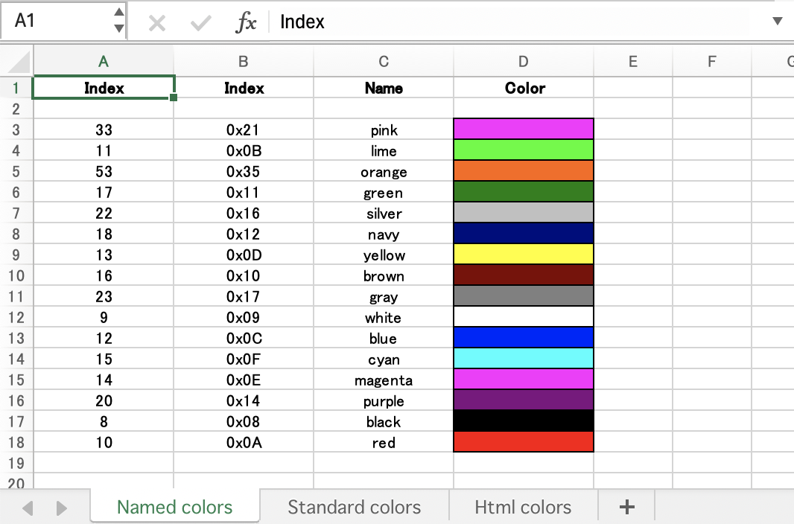
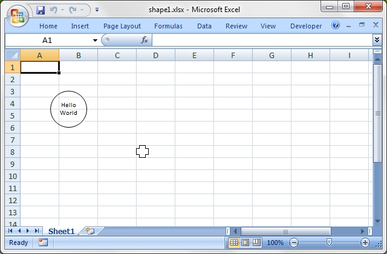

<a name="top" class="anchor" href="#top"><span class="octicon octicon-link" /></a>
Example programs
The following is a list of the 96 example programs that are included in the Excel::Writer::XLSX distribution.

| Example                                          | Description                                                 |
|--------------------------------------------------|-------------------------------------------------------------|
| [a_simple.rb](#a_simple)                         | A simple demo of some of the features.                      |
| [demo.rb](#demo)                                 | A demo of some of the available features.                   |
| [formats.rb](#formats)                           | All the available formatting on several worksheets.         |
| [regions.rb](#regions)                           | A simple example of multiple worksheets.                    |
| [stats.rb](#stats)                               | Basic formulas and functions.                               |
| [autofit.rb](#autofit)                           | Examples of simulated worksheet autofit.                    |
| [autofilter.rb](#autofilter)                     | Examples of worksheet autofilters.                          |
| [array_formula.rb](#array_formula)               | Examples of how to write array formulas.                    |
| [cgi.rb](#cgi)                                   | A simple CGI program.                                       |
| [chart_area.rb](#chart_area)                     | A demo of area style charts.                                |
| [chart_bar.rb](#chart_bar)                       | A demo of bar (vertical histogram) style charts.            |
| [chart_column.rb](#chart_column)                 | A demo of column (histogram) style charts.                  |
| [chart_line.rb](#chart_line)                     | A demo of line style charts.                                |
| [chart_pie.rb](#chart_pie)                       | A demo of pie style charts.                                 |
| [chart_doughnut.rb](#chart_doughnut)             | A demo of doughnut style charts.                            |
| [chart_radar.rb](#chart_radar)                   | A demo of radar style charts.                               |
| [chart_scatter.rb](#chart_scatter)               | A demo of scatter style charts.                             |
| [chart_secondary_axis.rb](#chart_secondary_axis) | A demo of a line chart with a secondary axis.               |
| [chart_combined.rb](#chart_combined)             | A demo of a combined column and line chart.                 |
| [chart_pareto.rb](#chart_pareto)                 | A demo of a combined Pareto chart.                          |
| [chart_stock.rb](#chart_stock)                   | A demo of stock style charts.                               |
| [chart_data_table.rb](#chart_data_table)         | A demo of a chart with a data table on the axis.            |
| [chart_data_tools.rb](#chart_data_tools)         | A demo of charts with data highlighting options.            |
| [chart_data_labels.rb](#chart_data_labels)       | A demo of standard and custom chart data labels.            |
| [chart_clustered.rb](#chart_clustered)           | A demo of a chart with a clustered axis.                    |
| [chart_styles.rb](#chart_styles)                 | A demo of the available chart styles.                       |
| [chart_gauge.rb](#chart_gauge)                   | A demo of a gauge style chart.                              |
| [colors.rb](#colors)                             | A demo of the colour palette and named colours.             |
| [comments1.rb](#comments1)                       | Add comments to worksheet cells.                            |
| [comments2.rb](#comments2)                       | Add comments with advanced options.                         |
| [conditional_format.rb](#conditional_format)     | Add conditional formats to a range of cells.                |
| [data_validate.rb](#data_validate)               | An example of data validation and dropdown lists.           |
| [date_time.rb](#date_time)                       | Write dates and times with write_date_time().               |
| [defined_name.rb](#defined_name)                 | Example of how to create defined names.                     |
| [diag_border.rb](#diag_border)                   | A simple example of diagonal cell borders.                  |
| [dynamic_arrays.rb](#dynamic_arrays)             | Example of using new Excel 365 dynamic functions.           |
| [embedded_images.rb](#embedded_images)           | Example of embedding imges in worksheet cells.              |
| [filehandle.rb](#filehandle)                     | Examples of working with filehandles.                       |
| [headers.rb](#headers)                           | Examples of worksheet headers and footers.                  |
| [hide_row_col.rb](#hide_row_col)                 | Example of hiding rows and columns.                         |
| [hide_sheet.rb](#hide_sheet)                     | Simple example of hiding a worksheet.                       |
| [hyperlink1.rb](#hyperlink1)                     | Shows how to create web hyperlinks.                         |
| [hyperlink2.rb](#hyperlink2)                     | Examples of internal and external hyperlinks.               |
| [indent.rb](#indent)                             | An example of cell indentation.                             |
| [ignore_errors.rb](#ignore_errors)               | An example of turning off worksheet cells errors/warnings.  |
| [lambda.rb](#lambda)                             | Example of using the Excel 365 LAMBDA() function.           |
| [macros.rb](#macros)                             | An example of adding macros from an existing file.          |
| [merge1.rb](#merge1)                             | A simple example of cell merging.                           |
| [merge2.rb](#merge2)                             | A simple example of cell merging with formatting.           |
| [merge3.rb](#merge3)                             | Add hyperlinks to merged cells.                             |
| [merge4.rb](#merge4)                             | An advanced example of merging with formatting.             |
| [merge5.rb](#merge5)                             | An advanced example of merging with formatting.             |
| [merge6.rb](#merge6)                             | An example of merging with Unicode strings.                 |
| [mod_perl1.rb](#mod_perl1)                       | A simple mod_perl 1 program.                                |
| [mod_perl2.rb](#mod_perl2)                       | A simple mod_perl 2 program.                                |
| [outline.rb](#outline)                           | An example of outlines and grouping.                        |
| [outline_collapsed.rb](#outline_collapsed)       | An example of collapsed outlines.                           |
| [panes.rb](#panes)                               | An example of how to create panes.                          |
| [properties.rb](#properties)                     | Add document properties to a workbook.                      |
| [protection.rb](#protection)                     | Example of cell locking and formula hiding.                 |
| [rich_strings.rb](#rich_strings)                 | Example of strings with multiple formats.                   |
| [right_to_left.rb](#right_to_left)               | Change default sheet direction to right to left.            |
| [sales.rb](#sales)                               | An example of a simple sales spreadsheet.                   |
| [shape1.rb](#shape1)                             | Insert shapes in worksheet.                                 |
| [shape2.rb](#shape2)                             | Insert shapes in worksheet. With properties.                |
| [shape3.rb](#shape3)                             | Insert shapes in worksheet. Scaled.                         |
| [shape4.rb](#shape4)                             | Insert shapes in worksheet. With modification.              |
| [shape5.rb](#shape5)                             | Insert shapes in worksheet. With connections.               |
| [shape6.rb](#shape6)                             | Insert shapes in worksheet. With connections.               |
| [shape7.rb](#shape7)                             | Insert shapes in worksheet. One to many connections.        |
| [shape8.rb](#shape8)                             | Insert shapes in worksheet. One to many connections.        |
| [shape_all.rb](#shape_all)                       | Demo of all the available shape and connector types.        |
| [sparklines1.rb](#sparklines1)                   | Simple sparklines demo.                                     |
| [sparklines2.rb](#sparklines2)                   | Sparklines demo showing formatting options.                 |
| [stats_ext.rb](#stats_ext)                       | Same as stats.pl with external references.                  |
| [stocks.rb](#stocks)                             | Demonstrates conditional formatting.                        |
| [watermark.rb](#watermark)                       | Example of how to set a watermark image for a worksheet.    |
| [background.rb](#background)                     | Example of how to set the background image for a worksheet. |
| [tab_colors.rb](#tab_colors)                     | Example of how to set worksheet tab colours.                |
| [tables.rb](#tables)                             | Add Excel tables to a worksheet.                            |
| [write_handler1.rb](#write_handler1)             | Example of extending the write() method. Step 1.            |
| [write_handler2.rb](#write_handler2)             | Example of extending the write() method. Step 2.            |
| [write_handler3.rb](#write_handler3)             | Example of extending the write() method. Step 3.            |
| [write_handler4.rb](#write_handler4)             | Example of extending the write() method. Step 4.            |
| [write_to_scalar.rb](#write_to_scalar)           | Example of writing an Excel file to a Perl scalar.          |
| [unicode_2022_jp.rb](#unicode_2022_jp)           | Japanese: ISO-2022-JP.                                      |
| [unicode_8859_11.rb](#unicode_8859_11)           | Thai: ISO-8859_11.                                          |
| [unicode_8859_7.rb](#unicode_8859_7)             | Greek: ISO-8859_7.                                          |
| [unicode_big5.rb](#unicode_big5)                 | Chinese: BIG5.                                              |
| [unicode_cp1251.rb](#unicode_cp1251)             | Russian: CP1251.                                            |
| [unicode_cp1256.rb](#unicode_cp1256)             | Arabic: CP1256.                                             |
| [unicode_cyrillic.rb](#unicode_cyrillic)         | Russian: Cyrillic.                                          |
| [unicode_koi8r.rb](#unicode_koi8r)               | Russian: KOI8-R.                                            |
| [unicode_polish_utf8.rb](#unicode_polish_utf8)   | Polish : UTF8.                                              |
| [unicode_shift_jis.rb](#unicode_shift_jis)       | Japanese: Shift JIS.                                        |

#### <a name="a_simple" class="anchor" href="#a_simple"><span class="octicon octicon-link" /></a>a_simple
A simple demo of some of the features of WriteXLSX.

A simple example of how to use the WriteXLSX gem to write text and numbers to an Excel xlsx file.


[To PageTop](#top)

```rb
#!/usr/bin/env ruby
# -*- coding: utf-8 -*-

#######################################################################
#
# A simple example of how to use the Excel::Writer::XLSX module to
# write text and numbers to an Excel xlsx file.
#
# reverse(c), March 2001, John McNamara, jmcnamara@cpan.org
# convert to ruby by Hideo NAKAMURA, nakamura.hideo@gmail.com
#

require 'write_xlsx'

# Create a new workbook called simple.xls and add a worksheet
workbook  = WriteXLSX.new('a_simple.xlsx')
worksheet = workbook.add_worksheet

# The general syntax is write(row, column, token). Note that row and
# column are zero indexed
#

# Write some text
worksheet.write(0, 0, "Hi Excel!")

# Write some numbers
worksheet.write(2, 0, 3)          # Writes 3
worksheet.write(3, 0, 3.00000)    # Writes 3
worksheet.write(4, 0, 3.00001)    # Writes 3.00001
worksheet.write(5, 0, 3.14159)    # TeX revision no.?

# Write some formulas
worksheet.write(7, 0, '=A3 + A6')
worksheet.write(8, 0, '=IF(A5>3,"Yes", "No")')

# Write a hyperlink
worksheet.write(10, 0, 'http://www.ruby-lang.org/')

workbook.close

```

[To PageTop](#top)

#### <a name="demo" class="anchor" href="#demo"><span class="octicon octicon-link" /></a>demo
A demo of some of the available features.


[To PageTop](#top)

```rb
#!/usr/bin/env ruby
# -*- coding: utf-8 -*-

require 'write_xlsx'

workbook   = WriteXLSX.new('demo.xlsx')
worksheet  = workbook.add_worksheet('Demo')
worksheet2 = workbook.add_worksheet('Another sheet')
worksheet3 = workbook.add_worksheet('And another')

bold = workbook.add_format(bold: 1)

#######################################################################
#
# Write a general heading
#
worksheet.set_column('A:A', 36, bold)
worksheet.set_column('B:B', 20)
worksheet.set_row(0, 40)

heading = workbook.add_format(
  bold:  1,
  color: 'blue',
  size:  16,
  merge: 1,
  align: 'vcenter'
)

headings = ['Features of WriteXLSX', '']
worksheet.write_row('A1', headings, heading)

#######################################################################
#
# Some text examples
#
text_format = workbook.add_format(
  bold:   1,
  italic: 1,
  color:  'red',
  size:   18,
  font:   'Lucida Calligraphy'
)

worksheet.write('A2', "Text")
worksheet.write('B2', "Hello Excel")
worksheet.write('A3', "Formatted text")
worksheet.write('B3', "Hello Excel", text_format)
worksheet.write('A4', "Unicode text")
worksheet.write('B4', "А Б В Г Д")

#######################################################################
#
# Some numeric examples
#
num1_format = workbook.add_format(num_format: '$#,##0.00')
num2_format = workbook.add_format(num_format: ' d mmmm yyy')

worksheet.write('A5', "Numbers")
worksheet.write('B5', 1234.56)
worksheet.write('A6', "Formatted numbers")
worksheet.write('B6', 1234.56, num1_format)
worksheet.write('A7', "Formatted numbers")
worksheet.write('B7', 37257, num2_format)

#######################################################################
#
# Formulae
#
worksheet.set_selection('B8')
worksheet.write('A8', 'Formulas and functions, "=SIN(PI()/4)"')
worksheet.write('B8', '=SIN(PI()/4)')

#######################################################################
#
# Hyperlinks
#
worksheet.write('A9', "Hyperlinks")
worksheet.write('B9', 'http://www.ruby-lang.org/')

#######################################################################
#
# Images
#
worksheet.write('A10', "Images")
worksheet.insert_image(
  'B10', 'republic.png',
  x_offset: 16, y_offset: 8
)

#######################################################################
#
# Misc
#
worksheet.write('A18', "Page/printer setup")
worksheet.write('A19', "Multiple worksheets")

workbook.close

```

[To PageTop](#top)

#### <a name="formats" class="anchor" href="#formats"><span class="octicon octicon-link" /></a>formats
All the available formatting on several worksheets.

This program demonstrates almost all possible formatting options.
It is worth running this program and viewing the output Excel file if you are interested in the various formatting possibilities.


[To PageTop](#top)

```rb
#!/usr/bin/env ruby
# -*- coding: utf-8 -*-

###############################################################################
#
# Examples of formatting using the Excel::Writer::XLSX module.
#
# This program demonstrates almost all possible formatting options. It is worth
# running this program and viewing the output Excel file if you are interested
# in the various formatting possibilities.
#
# reverse('ｩ'), September 2002, John McNamara, jmcnamara@cpan.org
# convert to Ruby by Hideo NAKAMURA, nakamura.hideo@gmail.com
#

require 'write_xlsx'

workbook = WriteXLSX.new('formats.xlsx')

# Some common formats
center = workbook.add_format(align: 'center')
heading = workbook.add_format(align: 'center', bold: 1)

# The named colors
colors = {
  0x08 => 'black',
  0x0C => 'blue',
  0x10 => 'brown',
  0x0F => 'cyan',
  0x17 => 'gray',
  0x11 => 'green',
  0x0B => 'lime',
  0x0E => 'magenta',
  0x12 => 'navy',
  0x35 => 'orange',
  0x21 => 'pink',
  0x14 => 'purple',
  0x0A => 'red',
  0x16 => 'silver',
  0x09 => 'white',
  0x0D => 'yellow'
}

######################################################################
#
# Intro.
#
def intro(workbook, _center, _heading, _colors)
  worksheet = workbook.add_worksheet('Introduction')

  worksheet.set_column(0, 0, 60)

  format = workbook.add_format
  format.set_bold
  format.set_size(14)
  format.set_color('blue')
  format.set_align('center')

  format2 = workbook.add_format
  format2.set_bold
  format2.set_color('blue')

  format3 = workbook.add_format(
    color:     'blue',
    underline: 1
  )

  worksheet.write(2, 0, 'This workbook demonstrates some of', format)
  worksheet.write(3, 0, 'the formatting options provided by', format)
  worksheet.write(4, 0, 'the Excel::Writer::XLSX module.',    format)
  worksheet.write('A7', 'Sections:', format2)

  worksheet.write('A8', "internal:Fonts!A1", 'Fonts', format3)

  worksheet.write('A9', "internal:'Named colors'!A1",
                  'Named colors', format3)

  worksheet.write(
    'A10',
    "internal:'Standard colors'!A1",
    'Standard colors', format3
  )

  worksheet.write(
    'A11',
    "internal:'Numeric formats'!A1",
    'Numeric formats', format3
  )

  worksheet.write('A12', "internal:Borders!A1", 'Borders', format3)
  worksheet.write('A13', "internal:Patterns!A1", 'Patterns', format3)
  worksheet.write('A14', "internal:Alignment!A1", 'Alignment', format3)
  worksheet.write('A15', "internal:Miscellaneous!A1", 'Miscellaneous',
                  format3)
end

######################################################################
#
# Demonstrate the named colors.
#
def named_colors(workbook, center, heading, colors)
  worksheet = workbook.add_worksheet('Named colors')

  worksheet.set_column(0, 3, 15)

  worksheet.write(0, 0, "Index", heading)
  worksheet.write(0, 1, "Index", heading)
  worksheet.write(0, 2, "Name",  heading)
  worksheet.write(0, 3, "Color", heading)

  i = 1

  [33, 11, 53, 17, 22, 18, 13, 16, 23, 9, 12, 15, 14, 20, 8, 10].each do |index|
    color = colors[index]
    format = workbook.add_format(
      bg_color: color,
      pattern:  1,
      border:   1
    )

    worksheet.write(i + 1, 0, index, center)
    worksheet.write(i + 1, 1, sprintf("0x%02X", index), center)
    worksheet.write(i + 1, 2, color, center)
    worksheet.write(i + 1, 3, '',     format)
    i += 1
  end
end

######################################################################
#
# Demonstrate the standard Excel colors in the range 8..63.
#
def standard_colors(workbook, center, heading, colors)
  worksheet = workbook.add_worksheet('Standard colors')

  worksheet.set_column(0, 3, 15)

  worksheet.write(0, 0, "Index", heading)
  worksheet.write(0, 1, "Index", heading)
  worksheet.write(0, 2, "Color", heading)
  worksheet.write(0, 3, "Name",  heading)

  (8..63).each do |i|
    format = workbook.add_format(
      bg_color: i,
      pattern:  1,
      border:   1
    )

    worksheet.write((i - 7), 0, i, center)
    worksheet.write((i - 7), 1, sprintf("0x%02X", i), center)
    worksheet.write((i - 7), 2, '', format)

    # Add the  color names
    worksheet.write((i - 7), 3, colors[i], center) if colors[i]
  end
end

######################################################################
#
# Demonstrate the standard numeric formats.
#
def numeric_formats(workbook, center, heading, _colors)
  worksheet = workbook.add_worksheet('Numeric formats')

  worksheet.set_column(0, 4, 15)
  worksheet.set_column(5, 5, 45)

  worksheet.write(0, 0, "Index",       heading)
  worksheet.write(0, 1, "Index",       heading)
  worksheet.write(0, 2, "Unformatted", heading)
  worksheet.write(0, 3, "Formatted",   heading)
  worksheet.write(0, 4, "Negative",    heading)
  worksheet.write(0, 5, "Format",      heading)

  formats = []
  formats << [0x00, 1234.567,   0,         'General']
  formats << [0x01, 1234.567,   0,         '0']
  formats << [0x02, 1234.567,   0,         '0.00']
  formats << [0x03, 1234.567,   0,         '#,##0']
  formats << [0x04, 1234.567,   0,         '#,##0.00']
  formats << [0x05, 1234.567,   -1234.567, '($#,##0_);($#,##0)']
  formats << [0x06, 1234.567,   -1234.567, '($#,##0_);[Red]($#,##0)']
  formats << [0x07, 1234.567,   -1234.567, '($#,##0.00_);($#,##0.00)']
  formats << [0x08, 1234.567,   -1234.567, '($#,##0.00_);[Red]($#,##0.00)']
  formats << [0x09, 0.567,      0,         '0%']
  formats << [0x0a, 0.567,      0,         '0.00%']
  formats << [0x0b, 1234.567,   0,         '0.00E+00']
  formats << [0x0c, 0.75,       0,         '# ?/?']
  formats << [0x0d, 0.3125,     0,         '# ??/??']
  formats << [0x0e, 36892.521,  0,         'm/d/yy']
  formats << [0x0f, 36892.521,  0,         'd-mmm-yy']
  formats << [0x10, 36892.521,  0,         'd-mmm']
  formats << [0x11, 36892.521,  0,         'mmm-yy']
  formats << [0x12, 36892.521,  0,         'h:mm AM/PM']
  formats << [0x13, 36892.521,  0,         'h:mm:ss AM/PM']
  formats << [0x14, 36892.521,  0,         'h:mm']
  formats << [0x15, 36892.521,  0,         'h:mm:ss']
  formats << [0x16, 36892.521,  0,         'm/d/yy h:mm']
  formats << [0x25, 1234.567,   -1234.567, '(#,##0_);(#,##0)']
  formats << [0x26, 1234.567,   -1234.567, '(#,##0_);[Red](#,##0)']
  formats << [0x27, 1234.567,   -1234.567, '(#,##0.00_);(#,##0.00)']
  formats << [0x28, 1234.567,   -1234.567, '(#,##0.00_);[Red](#,##0.00)']
  formats << [0x29, 1234.567,   -1234.567, '_(* #,##0_);_(* (#,##0);_(* "-"_);_(@_)']
  formats << [0x2a, 1234.567,   -1234.567, '_($* #,##0_);_($* (#,##0);_($* "-"_);_(@_)']
  formats << [0x2b, 1234.567,   -1234.567, '_(* #,##0.00_);_(* (#,##0.00);_(* "-"??_);_(@_)']
  formats << [0x2c, 1234.567,   -1234.567, '_($* #,##0.00_);_($* (#,##0.00);_($* "-"??_);_(@_)']
  formats << [0x2d, 36892.521,  0,         'mm:ss']
  formats << [0x2e, 3.0153,     0,         '[h]:mm:ss']
  formats << [0x2f, 36892.521,  0,         'mm:ss.0']
  formats << [0x30, 1234.567,   0,         '##0.0E+0']
  formats << [0x31, 1234.567,   0,         '@']

  i = 0
  formats.each do |format|
    style = workbook.add_format
    style.set_num_format(format[0])

    i += 1
    worksheet.write(i, 0, format[0], center)
    worksheet.write(i, 1, sprintf("0x%02X", format[0]), center)
    worksheet.write(i, 2, format[1], center)
    worksheet.write(i, 3, format[1], style)

    worksheet.write(i, 4, format[2], style) if format[2] != 0

    worksheet.write_string(i, 5, format[3])
  end
end

######################################################################
#
# Demonstrate the font options.
#
def fonts(workbook, _center, heading, _colors)
  worksheet = workbook.add_worksheet('Fonts')

  worksheet.set_column(0, 0, 30)
  worksheet.set_column(1, 1, 10)

  worksheet.write(0, 0, "Font name", heading)
  worksheet.write(0, 1, "Font size", heading)

  fonts = []
  fonts << [10, 'Arial']
  fonts << [12, 'Arial']
  fonts << [14, 'Arial']
  fonts << [12, 'Arial Black']
  fonts << [12, 'Arial Narrow']
  fonts << [12, 'Century Schoolbook']
  fonts << [12, 'Courier']
  fonts << [12, 'Courier New']
  fonts << [12, 'Garamond']
  fonts << [12, 'Impact']
  fonts << [12, 'Lucida Handwriting']
  fonts << [12, 'Times New Roman']
  fonts << [12, 'Symbol']
  fonts << [12, 'Wingdings']
  fonts << [12, 'A font that doesn\'t exist']

  i = 0
  fonts.each do |font|
    format = workbook.add_format

    format.set_size(font[0])
    format.set_font(font[1])

    i += 1
    worksheet.write(i, 0, font[1], format)
    worksheet.write(i, 1, font[0], format)
  end
end

######################################################################
#
# Demonstrate the standard Excel border styles.
#
def borders(workbook, center, heading, _colors)
  worksheet = workbook.add_worksheet('Borders')

  worksheet.set_column(0, 4, 10)
  worksheet.set_column(5, 5, 40)

  worksheet.write(0, 0, "Index",                                heading)
  worksheet.write(0, 1, "Index",                                heading)
  worksheet.write(0, 3, "Style",                                heading)
  worksheet.write(0, 5, "The style is highlighted in red for ", heading)
  worksheet.write(1, 5, "emphasis, the default color is black.",
                  heading)

  14.times do |i|
    format = workbook.add_format
    format.set_border(i)
    format.set_border_color('red')
    format.set_align('center')

    worksheet.write((2 * (i + 1)), 0, i, center)
    worksheet.write((2 * (i + 1)),
                    1, sprintf("0x%02X", i), center)

    worksheet.write((2 * (i + 1)), 3, "Border", format)
  end

  worksheet.write(30, 0, "Diag type",             heading)
  worksheet.write(30, 1, "Index",                 heading)
  worksheet.write(30, 3, "Style",                 heading)
  worksheet.write(30, 5, "Diagonal Boder styles", heading)

  (1..3).each do |i|
    format = workbook.add_format
    format.set_diag_type(i)
    format.set_diag_border(1)
    format.set_diag_color('red')
    format.set_align('center')

    worksheet.write((2 * (i + 15)), 0, i, center)
    worksheet.write((2 * (i + 15)),
                    1, sprintf("0x%02X", i), center)

    worksheet.write((2 * (i + 15)), 3, "Border", format)
  end
end

######################################################################
#
# Demonstrate the standard Excel cell patterns.
#
def patterns(workbook, center, heading, _colors)
  worksheet = workbook.add_worksheet('Patterns')

  worksheet.set_column(0, 4, 10)
  worksheet.set_column(5, 5, 50)

  worksheet.write(0, 0, "Index",   heading)
  worksheet.write(0, 1, "Index",   heading)
  worksheet.write(0, 3, "Pattern", heading)

  worksheet.write(0, 5, "The background colour has been set to silver.",
                  heading)
  worksheet.write(1, 5, "The foreground colour has been set to green.",
                  heading)

  19.times do |i|
    format = workbook.add_format

    format.set_pattern(i)
    format.set_bg_color('silver')
    format.set_fg_color('green')
    format.set_align('center')

    worksheet.write((2 * (i + 1)), 0, i, center)
    worksheet.write((2 * (i + 1)),
                    1, sprintf("0x%02X", i), center)

    worksheet.write((2 * (i + 1)), 3, "Pattern", format)

    if i == 1
      worksheet.write((2 * (i + 1)),
                      5, "This is solid colour, the most useful pattern.", heading)
    end
  end
end

######################################################################
#
# Demonstrate the standard Excel cell alignments.
#
def alignment(workbook, _center, heading, _colors)
  worksheet = workbook.add_worksheet('Alignment')

  worksheet.set_column(0, 7, 12)
  worksheet.set_row(0, 40)
  worksheet.set_selection(7, 0)

  format01 = workbook.add_format
  format02 = workbook.add_format
  format03 = workbook.add_format
  format04 = workbook.add_format
  format05 = workbook.add_format
  format06 = workbook.add_format
  format07 = workbook.add_format
  format08 = workbook.add_format
  format09 = workbook.add_format
  format10 = workbook.add_format
  format11 = workbook.add_format
  format12 = workbook.add_format
  format13 = workbook.add_format
  format14 = workbook.add_format
  format15 = workbook.add_format
  format16 = workbook.add_format
  format17 = workbook.add_format

  format02.set_align('top')
  format03.set_align('bottom')
  format04.set_align('vcenter')
  format05.set_align('vjustify')
  format06.set_text_wrap

  format07.set_align('left')
  format08.set_align('right')
  format09.set_align('center')
  format10.set_align('fill')
  format11.set_align('justify')
  format12.set_merge

  format13.set_rotation(45)
  format14.set_rotation(-45)
  format15.set_rotation(270)

  format16.set_shrink
  format17.set_indent(1)

  worksheet.write(0, 0, 'Vertical',   heading)
  worksheet.write(0, 1, 'top',        format02)
  worksheet.write(0, 2, 'bottom',     format03)
  worksheet.write(0, 3, 'vcenter',    format04)
  worksheet.write(0, 4, 'vjustify',   format05)
  worksheet.write(0, 5, "text\nwrap", format06)

  worksheet.write(2, 0, 'Horizontal', heading)
  worksheet.write(2, 1, 'left',       format07)
  worksheet.write(2, 2, 'right',      format08)
  worksheet.write(2, 3, 'center',     format09)
  worksheet.write(2, 4, 'fill',       format10)
  worksheet.write(2, 5, 'justify',    format11)

  worksheet.write(3, 1, 'merge', format12)
  worksheet.write(3, 2, '',      format12)

  worksheet.write(3, 3, 'Shrink ' * 3, format16)
  worksheet.write(3, 4, 'Indent',      format17)

  worksheet.write(5, 0, 'Rotation',   heading)
  worksheet.write(5, 1, 'Rotate 45',  format13)
  worksheet.write(6, 1, 'Rotate -45', format14)
  worksheet.write(7, 1, 'Rotate 270', format15)
end

######################################################################
#
# Demonstrate other miscellaneous features.
#
def misc(workbook, _center, _heading, _colors)
  worksheet = workbook.add_worksheet('Miscellaneous')

  worksheet.set_column(2, 2, 25)

  format01 = workbook.add_format
  format02 = workbook.add_format
  format03 = workbook.add_format
  format04 = workbook.add_format
  format05 = workbook.add_format
  format06 = workbook.add_format
  format07 = workbook.add_format

  format01.set_underline(0x01)
  format02.set_underline(0x02)
  format03.set_underline(0x21)
  format04.set_underline(0x22)
  format05.set_font_strikeout
  format06.set_font_outline
  format07.set_font_shadow

  worksheet.write(1,  2, 'Underline  0x01',          format01)
  worksheet.write(3,  2, 'Underline  0x02',          format02)
  worksheet.write(5,  2, 'Underline  0x21',          format03)
  worksheet.write(7,  2, 'Underline  0x22',          format04)
  worksheet.write(9,  2, 'Strikeout',                format05)
  worksheet.write(11, 2, 'Outline (Macintosh only)', format06)
  worksheet.write(13, 2, 'Shadow (Macintosh only)',  format07)
end

# Call these subroutines to demonstrate different formatting options
intro(workbook, center, heading, colors)
fonts(workbook, center, heading, colors)
named_colors(workbook, center, heading, colors)
standard_colors(workbook, center, heading, colors)
numeric_formats(workbook, center, heading, colors)
borders(workbook, center, heading, colors)
patterns(workbook, center, heading, colors)
alignment(workbook, center, heading, colors)
misc(workbook, center, heading, colors)

# NOTE: this is required
workbook.close

```

[To PageTop](#top)

#### <a name="regions" class="anchor" href="#regions"><span class="octicon octicon-link" /></a>regions

An example of how to use the WriteXLSX gem to write a basic Excel workbook with multiple worksheets.


[To PageTop](#top)

```rb
#!/usr/bin/env ruby
# -*- coding: utf-8 -*-

#######################################################################
#
# An example of how to use the WriteXLSX gem to write a basic
# Excel workbook with multiple worksheets.
#
# reverse(c), March 2001, John McNamara, jmcnamara@cpan.org
# convert to ruby by Hideo NAKAMURA, nakamura.hideo@gmail.com
#

require 'write_xlsx'

workbook  = WriteXLSX.new('regions.xlsx')

# Add some worksheets
north = workbook.add_worksheet('North')
south = workbook.add_worksheet('South')
east  = workbook.add_worksheet('East')
west  = workbook.add_worksheet('West')

# Add a Format
format = workbook.add_format
format.set_bold
format.set_color('blue')

# Add a caption to each worksheet
workbook.sheets.each do |worksheet|
  worksheet.write(0, 0, 'Sales', format)
end

# Write some data
north.write(0, 1, 200000)
south.write(0, 1, 100000)
east.write(0, 1, 150000)
west.write(0, 1, 100000)

# Set the active worksheet
south.activate

# Set the width of the first column
south.set_column(0, 0, 20)

# Set the active cell
south.set_selection(0, 1)

workbook.close

```

[To PageTop](#top)

#### <a name="stats" class="anchor" href="#stats"><span class="octicon octicon-link" /></a>stats

A simple example of how to use functions with the WriteXLSX gem.


[To PageTop](#top)

```rb
#!/usr/bin/env ruby
# -*- coding: utf-8 -*-

#######################################################################
#
# A Simple example of how to use functions with the WriteXLSX gem.
#
# reverse(c), March 2001, John McNamara, jmcnamara@cpan.org
# convert to ruby by Hideo NAKAMURA, nakamura.hideo@gmail.com
#

require 'write_xlsx'

# Create a new workbook and add a worksheet
workbook  = WriteXLSX.new('stats.xlsx')
worksheet = workbook.add_worksheet('Test data')

# Set the column width for column 1
worksheet.set_column(0, 0, 20)

# Create a format for the headings
format = workbook.add_format
format.set_bold

# Write the sample data
worksheet.write(0, 0, 'Sample', format)
worksheet.write(0, 1, 1)
worksheet.write(0, 2, 2)
worksheet.write(0, 3, 3)
worksheet.write(0, 4, 4)
worksheet.write(0, 5, 5)
worksheet.write(0, 6, 6)
worksheet.write(0, 7, 7)
worksheet.write(0, 8, 8)

worksheet.write(1, 0, 'Length', format)
worksheet.write(1, 1, 25.4)
worksheet.write(1, 2, 25.4)
worksheet.write(1, 3, 24.8)
worksheet.write(1, 4, 25.0)
worksheet.write(1, 5, 25.3)
worksheet.write(1, 6, 24.9)
worksheet.write(1, 7, 25.2)
worksheet.write(1, 8, 24.8)

# Write some statistical functions
worksheet.write(4, 0, 'Count', format)
worksheet.write(4, 1, '=COUNT(B1:I1)')

worksheet.write(5, 0, 'Sum', format)
worksheet.write(5, 1, '=SUM(B2:I2)')

worksheet.write(6, 0, 'Average', format)
worksheet.write(6, 1, '=AVERAGE(B2:I2)')

worksheet.write(7, 0, 'Min', format)
worksheet.write(7, 1, '=MIN(B2:I2)')

worksheet.write(8, 0, 'Max', format)
worksheet.write(8, 1, '=MAX(B2:I2)')

worksheet.write(9, 0, 'Standard Deviation', format)
worksheet.write(9, 1, '=STDEV(B2:I2)')

worksheet.write(10, 0, 'Kurtosis', format)
worksheet.write(10, 1, '=KURT(B2:I2)')

workbook.close

```


[To PageTop](#top)

#### <a name="autofit" class="anchor" href="#autofit"><span class="octicon octicon-link" /></a>autofit

An example of using simulated autofit to automatically adjust the width of worksheet columns based on the data in the cells.


[To PageTop](#top)

```rb
#!/usr/bin/env ruby
# -*- coding: utf-8 -*-

#
# An example of using simulated autofit to automatically adjust the width of
# worksheet columns based on the data in the cells.
#
# Copyright 2000-2023, John McNamara, jmcnamara@cpan.org
#
# SPDX-License-Identifier: Artistic-1.0-Perl OR GPL-1.0-or-later
#
# convert to Ruby by Hideo NAKAMURA, nakamura.hideo@gmail.com
#
require 'write_xlsx'

workbook   = WriteXLSX.new('autofit.xlsx')
worksheet  = workbook.add_worksheet

# Write some worksheet data to demonstrate autofitting.
worksheet.write(0, 0, "Foo")
worksheet.write(1, 0, "Food")
worksheet.write(2, 0, "Foody")
worksheet.write(3, 0, "Froody")

worksheet.write(0, 1, 12345)
worksheet.write(1, 1, 12345678)
worksheet.write(2, 1, 12345)

worksheet.write(0, 2, "Some longer text")

worksheet.write(0, 3, 'http://www.google.com')
worksheet.write(1, 3, 'https://github.com')

# Autofit the worksheet
worksheet.autofit

workbook.close

```

[To PageTop](#top)

#### <a name="autofilter" class="anchor" href="#autofilter"><span class="octicon octicon-link" /></a>autofilter

An example of how to create autofilters with WriteXLSX.

An autofilter is a way of adding drop down lists to the headers of a 2D range of worksheet data. This allows users to filter the data based on simple criteria so that some data is shown and some is hidden.


[To PageTop](#top)

```rb
#!/usr/bin/env ruby
# -*- coding: utf-8 -*-

###############################################################################
#
# An example of how to create autofilters with Excel::Writer::XLSX.
#
# An autofilter is a way of adding drop down lists to the headers of a 2D range
# of worksheet data. This is turn allow users to filter the data based on
# simple criteria so that some data is shown and some is hidden.
#
# reverse('ｩ'), September 2007, John McNamara, jmcnamara@cpan.org
#

require 'write_xlsx'

workbook = WriteXLSX.new('autofilter.xlsx')

worksheet1 = workbook.add_worksheet
worksheet2 = workbook.add_worksheet
worksheet3 = workbook.add_worksheet
worksheet4 = workbook.add_worksheet
worksheet5 = workbook.add_worksheet
worksheet6 = workbook.add_worksheet
worksheet7 = workbook.add_worksheet

bold = workbook.add_format(bold: 1)

# Extract the data embedded at the end of this file.
headings = DATA.gets.split
data = DATA.map(&:split)

# Set up several sheets with the same data.
workbook.worksheets.each do |worksheet|
  worksheet.set_column('A:D', 12)
  worksheet.set_row(0, 20, bold)
  worksheet.write('A1', headings)
end

###############################################################################
#
# Example 1. Autofilter without conditions.
#

worksheet1.autofilter('A1:D51')
worksheet1.write('A2', [data])

###############################################################################
#
#
# Example 2. Autofilter with a filter condition in the first column.
#

# The range in this example is the same as above but in row-column notation.
worksheet2.autofilter(0, 0, 50, 3)

# The placeholder "Region" in the filter is ignored and can be any string
# that adds clarity to the expression.
#
worksheet2.filter_column(0, 'Region eq East')

#
# Hide the rows that don't match the filter criteria.
#
row = 1

data.each do |row_data|
  region = row_data[0]

  worksheet2.set_row(row, nil, nil, 1) unless region == 'East'
  worksheet2.write(row, 0, row_data)
  row += 1
end

###############################################################################
#
#
# Example 3. Autofilter with a dual filter condition in one of the columns.
#

worksheet3.autofilter('A1:D51')

worksheet3.filter_column('A', 'x eq East or x eq South')

#
# Hide the rows that don't match the filter criteria.
#
row = 1

data.each do |row_data|
  region = row_data[0]

  worksheet3.set_row(row, nil, nil, 1) unless %w[East South].include?(region)
  worksheet3.write(row, 0, row_data)
  row += 1
end

###############################################################################
#
#
# Example 4. Autofilter with filter conditions in two columns.
#

worksheet4.autofilter('A1:D51')

worksheet4.filter_column('A', 'x eq East')
worksheet4.filter_column('C', 'x > 3000 and x < 8000')

#
# Hide the rows that don't match the filter criteria.
#
row = 1

data.each do |row_data|
  region = row_data[0]
  volume = row_data[2]

  unless region == 'East' && volume.to_i > 3000 && volume.to_i < 8000
    # Hide row.
    worksheet4.set_row(row, nil, nil, 1)
  end

  worksheet4.write(row, 0, row_data)
  row += 1
end

###############################################################################
#
#
# Example 5. Autofilter with filter list condition in one of the columns.
#

worksheet5.autofilter('A1:D51')

worksheet5.filter_column_list('A', %w[East North South])

#
# Hide the rows that don't match the filter criteria.
#
row = 1

data.each do |row_data|
  region = row_data[0]

  worksheet5.set_row(row, nil, nil, 1) unless %w[East North South].include?(region)

  worksheet5.write(row, 0, row_data)
  row += 1
end

###############################################################################
#
#
# Example 6. Autofilter with filter for blanks.
#

# Create a blank cell in our test data.
data[5][0] = ''

worksheet6.autofilter('A1:D51')
worksheet6.filter_column('A', 'x == Blanks')

#
# Hide the rows that don't match the filter criteria.
#
row = 1

data.each do |row_data|
  region = row_data[0]

  worksheet6.set_row(row, nil, nil, 1) unless region == ''

  worksheet6.write(row, 0, row_data)
  row += 1
end

workbook.close

###############################################################################
#
#
# Example 7. Autofilter with filter for non-blanks.
#

worksheet7.autofilter('A1:D51')
worksheet7.filter_column('A', 'x == NonBlanks')

#
# Hide the rows that don't match the filter criteria.
#
row = 1

data.each do |row_data|
  region = row_data[0]

  worksheet7.set_row(row, nil, nil, 1) unless region != ''

  worksheet7.write(row, 0, row_data)
  row += 1
end

workbook.close


__END__
Region    Item      Volume    Month
East      Apple     9000      July
East      Apple     5000      July
South     Orange    9000      September
North     Apple     2000      November
West      Apple     9000      November
South     Pear      7000      October
North     Pear      9000      August
West      Orange    1000      December
West      Grape     1000      November
South     Pear      10000     April
West      Grape     6000      January
South     Orange    3000      May
North     Apple     3000      December
South     Apple     7000      February
West      Grape     1000      December
East      Grape     8000      February
South     Grape     10000     June
West      Pear      7000      December
South     Apple     2000      October
East      Grape     7000      December
North     Grape     6000      April
East      Pear      8000      February
North     Apple     7000      August
North     Orange    7000      July
North     Apple     6000      June
South     Grape     8000      September
West      Apple     3000      October
South     Orange    10000     November
West      Grape     4000      July
North     Orange    5000      August
East      Orange    1000      November
East      Orange    4000      October
North     Grape     5000      August
East      Apple     1000      December
South     Apple     10000     March
East      Grape     7000      October
West      Grape     1000      September
East      Grape     10000     October
South     Orange    8000      March
North     Apple     4000      July
South     Orange    5000      July
West      Apple     4000      June
East      Apple     5000      April
North     Pear      3000      August
East      Grape     9000      November
North     Orange    8000      October
East      Apple     10000     June
South     Pear      1000      December
North     Grape     10000     July
East      Grape     6000      February

```

[To PageTop](#top)

#### <a name="array_formula" class="anchor" href="#array_formula"><span class="octicon octicon-link" /></a>array_formula
Examples of how to write array formulas.


[To PageTop](#top)

```rb
#!/usr/bin/env ruby
# -*- coding: utf-8 -*-

#######################################################################
#
# Example of how to use the WriteXLSX gem to write simple
# array formulas.
#
# reverse(c), August 2004, John McNamara, jmcnamara@cpan.org
# convert to ruby by Hideo NAKAMURA, nakamura.hideo@gmail.com
#

require 'write_xlsx'

# Create a new workbook and add a worksheet
workbook  = WriteXLSX.new('array_formula.xlsx')
worksheet = workbook.add_worksheet

# Write some test data.
worksheet.write('B1', [[500, 10], [300, 15]])
worksheet.write('B5', [[1, 2, 3], [20234, 21003, 10000]])

# Write an array formula that returns a single value
worksheet.write('A1', '{=SUM(B1:C1*B2:C2)}')

# Same as above but more verbose.
worksheet.write_array_formula('A2:A2', '{=SUM(B1:C1*B2:C2)}')

# Write an array formula that returns a range of values
worksheet.write_array_formula('A5:A7', '{=TREND(C5:C7,B5:B7)}')

workbook.close

```

[To PageTop](#top)

#### <a name="chart_area" class="anchor" href="#chart_area"><span class="octicon octicon-link" /></a>chart_area
A demo of area style charts.


[To PageTop](#top)

```rb
#!/usr/bin/env ruby
# -*- coding: utf-8 -*-

#######################################################################
#
# A demo of an Area chart in Excel::Writer::XLSX.
#
# reverse('ｩ'), March 2011, John McNamara, jmcnamara@cpan.org
# convert to ruby by Hideo NAKAMURA, nakamura.hideo@gmail.com
#

require 'write_xlsx'

workbook  = WriteXLSX.new('chart_area.xlsx')
worksheet = workbook.add_worksheet
bold      = workbook.add_format(bold: 1)

# Add the worksheet data that the charts will refer to.
headings = ['Number', 'Batch 1', 'Batch 2']
data = [
  [2, 3, 4, 5, 6, 7],
  [40, 40, 50, 30, 25, 50],
  [30, 25, 30, 10,  5, 10]
]

worksheet.write('A1', headings, bold)
worksheet.write('A2', data)

# Create a new chart object. In this case an embedded chart.
chart = workbook.add_chart(type: 'area', embedded: 1)

# Configure the first series.
chart.add_series(
  name:       '=Sheet1!$B$1',
  categories: '=Sheet1!$A$2:$A$7',
  values:     '=Sheet1!$B$2:$B$7'
)

# Configure second series. Note alternative use of array ref to define
# ranges: [ sheetname, row_start, row_end, col_start, col_end ].
chart.add_series(
  name:       '=Sheet1!$C$1',
  categories: ['Sheet1', 1, 6, 0, 0],
  values:     ['Sheet1', 1, 6, 2, 2]
)

# Add a chart title and some axis labels.
chart.set_title(name: 'Results of sample analysis')
chart.set_x_axis(name: 'Test number')
chart.set_y_axis(name: 'Sample length (mm)')

# Set an Excel chart style. Blue colors with white outline and shadow.
chart.set_style(11)

# Insert the chart into the worksheet (with an offset).
worksheet.insert_chart(
  'D2', chart,
  x_offset: 25, y_offset: 10
)

workbook.close

```

[To PageTop](#top)

#### <a name="chart_bar" class="anchor" href="#chart_bar"><span class="octicon octicon-link" /></a>chart_bar
A demo of bar (vertical histogram) style charts.


[To PageTop](#top)

```rb
#!/usr/bin/env ruby
# -*- coding: utf-8 -*-

#######################################################################
#
# A demo of an Bar chart in Excel::Writer::XLSX.
#
# reverse('c'), March 2011, John McNamara, jmcnamara@cpan.org
# convert to ruby by Hideo NAKAMURA, nakamura.hideo@gmail.com
#

require 'write_xlsx'

workbook  = WriteXLSX.new('chart_bar.xlsx')
worksheet = workbook.add_worksheet
bold      = workbook.add_format(bold: 1)

# Add the worksheet data that the charts will refer to.
headings = ['Number', 'Batch 1', 'Batch 2']
data = [
  [2, 3, 4, 5, 6, 7],
  [10, 40, 50, 20, 10, 50],
  [30, 60, 70, 50, 40, 30]
]

worksheet.write('A1', headings, bold)
worksheet.write('A2', data)

# Create a new chart object. In this case an embedded chart.
chart = workbook.add_chart(type: 'bar', embedded: 1)

# Configure the first series.
chart.add_series(
  name:       '=Sheet1!$B$1',
  categories: '=Sheet1!$A$2:$A$7',
  values:     '=Sheet1!$B$2:$B$7'
)

# Configure second series. Note alternative use of array ref to define
# ranges: [ sheetname, row_start, row_end, col_start, col_end ].
chart.add_series(
  name:       '=Sheet1!$C$1',
  categories: ['Sheet1', 1, 6, 0, 0],
  values:     ['Sheet1', 1, 6, 2, 2]
)

# Add a chart title and some axis labels.
chart.set_title(name: 'Results of sample analysis')
chart.set_x_axis(name: 'Test number')
chart.set_y_axis(name: 'Sample length (mm)')

# Set an Excel chart style. Blue colors with white outline and shadow.
chart.set_style(11)

# Insert the chart into the worksheet (with an offset).
worksheet.insert_chart(
  'D2', chart,
  x_offset: 25, y_offset: 10
)

workbook.close

```

[To PageTop](#top)

#### <a name="chart_column" class="anchor" href="#chart_column"><span class="octicon octicon-link" /></a>chart_column
A demo of column (histogram) style charts.


[To PageTop](#top)

```rb
#!/usr/bin/env ruby
# -*- coding: utf-8 -*-

#######################################################################
#
# A demo of an Area chart in Excel::Writer::XLSX.
#
# reverse('ｩ'), March 2011, John McNamara, jmcnamara@cpan.org
# convert to ruby by Hideo NAKAMURA, nakamura.hideo@gmail.com
#

require 'write_xlsx'

workbook  = WriteXLSX.new('chart_column.xlsx')
worksheet = workbook.add_worksheet
bold      = workbook.add_format(bold: 1)

# Add the worksheet data that the charts will refer to.
headings = ['Number', 'Batch 1', 'Batch 2']
data = [
  [2, 3, 4, 5, 6, 7],
  [10, 40, 50, 20, 10, 50],
  [30, 60, 70, 50, 40, 30]
]

worksheet.write('A1', headings, bold)
worksheet.write('A2', data)

# Create a new chart object. In this case an embedded chart.
chart = workbook.add_chart(type: 'column', embedded: 1)

# Configure the first series.
chart.add_series(
  name:       '=Sheet1!$B$1',
  categories: '=Sheet1!$A$2:$A$7',
  values:     '=Sheet1!$B$2:$B$7'
)

# Configure second series. Note alternative use of array ref to define
# ranges: [ sheetname, row_start, row_end, col_start, col_end ].
chart.add_series(
  name:       '=Sheet1!$C$1',
  categories: ['Sheet1', 1, 6, 0, 0],
  values:     ['Sheet1', 1, 6, 2, 2]
)

# Add a chart title and some axis labels.
chart.set_title(name: 'Results of sample analysis')
chart.set_x_axis(name: 'Test number')
chart.set_y_axis(name: 'Sample length (mm)')

# Set an Excel chart style. Blue colors with white outline and shadow.
chart.set_style(11)

# Insert the chart into the worksheet (with an offset).
worksheet.insert_chart(
  'D2', chart,
  x_offset: 25, y_offset: 10
)

workbook.close

```

[To PageTop](#top)

#### <a name="chart_line" class="anchor" href="#chart_line"><span class="octicon octicon-link" /></a>chart_line
A demo of line style charts.


[To PageTop](#top)

```rb
#!/usr/bin/env ruby
# -*- coding: utf-8 -*-

#######################################################################
#
# A demo of a Line chart in Excel::Writer::XLSX.
#
# reverse('ｩ'), March 2011, John McNamara, jmcnamara@cpan.org
# convert to ruby by Hideo NAKAMURA, nakamura.hideo@gmail.com
#

require 'write_xlsx'

workbook  = WriteXLSX.new('chart_line.xlsx')
worksheet = workbook.add_worksheet
bold      = workbook.add_format(bold: 1)

# Add the worksheet data that the charts will refer to.
headings = ['Number', 'Batch 1', 'Batch 2']
data = [
  [2,  3,  4,  5,  6,  7],
  [10, 40, 50, 20, 10, 50],
  [30, 60, 70, 50, 40, 30]
]

worksheet.write('A1', headings, bold)
worksheet.write('A2', data)

# Create a new chart object. In this case an embedded chart.
chart = workbook.add_chart(type: 'line', embedded: 1)

# Configure the first series.
chart.add_series(
  name:       '=Sheet1!$B$1',
  categories: '=Sheet1!$A$2:$A$7',
  values:     '=Sheet1!$B$2:$B$7'
)

# Configure second series. Note alternative use of array ref to define
# ranges: [ sheetname, row_start, row_end, col_start, col_end ].
chart.add_series(
  name:       '=Sheet1!$C$1',
  categories: ['Sheet1', 1, 6, 0, 0],
  values:     ['Sheet1', 1, 6, 2, 2]
)

# Add a chart title and some axis labels.
chart.set_title(name: 'Results of sample analysis')
chart.set_x_axis(name: 'Test number')
chart.set_y_axis(name: 'Sample length (mm)')

# Set an Excel chart style. Blue colors with white outline and shadow.
chart.set_style(10)

# Insert the chart into the worksheet (with an offset).
worksheet.insert_chart(
  'D2', chart,
  x_offset: 25, y_offset: 10
)

#
# Create a stacked chart sub-type
#
chart2 = workbook.add_chart(
  type:     'line',
  embedded: 1,
  subtype:  'stacked'
)

# Configure the first series.
chart2.add_series(
  name:       '=Sheet1!$B$1',
  categories: '=Sheet1!$A$2:$A$7',
  values:     '=Sheet1!$B$2:$B$7'
)

# Configure second series.
chart2.add_series(
  name:       '=Sheet1!$C$1',
  categories: ['Sheet1', 1, 6, 0, 0],
  values:     ['Sheet1', 1, 6, 2, 2]
)

# Add a chart title and some axis labels.
chart2.set_title(name: 'Stacked Chart')
chart2.set_x_axis(name: 'Test number')
chart2.set_y_axis(name: 'Sample length (mm)')

# Set an Excel chart style. Blue colors with white outline and shadow.
chart2.set_style(12)

# Insert the chart into the worksheet (with an offset).
worksheet.insert_chart(
  'D18', chart2,
  { x_offset: 25, y_offset: 10 }
)

#
# Create a percent stacked chart sub-type
#
chart3 = workbook.add_chart(
  type:     'line',
  embedded: 1,
  subtype:  'percent_stacked'
)

# Configure the first series.
chart3.add_series(
  name:       '=Sheet1!$B$1',
  categories: '=Sheet1!$A$2:$A$7',
  values:     '=Sheet1!$B$2:$B$7'
)

# Configure second series.
chart3.add_series(
  name:       '=Sheet1!$C$1',
  categories: ['Sheet1', 1, 6, 0, 0],
  values:     ['Sheet1', 1, 6, 2, 2]
)

# Add a chart title and some axis labels.
chart3.set_title(name: 'Percent Stacked Chart')
chart3.set_x_axis(name: 'Test number')
chart3.set_y_axis(name: 'Sample length (mm)')

# Set an Excel chart style. Blue colors with white outline and shadow.
chart3.set_style(13)

# Insert the chart into the worksheet (with an offset).
worksheet.insert_chart(
  'D34', chart3,
  { x_offset: 25, y_offset: 10 }
)

workbook.close

```

[To PageTop](#top)

#### <a name="chart_pie" class="anchor" href="#chart_pie"><span class="octicon octicon-link" /></a>chart_pie
A demo of pie style charts.


[To PageTop](#top)

```rb
#!/usr/bin/env ruby
# -*- coding: utf-8 -*-

#######################################################################
#
# A demo of a Pie chart in Excel::Writer::XLSX.
#
# The demo also shows how to set segment colours. It is possible to
# define chart colors for most types of WrtieXLSX charts
# via the add_series() method. However, Pie charts are a special case
# since each segment is represented as a point so it is necessary to
# assign formatting to each point in the series.
#
# reverse(c), March 2011, John McNamara, jmcnamara@cpan.org
# convert to ruby by Hideo NAKAMURA, nakamura.hideo@gmail.com
#

require 'write_xlsx'

workbook  = WriteXLSX.new('chart_pie.xlsx')
worksheet = workbook.add_worksheet
bold      = workbook.add_format(bold: 1)

# Add the worksheet data that the charts will refer to.
headings = %w[Category Values]
data = [
  %w[Apple Cherry Pecan],
  [60,       30,       10]
]

worksheet.write('A1', headings, bold)
worksheet.write('A2', data)

# Create a new chart object. In this case an embedded chart.
chart1 = workbook.add_chart(type: 'pie', embedded: 1)

# Configure the series. Note the use of the array ref to define ranges:
# [ $sheetname, $row_start, $row_end, $col_start, $col_end ].
# See below for an alternative syntax.
chart1.add_series(
  name:       'Pie sales data',
  categories: ['Sheet1', 1, 3, 0, 0],
  values:     ['Sheet1', 1, 3, 1, 1]
)

# Add a title.
chart1.set_title(name: 'Popular Pie Types')

# Set an Excel chart style. Blue colors with white outline and shadow.
chart1.set_style(10)

# Insert the chart into the worksheet (with an offset).
worksheet.insert_chart(
  'C2', chart1,
  x_offset: 25, y_offset: 10
)

#
# Create a Pie chart with user defined segment colors.
#

# Create an example Pie chart like above.
chart2 = workbook.add_chart(type: 'pie', embedded: 1)

# Configure the series.
chart2.add_series(
  name:       'Pie sales data',
  categories: '=Sheet1!$A$2:$A$4',
  values:     '=Sheet1!$B$2:$B$4',
  points:     [
    { fill: { color: '#5ABA10' } },
    { fill: { color: '#FE110E' } },
    { fill: { color: '#CA5C05' } }
  ]
)

# Add a title.
chart2.set_title(name: 'Pie Chart with user defined colors')

worksheet.insert_chart(
  'C18', chart2,
  x_offset: 25, y_offset: 10
)

workbook.close

```

[To PageTop](#top)

#### <a name="chart_doughnut" class="anchor" href="#chart_doughnut"><span class="octicon octicon-link" /></a>chart_doughnut
A demo of doughnut style charts.


[To PageTop](#top)

```rb
#!/usr/bin/env ruby
# -*- coding: utf-8 -*-

#######################################################################
#
# A demo of a Doughnut chart in Excel::Writer::XLSX.
#
# The demo also shows how to set segment colours. It is possible to define
# chart colors for most types of Excel::Writer::XLSX charts via the
# add_series() method. However, Pie and Doughtnut charts are a special case
# since each segment is represented as a point so it is necessary to assign
# formatting to each point in the series.
#
# reverse ('(c)'), March 2011, John McNamara, jmcnamara@cpan.org
# convert to ruby by Hideo NAKAMURA, nakamura.hideo@gmail.com
#

require 'write_xlsx'

workbook  = WriteXLSX.new('chart_doughnut.xlsx')
worksheet = workbook.add_worksheet
bold      = workbook.add_format(bold: 1)

# Add the worksheet data that the charts will refer to.
headings = %w[Category Values]
data = [
  %w[Glazed Chocolate Cream],
  [50,       35,          15]
]

worksheet.write('A1', headings, bold)
worksheet.write('A2', data)

# Create a new chart object. In this case an embedded chart.
chart1 = workbook.add_chart(type: 'doughnut', embedded: 1)

# Configure the series. Note the use of the array ref to define ranges:
# [ $sheetname, $row_start, $row_end, $col_start, $col_end ].
# See below for an alternative syntax.
chart1.add_series(
  name:       'Doughnut sales data',
  categories: ['Sheet1', 1, 3, 0, 0],
  values:     ['Sheet1', 1, 3, 1, 1]
)

# Add a title.
chart1.set_title(name: 'Popular Doughnut Types')

# Set an Excel chart style. Colors with white outline and shadow.
chart1.set_style(10)

# Insert the chart into the worksheet (with an offset).
worksheet.insert_chart(
  'C2', chart1,
  x_offset: 25, y_offset: 10
)

#
# Create a Doughnut chart with user defined segment colors.
#

# Create an example Doughnut chart like above.
chart2 = workbook.add_chart(type: 'doughnut', embedded: 1)

# Configure the series and add user defined segment colours.
chart2.add_series(
  name:       'Doughnut sales data',
  categories: '=Sheet1!$A$2:$A$4',
  values:     '=Sheet1!$B$2:$B$4',
  points:     [
    { fill: { color: '#FA58D0' } },
    { fill: { color: '#61210B' } },
    { fill: { color: '#F5F6CE' } }
  ]
)

# Add a title.
chart2.set_title(name: 'Doughnut Chart with user defined colors')

# Insert the chart into the worksheet (with an offset).
worksheet.insert_chart(
  'C18', chart2,
  x_offset: 25, y_offset: 10
)

#
# Create a Doughnut chart with rotation of the segments.
#

# Create an example Doughnut chart like above.
chart3 = workbook.add_chart(type: 'doughnut', embedded: 1)

# Configure the series.
chart3.add_series(
  name:       'Doughnut sales data',
  categories: '=Sheet1!$A$2:$A$4',
  values:     '=Sheet1!$B$2:$B$4'
)

# Add a title.
chart3.set_title(name: 'Doughnut Chart with segment rotation')

# Change the angle/rotation of the first segment.
chart3.set_rotation(90)

# Insert the chart into the worksheet (with an offset).
worksheet.insert_chart(
  'C34', chart3,
  x_offset: 25, y_offset: 10
)

#
# Create a Doughnut chart with user defined hole size.
#

# Create an example Doughnut chart like above.
chart4 = workbook.add_chart(type: 'doughnut', embedded: 1)

# Configure the series.
chart4.add_series(
  name:       'Doughnut sales data',
  categories: '=Sheet1!$A$2:$A$4',
  values:     '=Sheet1!$B$2:$B$4'
)

# Add a title.
chart4.set_title(name: 'Doughnut Chart with user defined hole size')

# Change the hole size.
chart4.set_hole_size(33)

# Insert the chart into the worksheet (with an offset).
worksheet.insert_chart(
  'C50', chart4,
  x_offset: 25, y_offset: 10
)

workbook.close
```

[To PageTop](#top)

#### <a name="chart_radar" class="anchor" href="#chart_radar"><span class="octicon octicon-link" /></a>chart_radar
A demo of radar style charts.


[To PageTop](#top)

```rb
#!/usr/bin/env ruby
# -*- coding: utf-8 -*-

#######################################################################
#
# A demo of an Area chart in Excel::Writer::XLSX.
#
# reverse ('(c)'), October 2012, John McNamara, jmcnamara@cpan.org
# convert to ruby by Hideo NAKAMURA, nakamura.hideo@gmail.com
#

require 'write_xlsx'

workbook  = WriteXLSX.new('chart_radar.xlsx')
worksheet = workbook.add_worksheet
bold      = workbook.add_format(bold: 1)

# Add the worksheet data that the charts will refer to.
headings = ['Number', 'Batch 1', 'Batch 2']
data = [
  [2, 3, 4, 5, 6, 7],
  [30, 60, 70, 50, 40, 30],
  [25, 40, 50, 30, 50, 40]
]

worksheet.write('A1', headings, bold)
worksheet.write('A2', data)

# Create a new chart object. In this case an embedded chart.
chart1 = workbook.add_chart(type: 'radar', embedded: 1)

# Configure the first series.
chart1.add_series(
  name:       '=Sheet1!$B$1',
  categories: '=Sheet1!$A$2:$A$7',
  values:     '=Sheet1!$B$2:$B$7'
)

# Configure second series. Note alternative use of array ref to define
# ranges: [ sheetname, row_start, row_end, col_start, col_end ].
chart1.add_series(
  name:       '=Sheet1!$C$1',
  categories: ['Sheet1', 1, 6, 0, 0],
  values:     ['Sheet1', 1, 6, 2, 2]
)

# Add a chart title.
chart1.set_title(name: 'Results of sample analysis')

# Set an Excel chart style. Blue colors with white outline and shadow.
chart1.set_style(11)

# Insert the chart into the worksheet (with an offset).
worksheet.insert_chart(
  'D2', chart1,
  x_offset: 25, y_offset: 10
)

#
# Create a with_markers chart sub-type
#
chart2 = workbook.add_chart(
  type:     'radar',
  embedded: 1,
  subtype:  'with_markers'
)

# Configure the first series.
chart2.add_series(
  name:       '=Sheet1!$B$1',
  categories: '=Sheet1!$A$2:$A$7',
  values:     '=Sheet1!$B$2:$B$7'
)

# Configure second series.
chart2.add_series(
  name:       '=Sheet1!$C$1',
  categories: ['Sheet1', 1, 6, 0, 0],
  values:     ['Sheet1', 1, 6, 2, 2]
)

# Add a chart title.
chart2.set_title(name: 'Stacked Chart')

# Set an Excel chart style. Blue colors with white outline and shadow.
chart2.set_style(12)

# Insert the chart into the worksheet (with an offset).
worksheet.insert_chart(
  'D18', chart2,
  x_offset: 25, y_offset: 10
)

#
# Create a filled chart sub-type
#
chart3 = workbook.add_chart(
  type:     'radar',
  embedded: 1,
  subtype:  'filled'
)

# Configure the first series.
chart3.add_series(
  name:       '=Sheet1!$B$1',
  categories: '=Sheet1!$A$2:$A$7',
  values:     '=Sheet1!$B$2:$B$7'
)

# Configure second series.
chart3.add_series(
  name:       '=Sheet1!$C$1',
  categories: ['Sheet1', 1, 6, 0, 0],
  values:     ['Sheet1', 1, 6, 2, 2]
)

# Add a chart title.
chart3.set_title(name: 'Percent Stacked Chart')

# Set an Excel chart style. Blue colors with white outline and shadow.
chart3.set_style(13)

# Insert the chart into the worksheet (with an offset).
worksheet.insert_chart(
  'D34', chart3,
  x_offset: 25, y_offset: 10
)

workbook.close

```

[To PageTop](#top)

#### <a name="chart_scatter" class="anchor" href="#chart_scatter"><span class="octicon octicon-link" /></a>chart_scatter
A demo of scatter style charts.


[To PageTop](#top)

```rb
#!/usr/bin/env ruby
# -*- coding: utf-8 -*-

#######################################################################
#
# A demo of a Scatter chart in Excel::Writer::XLSX.
#
# reverse(c), March 2011, John McNamara, jmcnamara@cpan.org
# convert to ruby by Hideo NAKAMURA, nakamura.hideo@gmail.com
#

require 'write_xlsx'

workbook  = WriteXLSX.new('chart_scatter.xlsx')
worksheet = workbook.add_worksheet
bold      = workbook.add_format(bold: 1)

# Add the worksheet data that the charts will refer to.
headings = ['Number', 'Batch 1', 'Batch 2']
data = [
  [2, 3, 4, 5, 6, 7],
  [10, 40, 50, 20, 10, 50],
  [30, 60, 70, 50, 40, 30]
]

worksheet.write('A1', headings, bold)
worksheet.write('A2', data)

# Create a new chart object. In this case an embedded chart.
chart = workbook.add_chart(type: 'scatter', embedded: 1)

# Configure the first series.
chart.add_series(
  name:       '=Sheet1!$B$1',
  categories: '=Sheet1!$A$2:$A$7',
  values:     '=Sheet1!$B$2:$B$7'
)

# Configure second series. Note alternative use of array ref to define
# ranges: [ $sheetname, $row_start, $row_end, $col_start, $col_end ].
chart.add_series(
  name:       '=Sheet1!$C$1',
  categories: ['Sheet1', 1, 6, 0, 0],
  values:     ['Sheet1', 1, 6, 2, 2]
)

# Add a chart title and some axis labels.
chart.set_title(name: 'Results of sample analysis')
chart.set_x_axis(name: 'Test number')
chart.set_y_axis(name: 'Sample length (mm)')

# Set an Excel chart style. Blue colors with white outline and shadow.
chart.set_style(10)

# Insert the chart into the worksheet (with an offset).
worksheet.insert_chart(
  'D2', chart,
  x_offset: 25, y_offset: 10
)

workbook.close

```

[To PageTop](#top)

#### <a name="chart_secondary_axis" class="anchor" href="#chart_secondary_axis"><span class="octicon octicon-link" /></a>chart_secondary_axis
A demo of line chart with a secondary axis.


[To PageTop](#top)

```rb
#!/usr/bin/env ruby
# -*- coding: utf-8 -*-

#######################################################################
#
# A demo of a Line chart with a secondary axis in WriteXLSX.
#
# reverse(c), March 2011, John McNamara, jmcnamara@cpan.org
# convert to ruby by Hideo NAKAMURA, nakamura.hideo@gmail.com
#

require 'write_xlsx'

workbook  = WriteXLSX.new('chart_secondary_axis.xlsx')
worksheet = workbook.add_worksheet
bold      = workbook.add_format(bold: 1)

# Add the worksheet data that the charts will refer to.
headings = %w[Aliens Humans]
data = [
  [2,  3,  4,  5,  6,  7],
  [10, 40, 50, 20, 10, 50]
]

worksheet.write('A1', headings, bold)
worksheet.write('A2', data)

# Create a new chart object. In this case an embedded chart.
chart = workbook.add_chart(type: 'line', embedded: 1)

# Configure the first series.
chart.add_series(
  name:    '=Sheet1!$A$1',
  values:  '=Sheet1!$A$2:$A$7',
  y2_axis: 1
)

chart.add_series(
  name:   '=Sheet1!$B$1',
  values: '=Sheet1!$B$2:$B$7'
)

chart.set_legend(position: 'right')

# Add a chart title and some axis labels.
chart.set_title(name: 'Survey results')
chart.set_x_axis(name: 'Days')
chart.set_y_axis(name: 'Population', major_gridlines: { visible: 0 })
chart.set_y2_axis(name: 'Laser wounds')

# Insert the chart into the worksheet (with an offset).
worksheet.insert_chart(
  'D2', chart,
  x_offset: 25, y_offset: 10
)

workbook.close

```

[To PageTop](#top)

#### <a name="chart_stock" class="anchor" href="#chart_stock"><span class="octicon octicon-link" /></a>chart_stock
A demo of stock style charts.


[To PageTop](#top)

```rb
#!/usr/bin/env ruby
# -*- coding: utf-8 -*-

#######################################################################
#
# A demo of a Stock chart in Excel::Writer::XLSX.
#
# reverse(c), March 2011, John McNamara, jmcnamara@cpan.org
# convert to ruby by Hideo NAKAMURA, nakamura.hideo@gmail.com
#

require 'write_xlsx'

workbook    = WriteXLSX.new('chart_stock.xlsx')
worksheet   = workbook.add_worksheet
bold        = workbook.add_format(bold: 1)
date_format = workbook.add_format(num_format: 'dd/mm/yyyy')
chart       = workbook.add_chart(type: 'stock', embedded: 1)

# Add the worksheet data that the charts will refer to.
headings = %w[Date High Low Close]
data = [
  %w[2007-01-01T 2007-01-02T 2007-01-03T 2007-01-04T 2007-01-05T],
  [27.2,  25.03, 19.05, 20.34, 18.5],
  [23.49, 19.55, 15.12, 17.84, 16.34],
  [25.45, 23.05, 17.32, 20.45, 17.34]
]

worksheet.write('A1', headings, bold)

5.times do |row|
  worksheet.write_date_time(row + 1, 0, data[0][row], date_format)
  worksheet.write(row + 1, 1, data[1][row])
  worksheet.write(row + 1, 2, data[2][row])
  worksheet.write(row + 1, 3, data[3][row])
end

worksheet.set_column('A:D', 11)

# Add a series for each of the High-Low-Close columns.
chart.add_series(
  categories: '=Sheet1!$A$2:$A$6',
  values:     '=Sheet1!$B$2:$B$6'
)

chart.add_series(
  categories: '=Sheet1!$A$2:$A$6',
  values:     '=Sheet1!$C$2:$C$6'
)

chart.add_series(
  categories: '=Sheet1!$A$2:$A$6',
  values:     '=Sheet1!$D$2:$D$6'
)

# Add a chart title and some axis labels.
chart.set_title(name: 'High-Low-Close')
chart.set_x_axis(name: 'Date')
chart.set_y_axis(name: 'Share price')

worksheet.insert_chart('E9', chart)

workbook.close

```

[To PageTop](#top)

#### <a name="chart_data_labels" class="anchor" href="#chart_data_labels"><span class="octicon octicon-link" /></a>chart_data_labels
A demo of an various Excel chart data label features.


[To PageTop](#top)

```rb
#!/usr/bin/env ruby
# -*- coding: utf-8 -*-

#######################################################################
#
# A demo of an various Excel chart data label features that are available
# via an WriteXLSX chart.
#
# Copyright 2000-2020, John McNamara, jmcnamara@cpan.org
# convert to ruby by Hideo NAKAMURA, nakamura.hideo@gmail.com
#

require 'write_xlsx'

workbook  = WriteXLSX.new('chart_data_labels.xlsx')
worksheet = workbook.add_worksheet
bold      = workbook.add_format(bold: 1)

# Add the worksheet data that the charts will refer to.
headings = %w[Number Data Text]
data = [
  [2,  3,  4,  5,  6,  7],
  [20, 10, 20, 30, 40, 30],
  %w[Jan Feb Mar Apr May Jun]
]

worksheet.write('A1', headings, bold)
worksheet.write('A2', data)

#######################################################################
#
# Example with standard data labels.
#

# Create a Column chart.
chart1 = workbook.add_chart(type: 'column', embedded: 1)

# Configure the data series and add the data labels.
chart1.add_series(
  categories:  '=Sheet1!$A$2:$A$7',
  values:      '=Sheet1!$B$2:$B$7',
  data_labels: { value: 1 }
)

# Add a chart title.
chart1.set_title(name: 'Chart with standard data labels')

# Turn off the chart legend.
chart1.set_legend(none: 1)

# Insert the chart into the worksheet (with an offset).
worksheet.insert_chart('D2', chart1, { x_offset: 25, y_offset: 10 })

#######################################################################
#
# Example with value and category data labels.
#

# Create a Column chart.
chart2 = workbook.add_chart(type: 'column', embedded: 1)

# Configure the data series and add the data labels.
chart2.add_series(
  categories:  '=Sheet1!$A$2:$A$7',
  values:      '=Sheet1!$B$2:$B$7',
  data_labels: { value: 1, category: 1 }
)

# Add a chart title.
chart2.set_title(name: 'Category and Value data labels')

# Turn off the chart legend.
chart2.set_legend(none: 1)

# Insert the chart into the worksheet (with an offset).
worksheet.insert_chart('D18', chart2, { x_offset: 25, y_offset: 10 })

#######################################################################
#
# Example with standard data labels with different font.
#

# Create a Column chart.
chart3 = workbook.add_chart(type: 'column', embedded: 1)

# Configure the data series and add the data labels.
chart3.add_series(
  categories:  '=Sheet1!$A$2:$A$7',
  values:      '=Sheet1!$B$2:$B$7',
  data_labels: { value: 1,
                 font:  { bold:     1,
                          color:    'red',
                          rotation: -30 } }
)

# Add a chart title.
chart3.set_title(name: 'Data labels with user defined font')

# Turn off the chart legend.
chart3.set_legend(none: 1)

# Insert the chart into the worksheet (with an offset).
worksheet.insert_chart('D34', chart3, { x_offset: 25, y_offset: 10 })

#######################################################################
#
# Example with custom string data labels.
#

# Create a Column chart.
chart4 = workbook.add_chart(type: 'column', embedded: 1)

# Configure the data series and add the data labels.
chart4.add_series(
  categories:  '=Sheet1!$A$2:$A$7',
  values:      '=Sheet1!$B$2:$B$7',
  data_labels: {
    value:  1,
    border: { color: 'red' },
    fill:   { color: 'yellow' }
  }
)

# Add a chart title.
chart4.set_title(name: 'Data labels with formatting')

# Turn off the chart legend.
chart4.set_legend(none: 1)

# Insert the chart into the worksheet (with an offset).
worksheet.insert_chart('D50', chart4, { x_offset: 25, y_offset: 10 })

#######################################################################
#
# Example with custom string data labels.
#

# Create a Column chart.
chart5 = workbook.add_chart(type: 'column', embedded: 1)

# Some custom labels.
custom_labels = [
  { value: 'Amy' },
  { value: 'Bea' },
  { value: 'Eva' },
  { value: 'Fay' },
  { value: 'Liv' },
  { value: 'Una' }
]

# Configure the data series and add the data labels.
chart5.add_series(
  categories:  '=Sheet1!$A$2:$A$7',
  values:      '=Sheet1!$B$2:$B$7',
  data_labels: { value: 1, custom: custom_labels }
)

# Add a chart title.
chart5.set_title(name: 'Chart with custom string data labels')

# Turn off the chart legend.
chart5.set_legend(none: 1)

# Insert the chart into the worksheet (with an offset).
worksheet.insert_chart('D66', chart5, { x_offset: 25, y_offset: 10 })

#######################################################################
#
# Example with custom data labels from cells.
#

# Create a Column chart.
chart6 = workbook.add_chart(type: 'column', embedded: 1)

# Some custom labels.
custom_labels = [
  { value: '=Sheet1!$C$2' },
  { value: '=Sheet1!$C$3' },
  { value: '=Sheet1!$C$4' },
  { value: '=Sheet1!$C$5' },
  { value: '=Sheet1!$C$6' },
  { value: '=Sheet1!$C$7' }
]

# Configure the data series and add the data labels.
chart6.add_series(
  categories:  '=Sheet1!$A$2:$A$7',
  values:      '=Sheet1!$B$2:$B$7',
  data_labels: { value: 1, custom: custom_labels }
)

# Add a chart title.
chart6.set_title(name: 'Chart with custom data labels from cells')

# Turn off the chart legend.
chart6.set_legend(none: 1)

# Insert the chart into the worksheet (with an offset).
worksheet.insert_chart('D82', chart6, { x_offset: 25, y_offset: 10 })

#######################################################################
#
# Example with custom and default data labels.
#

# Create a Column chart.
chart7 = workbook.add_chart(type: 'column', embedded: 1)

# Some custom labels. The nil items will get the default value.
# We also set a font for the custom items as an extra example.
custom_labels = [
  { value: '=Sheet1!$C$2', font: { color: 'red' } },
  nil,
  { value: '=Sheet1!$C$4', font: { color: 'red' } },
  { value: '=Sheet1!$C$5', font: { color: 'red' } }
]

# Configure the data series and add the data labels.
chart7.add_series(
  categories:  '=Sheet1!$A$2:$A$7',
  values:      '=Sheet1!$B$2:$B$7',
  data_labels: { value: 1, custom: custom_labels }
)

# Add a chart title.
chart7.set_title(name: 'Mixed custom and default data labels')

# Turn off the chart legend.
chart7.set_legend(none: 1)

# Insert the chart into the worksheet (with an offset).
worksheet.insert_chart('D98', chart7, { x_offset: 25, y_offset: 10 })

#######################################################################
#
# Example with deleted custom data labels.
#

# Create a Column chart.
chart8 = workbook.add_chart(type: 'column', embedded: 1)

# Some deleted custom labels and defaults (nil). This allows us to
# highlight certain values such as the minimum and maximum.
custom_labels = [
  { delete: 1 },
  nil,
  { delete: 1 },
  { delete: 1 },
  nil,
  { delete: 1 }
]

# Configure the data series and add the data labels.
chart8.add_series(
  categories:  '=Sheet1!$A$2:$A$7',
  values:      '=Sheet1!$B$2:$B$7',
  data_labels: { value: 1, custom: custom_labels }
)

# Add a chart title.
chart8.set_title(name: 'Chart with deleted data labels')

# Turn off the chart legend.
chart8.set_legend(none: 1)

# Insert the chart into the worksheet (with an offset).
worksheet.insert_chart('D114', chart8, { x_offset: 25, y_offset: 10 })

#######################################################################
#
# Example with custom string data labels and formatting.
#

# Create a Column chart.
chart9 = workbook.add_chart(type: 'column', embedded: 1)

# Some custom labels.
custom_labels = [
  { value: 'Amy', border: { color: 'blue' } },
  { value: 'Bea' },
  { value: 'Eva' },
  { value: 'Fay' },
  { value: 'Liv' },
  { value: 'Una', fill: { color: 'green' } }
]

# Configure the data series and add the data labels.
chart9.add_series(
  categories:  '=Sheet1!$A$2:$A$7',
  values:      '=Sheet1!$B$2:$B$7',
  data_labels: {
    value:  1,
    custom: custom_labels,
    border: { color: 'red' },
    fill:   { color: 'yellow' }
  }
)

# Add a chart title.
chart9.set_title(name: 'Chart with custom labels and formatting')

# Turn off the chart legend.
chart9.set_legend(none: 1)

# Insert the chart into the worksheet (with an offset).
worksheet.insert_chart('D130', chart9, { x_offset: 25, y_offset: 10 })

workbook.close

```

[To PageTop](#top)

#### <a name="chart_data_table" class="anchor" href="#chart_data_table"><span class="octicon octicon-link" /></a>chart_data_table
A demo of a chart with a data table on the axis.


[To PageTop](#top)

```rb
#!/usr/bin/env ruby
# -*- coding: utf-8 -*-

#######################################################################
#
# A demo of a Column chart with a data table on the X-axis using
# WriteXLSX.
#
# reverse ('(c)'), December 2012, John McNamara, jmcnamara@cpan.org
# convert to ruby by Hideo NAKAMURA, nakamura.hideo@gmail.com
#

require 'write_xlsx'

workbook  = WriteXLSX.new('chart_data_table.xlsx')
worksheet = workbook.add_worksheet
bold      = workbook.add_format(bold: 1)

# Add the worksheet data that the charts will refer to.
headings = ['Number', 'Batch 1', 'Batch 2']
data = [
  [2, 3, 4, 5, 6, 7],
  [10, 40, 50, 20, 10, 50],
  [30, 60, 70, 50, 40, 30]
]

worksheet.write('A1', headings, bold)
worksheet.write('A2', data)

# Create a new column chart with a data table.
chart1 = workbook.add_chart(type: 'column', embedded: 1)

# Configure the first series.
chart1.add_series(
  name:       '=Sheet1!$B$1',
  categories: '=Sheet1!$A$2:$A$7',
  values:     '=Sheet1!$B$2:$B$7'
)

# Configure second series. Note alternative use of array ref to define
# ranges: [ sheetname, row_start, row_end, col_start, col_end ].
chart1.add_series(
  name:       '=Sheet1!$C$1',
  categories: ['Sheet1', 1, 6, 0, 0],
  values:     ['Sheet1', 1, 6, 2, 2]
)

# Add a chart title and some axis labels.
chart1.set_title(name: 'Chart with Data Table')
chart1.set_x_axis(name: 'Test number')
chart1.set_y_axis(name: 'Sample length (mm)')

# Set a default data table on the X-Axis.
chart1.set_table

# Insert the chart into the worksheet (with an offset).
worksheet.insert_chart(
  'D2', chart1,
  x_offset: 25, y_offset: 10
)

#
# Create a second charat.
#
chart2 = workbook.add_chart(type: 'column', embedded: 1)

# Configure the first series.
chart2.add_series(
  name:       '=Sheet1!$B$1',
  categories: '=Sheet1!$A$2:$A$7',
  values:     '=Sheet1!$B$2:$B$7'
)

# Configure second series. Note alternative use of array ref to define
# ranges: [ sheetname, row_start, row_end, col_start, col_end ].
chart2.add_series(
  name:       '=Sheet1!$C$1',
  categories: ['Sheet1', 1, 6, 0, 0],
  values:     ['Sheet1', 1, 6, 2, 2]
)

# Add a chart title and some axis labels.
chart2.set_title(name: 'Data Table with legend keys')
chart2.set_x_axis(name: 'Test number')
chart2.set_y_axis(name: 'Sample length (mm)')

# Set a default data table on the X-Axis with the legend keys shown.
chart2.set_table(show_keys: true)

# Hide the chart legend since the keys are show on the data table.
chart2.set_legend(position: 'none')

# Insert the chart into the worksheet (with an offset).
worksheet.insert_chart(
  'D18', chart2,
  x_offset: 25, y_offset: 11
)

workbook.close

```

[To PageTop](#top)

#### <a name="chart_data_tools" class="anchor" href="#chart_data_tools"><span class="octicon octicon-link" /></a>chart_data_tools
A demo of charts with data highlighting options.


[To PageTop](#top)

```rb
#!/usr/bin/env ruby
# -*- coding: utf-8 -*-

#######################################################################
#
# A demo of an various Excel chart data tools that are available via
# an WriteXLSX chart.
#
# These include, Trendlines, Data Labels, Error Bars, Drop Lines,
# High-Low Lines and Up-Down Bars.
#
# reverse ('(c)'), December 2012, John McNamara, jmcnamara@cpan.org
# convert to ruby by Hideo NAKAMURA, nakamura.hideo@gmail.com
#

require 'write_xlsx'

# Create a new workbook called simple.xls and add a worksheet
workbook  = WriteXLSX.new('chart_data_tools.xlsx')
worksheet = workbook.add_worksheet
bold      = workbook.add_format(bold: 1)

# Add the worksheet data that the charts will refer to.
headings = ['Number', 'Data 1', 'Data 2']
data = [
  [2,  3,  4,  5,  6,  7],
  [10, 40, 50, 20, 10, 50],
  [30, 60, 70, 50, 40, 30]

]

worksheet.write('A1', headings, bold)
worksheet.write('A2', data)

#######################################################################
#
# Trendline example.
#

# Create a Line chart.
chart1 = workbook.add_chart(type: 'line', embedded: 1)

# Configure the first series with a polynomial trendline.
chart1.add_series(
  categories: '=Sheet1!$A$2:$A$7',
  values:     '=Sheet1!$B$2:$B$7',
  trendline:  {
    type:  'polynomial',
    order: 3
  }
)

# Configure the second series with a moving average trendline.
chart1.add_series(
  categories: '=Sheet1!$A$2:$A$7',
  values:     '=Sheet1!$C$2:$C$7',
  trendline:  { type: 'linear' }
)

# Add a chart title. and some axis labels.
chart1.set_title(name: 'Chart with Trendlines')

# Insert the chart into the worksheet (with an offset).
worksheet.insert_chart(
  'D2', chart1,
  x_offset: 25, y_offset: 10
)

#######################################################################
#
# Data Labels and Markers example.
#

# Create a Line chart.
chart2 = workbook.add_chart(type: 'line', embedded: 1)

# Configure the first series.
chart2.add_series(
  categories:  '=Sheet1!$A$2:$A$7',
  values:      '=Sheet1!$B$2:$B$7',
  data_labels: { value: 1 },
  marker:      { type: 'automatic' }
)

# Configure the second series.
chart2.add_series(
  categories: '=Sheet1!$A$2:$A$7',
  values:     '=Sheet1!$C$2:$C$7'
)

# Add a chart title. and some axis labels.
chart2.set_title(name: 'Chart with Data Labels and Markers')

# Insert the chart into the worksheet (with an offset).
worksheet.insert_chart(
  'D18', chart2,
  x_offset: 25, y_offset: 10
)

#######################################################################
#
# Error Bars example.
#

# Create a Line chart.
chart3 = workbook.add_chart(type: 'line', embedded: 1)

# Configure the first series.
chart3.add_series(
  categories:   '=Sheet1!$A$2:$A$7',
  values:       '=Sheet1!$B$2:$B$7',
  y_error_bars: { type: 'standard_error' }
)

# Configure the second series.
chart3.add_series(
  categories: '=Sheet1!$A$2:$A$7',
  values:     '=Sheet1!$C$2:$C$7'
)

# Add a chart title. and some axis labels.
chart3.set_title(name: 'Chart with Error Bars')

# Insert the chart into the worksheet (with an offset).
worksheet.insert_chart(
  'D34', chart3,
  x_offset: 25, y_offset: 10
)

#######################################################################
#
# Up-Down Bars example.
#

# Create a Line chart.
chart4 = workbook.add_chart(type: 'line', embedded: 1)

# Add the Up-Down Bars.
chart4.set_up_down_bars

# Configure the first series.
chart4.add_series(
  categories: '=Sheet1!$A$2:$A$7',
  values:     '=Sheet1!$B$2:$B$7'
)

# Configure the second series.
chart4.add_series(
  categories: '=Sheet1!$A$2:$A$7',
  values:     '=Sheet1!$C$2:$C$7'
)

# Add a chart title. and some axis labels.
chart4.set_title(name: 'Chart with Up-Down Bars')

# Insert the chart into the worksheet (with an offset).
worksheet.insert_chart(
  'D50', chart4,
  x_offset: 25, y_offset: 10
)

#######################################################################
#
# High-Low Lines example.
#

# Create a Line chart.
chart5 = workbook.add_chart(type: 'line', embedded: 1)

# Add the High-Low lines.
chart5.set_high_low_lines

# Configure the first series.
chart5.add_series(
  categories: '=Sheet1!$A$2:$A$7',
  values:     '=Sheet1!$B$2:$B$7'
)

# Configure the second series.
chart5.add_series(
  categories: '=Sheet1!$A$2:$A$7',
  values:     '=Sheet1!$C$2:$C$7'
)

# Add a chart title. and some axis labels.
chart5.set_title(name: 'Chart with High-Low Lines')

# Insert the chart into the worksheet (with an offset).
worksheet.insert_chart(
  'D66', chart5,
  x_offset: 25, y_offset: 10
)

#######################################################################
#
# Drop Lines example.
#

# Create a Line chart.
chart6 = workbook.add_chart(type: 'line', embedded: 1)

# Add Drop Lines.
chart6.set_drop_lines

# Configure the first series.
chart6.add_series(
  categories: '=Sheet1!$A$2:$A$7',
  values:     '=Sheet1!$B$2:$B$7'
)

# Configure the second series.
chart6.add_series(
  categories: '=Sheet1!$A$2:$A$7',
  values:     '=Sheet1!$C$2:$C$7'
)

# Add a chart title. and some axis labels.
chart6.set_title(name: 'Chart with Drop Lines')

# Insert the chart into the worksheet (with an offset).
worksheet.insert_chart(
  'D82', chart6,
  x_offset: 25, y_offset: 10
)

workbook.close

```

[To PageTop](#top)

#### <a name="chart_clustered" class="anchor" href="#chart_clustered"><span class="octicon octicon-link" /></a>chart_clustered
A demo of charts with a clustered axis.


[To PageTop](#top)

```rb
#!/usr/bin/env ruby
# -*- coding: utf-8 -*-

#
# A demo of a clustered category chart in Excel::Writer::XLSX.
#
# reverse ('(c)'), March 2015, John McNamara, jmcnamara@cpan.org
# convert to ruby by Hideo NAKAMURA, nakamura.hideo@gmail.com
#

require 'write_xlsx'

workbook  = WriteXLSX.new('chart_clustered.xlsx')
worksheet = workbook.add_worksheet
bold      = workbook.add_format(bold: 1)

# Add the worksheet data that the charts will refer to.
headings = ['Types',  'Sub Type',   'Value 1', 'Value 2', 'Value 3']
data = [
  ['Type 1', 'Sub Type A', 5000,      8000,      6000],
  ['',       'Sub Type B', 2000,      3000,      4000],
  ['',       'Sub Type C', 250,       1000,      2000],
  ['Type 2', 'Sub Type D', 6000,      6000,      6500],
  ['',       'Sub Type E', 500,       300,       200]
]

worksheet.write('A1', headings, bold)
worksheet.write_col('A2', data)

# Create a new chart object. In this case an embedded chart.
chart = workbook.add_chart(type: 'column', embedded: 1)

# Configure the series. Note, that the categories are 2D ranges (from column A
# to column B). This creates the clusters. The series are shown as formula
# strings for clarity but you can also use the array syntax. See the docs.
chart.add_series(
  name:       '=Sheet1!$C$1',
  categories: '=Sheet1!$A$2:$B$6',
  values:     '=Sheet1!$C$2:$C$6'
)

chart.add_series(
  name:       '=Sheet1!$D$1',
  categories: '=Sheet1!$A$2:$B$6',
  values:     '=Sheet1!$D$2:$D$6'
)

chart.add_series(
  name:       '=Sheet1!$E$1',
  categories: '=Sheet1!$A$2:$B$6',
  values:     '=Sheet1!$E$2:$E$6'
)

# Set the Excel chart style.
chart.set_style(37)

# Turn off the legend.
chart.set_legend(position: 'none')

# Insert the chart into the worksheet.
worksheet.insert_chart('G3', chart)

workbook.close

```

[To PageTop](#top)

#### <a name="chart_styles" class="anchor" href="#chart_styles"><span class="octicon octicon-link" /></a>chart_styles
A demo of the available chart styles.


[To PageTop](#top)

```rb
#!/usr/bin/env ruby
# -*- coding: utf-8 -*-

#######################################################################
#
# An example showing all 48 default chart styles available in Excel 2007
# using Excel::Writer::XLSX.. Note, these styles are not the same as the
# styles available in Excel 2013.
#
# reverse ('(c)'), March 2015, John McNamara, jmcnamara@cpan.org
# convert to ruby by Hideo NAKAMURA, nakamura.hideo@gmail.com
#

require 'write_xlsx'

workbook  = WriteXLSX.new('chart_styles.xlsx')

# Show the styles for all of these chart types.
chart_types = %w[column area line pie]

chart_types.each do |chart_type|
  # Add a worksheet for each chart type.
  worksheet = workbook.add_worksheet(chart_type.capitalize)
  worksheet.zoom = 30
  style_number = 1

  # Create 48 charts, each with a different style.
  0.step(89, 15) do |row_num|
    0.step(63, 8) do |col_num|
      chart = workbook.add_chart(
        type:     chart_type,
        embedded: 1
      )

      chart.add_series(values: '=Data!$A$1:$A$6')
      chart.set_title(name: "Style #{style_number}")
      chart.set_legend(none: 1)
      chart.set_style(style_number)

      worksheet.insert_chart(row_num, col_num, chart)
      style_number += 1
    end
  end
end

# Create a worksheet with data for the charts.
data = [10, 40, 50, 20, 10, 50]
data_worksheet = workbook.add_worksheet('Data')
data_worksheet.write_col('A1', data)
data_worksheet.hide

workbook.close

```

[To PageTop](#top)

#### <a name="colors" class="anchor" href="#colors"><span class="octicon octicon-link" /></a>colors
A demo of the color palette and named colors.


[To PageTop](#top)

```rb
#!/usr/bin/env ruby
# -*- coding: utf-8 -*-

################################################################################
#
# Demonstrates Excel::Writer::XLSX's named colors and the Excel color
# palette.
#
# The set_custom_color() Worksheet method can be used to override one of the
# built-in palette values with a more suitable colour. See the main docs.
#
# reverse('©'), March 2002, John McNamara, jmcnamara@cpan.org
#
# original written in Perl by John McNamara
# converted to Ruby by Hideo Nakamura, nakamura.hideo@gmail.com
#

require 'write_xlsx'

workbook = WriteXLSX.new("colors.xlsx")

# Some common formats
center  = workbook.add_format(align: 'center')
heading = workbook.add_format(align: 'center', bold: 1)

######################################################################
#
# Demonstrate the named colors.
#

order = [
  0x21,
  0x0B,
  0x35,
  0x11,
  0x16,
  0x12,
  0x0D,
  0x10,
  0x17,
  0x09,
  0x0C,
  0x0F,
  0x0E,
  0x14,
  0x08,
  0x0A
]

colors = {
  0x08 => 'black',
  0x0C => 'blue',
  0x10 => 'brown',
  0x0F => 'cyan',
  0x17 => 'gray',
  0x11 => 'green',
  0x0B => 'lime',
  0x0E => 'magenta',
  0x12 => 'navy',
  0x35 => 'orange',
  0x21 => 'pink',
  0x14 => 'purple',
  0x0A => 'red',
  0x16 => 'silver',
  0x09 => 'white',
  0x0D => 'yellow'
}

worksheet1 = workbook.add_worksheet('Named colors')

worksheet1.set_column(0, 3, 15)

worksheet1.write(0, 0, "Index", heading)
worksheet1.write(0, 1, "Index", heading)
worksheet1.write(0, 2, "Name",  heading)
worksheet1.write(0, 3, "Color", heading)

i = 1

# original was colors.each....
# order unmatch between perl and ruby (of cource, it's hash!)
# so i use order array to match perl's xls order.
#
order.each do |index|
  format = workbook.add_format(
    fg_color: colors[index],
    pattern:  1,
    border:   1
  )

  worksheet1.write(i + 1, 0, index,                    center)
  worksheet1.write(i + 1, 1, sprintf("0x%02X", index), center)
  worksheet1.write(i + 1, 2, colors[index],            center)
  worksheet1.write(i + 1, 3, '',                       format)
  i += 1
end

######################################################################
#
# Demonstrate the standard Excel colors in the range 8..63.
#

worksheet2 = workbook.add_worksheet('Standard colors')

worksheet2.set_column(0, 3, 15)

worksheet2.write(0, 0, "Index", heading)
worksheet2.write(0, 1, "Index", heading)
worksheet2.write(0, 2, "Color", heading)
worksheet2.write(0, 3, "Name",  heading)

(8..63).each do |i|
  format = workbook.add_format(
    fg_color: i,
    pattern:  1,
    border:   1
  )

  worksheet2.write((i - 7), 0, i,                    center)
  worksheet2.write((i - 7), 1, sprintf("0x%02X", i), center)
  worksheet2.write((i - 7), 2, '',                   format)

  # Add the  color names
  worksheet2.write((i - 7), 3, colors[i], center) if colors.has_key?(i)
end

#
# Demonstrate the Html colors.
#

colors = {
  '#000000' => 'black',
  '#0000FF' => 'blue',
  '#800000' => 'brown',
  '#00FFFF' => 'cyan',
  '#808080' => 'gray',
  '#008000' => 'green',
  '#00FF00' => 'lime',
  '#FF00FF' => 'magenta',
  '#000080' => 'navy',
  '#FF6600' => 'orange',
  '#FFC0CB' => 'pink',
  '#800080' => 'purple',
  '#FF0000' => 'red',
  '#C0C0C0' => 'silver',
  '#FFFFFF' => 'white',
  '#FFFF00' => 'yellow'
}

worksheet3 = workbook.add_worksheet('Html colors')

worksheet3.set_column(0, 3, 15)

worksheet3.write(0, 0, "Html",  heading)
worksheet3.write(0, 1, "Name",  heading)
worksheet3.write(0, 2, "Color", heading)

i = 1

colors.each do |html_color, color|
  format = workbook.add_format(
    fg_color: html_color,
    pattern:  1,
    border:   1
  )

  worksheet3.write(i + 1, 1, html_color, center)
  worksheet3.write(i + 1, 2, color,      center)
  worksheet3.write(i + 1, 3, '',         format)
  i += 1
end

workbook.close

```

[To PageTop](#top)

#### <a name="comments1" class="anchor" href="#comments1"><span class="octicon octicon-link" /></a>comments1
Add comments to worksheet cells.


[To PageTop](#top)

```rb
#!/usr/bin/env ruby
# -*- coding: utf-8 -*-

require 'write_xlsx'

workbook  = WriteXLSX.new('comments1.xlsx')
worksheet = workbook.add_worksheet

worksheet.write('A1', 'Hello')
worksheet.write_comment('A1', 'This is a comment')

workbook.close

```

[To PageTop](#top)

#### <a name="comments2" class="anchor" href="#comments2"><span class="octicon octicon-link" /></a>comments2
Add comments with advanced options.


[To PageTop](#top)

```rb
#!/usr/bin/env ruby
# -*- coding: utf-8 -*-

require 'write_xlsx'

workbook  = WriteXLSX.new('comments2.xlsx')

text_wrap  = workbook.add_format(text_wrap: 1, valign: 'top')
worksheet1 = workbook.add_worksheet
worksheet2 = workbook.add_worksheet
worksheet3 = workbook.add_worksheet
worksheet4 = workbook.add_worksheet
worksheet5 = workbook.add_worksheet
worksheet6 = workbook.add_worksheet
worksheet7 = workbook.add_worksheet
worksheet8 = workbook.add_worksheet

# Variables that we will use in each example.
cell_text = ''
comment   = ''

###############################################################################
#
# Example 1. Demonstrates a simple cell comments without formatting.
#            comments.
#

# Set up some formatting.
worksheet1.set_column('C:C', 25)
worksheet1.set_row(2, 50)
worksheet1.set_row(5, 50)

# Simple ascii string.
cell_text = 'Hold the mouse over this cell to see the comment.'

comment = 'This is a comment.'

worksheet1.write('C3', cell_text, text_wrap)
worksheet1.write_comment('C3', comment)

cell_text = 'This is a UTF-8 string.'
comment   = '☺'

worksheet1.write('C6', cell_text, text_wrap)
worksheet1.write_comment('C6', comment)

###############################################################################
#
# Example 2. Demonstrates visible and hidden comments.
#

# Set up some formatting.
worksheet2.set_column('C:C', 25)
worksheet2.set_row(2, 50)
worksheet2.set_row(5, 50)

cell_text = 'This cell comment is visible.'

comment = 'Hello.'

worksheet2.write('C3', cell_text, text_wrap)
worksheet2.write_comment('C3', comment, visible: 1)

cell_text = "This cell comment isn't visible (the default)."

comment = 'Hello.'

worksheet2.write('C6', cell_text, text_wrap)
worksheet2.write_comment('C6', comment)

###############################################################################
#
# Example 3. Demonstrates visible and hidden comments set at the worksheet
#            level.
#

# Set up some formatting.
worksheet3.set_column('C:C', 25)
worksheet3.set_row(2, 50)
worksheet3.set_row(5, 50)
worksheet3.set_row(8, 50)

# Make all comments on the worksheet visible.
worksheet3.show_comments

cell_text = 'This cell comment is visible, explicitly.'

comment = 'Hello.'

worksheet3.write('C3', cell_text, text_wrap)
worksheet3.write_comment('C3', comment, visible: 1)

cell_text =
  'This cell comment is also visible because we used show_comments().'

comment = 'Hello.'

worksheet3.write('C6', cell_text, text_wrap)
worksheet3.write_comment('C6', comment)

cell_text = 'However, we can still override it locally.'

comment = 'Hello.'

worksheet3.write('C9', cell_text, text_wrap)
worksheet3.write_comment('C9', comment, visible: 0)

###############################################################################
#
# Example 4. Demonstrates changes to the comment box dimensions.
#

# Set up some formatting.
worksheet4.set_column('C:C', 25)
worksheet4.set_row(2,  50)
worksheet4.set_row(5,  50)
worksheet4.set_row(8,  50)
worksheet4.set_row(15, 50)

worksheet4.show_comments

cell_text = 'This cell comment is default size.'

comment = 'Hello.'

worksheet4.write('C3', cell_text, text_wrap)
worksheet4.write_comment('C3', comment)

cell_text = 'This cell comment is twice as wide.'

comment = 'Hello.'

worksheet4.write('C6', cell_text, text_wrap)
worksheet4.write_comment('C6', comment, x_scale: 2)

cell_text = 'This cell comment is twice as high.'

comment = 'Hello.'

worksheet4.write('C9', cell_text, text_wrap)
worksheet4.write_comment('C9', comment, y_scale: 2)

cell_text = 'This cell comment is scaled in both directions.'

comment = 'Hello.'

worksheet4.write('C16', cell_text, text_wrap)
worksheet4.write_comment('C16', comment, x_scale: 1.2, y_scale: 0.8)

cell_text = 'This cell comment has width and height specified in pixels.'

comment = 'Hello.'

worksheet4.write('C19', cell_text, text_wrap)
worksheet4.write_comment('C19', comment, width: 200, height: 20)

###############################################################################
#
# Example 5. Demonstrates changes to the cell comment position.
#

worksheet5.set_column('C:C', 25)
worksheet5.set_row(2,  50)
worksheet5.set_row(5,  50)
worksheet5.set_row(8,  50)
worksheet5.set_row(11, 50)

worksheet5.show_comments

cell_text = 'This cell comment is in the default position.'

comment = 'Hello.'

worksheet5.write('C3', cell_text, text_wrap)
worksheet5.write_comment('C3', comment)

cell_text = 'This cell comment has been moved to another cell.'

comment = 'Hello.'

worksheet5.write('C6', cell_text, text_wrap)
worksheet5.write_comment('C6', comment, start_cell: 'E4')

cell_text = 'This cell comment has been moved to another cell.'

comment = 'Hello.'

worksheet5.write('C9', cell_text, text_wrap)
worksheet5.write_comment('C9', comment, start_row: 8, start_col: 4)

cell_text = 'This cell comment has been shifted within its default cell.'

comment = 'Hello.'

worksheet5.write('C12', cell_text, text_wrap)
worksheet5.write_comment('C12', comment, x_offset: 30, y_offset: 12)

###############################################################################
#
# Example 6. Demonstrates changes to the comment background colour.
#

worksheet6.set_column('C:C', 25)
worksheet6.set_row(2, 50)
worksheet6.set_row(5, 50)
worksheet6.set_row(8, 50)

worksheet6.show_comments

cell_text = 'This cell comment has a different colour.'

comment = 'Hello.'

worksheet6.write('C3', cell_text, text_wrap)
worksheet6.write_comment('C3', comment, color: 'green')

cell_text = 'This cell comment has the default colour.'

comment = 'Hello.'

worksheet6.write('C6', cell_text, text_wrap)
worksheet6.write_comment('C6', comment)

cell_text = 'This cell comment has a different colour.'

comment = 'Hello.'

worksheet6.write('C9', cell_text, text_wrap)
worksheet6.write_comment('C9', comment, color: '#FF6600')

###############################################################################
#
# Example 7. Demonstrates how to set the cell comment author.
#

worksheet7.set_column('C:C', 30)
worksheet7.set_row(2,  50)
worksheet7.set_row(5,  50)
worksheet7.set_row(8,  50)

author = ''
cell   = 'C3'

cell_text = "Move the mouse over this cell and you will see 'Cell commented " +
            "by #{author}' (blank) in the status bar at the bottom"

comment = 'Hello.'

worksheet7.write(cell, cell_text, text_wrap)
worksheet7.write_comment(cell, comment)

author    = 'Ruby'
cell      = 'C6'
cell_text = "Move the mouse over this cell and you will see 'Cell commented " +
            "by #{author}' in the status bar at the bottom"

comment = 'Hello.'

worksheet7.write(cell, cell_text, text_wrap)
worksheet7.write_comment(cell, comment, author: author)

author    = '€'
cell      = 'C9'
cell_text = "Move the mouse over this cell and you will see 'Cell commented " +
            "by #{author}' in the status bar at the bottom"
comment = 'Hello.'

worksheet7.write(cell, cell_text, text_wrap)
worksheet7.write_comment(cell, comment, author: author)

###############################################################################
#
# Example 8. Demonstrates the need to explicitly set the row height.
#

# Set up some formatting.
worksheet8.set_column('C:C', 25)
worksheet8.set_row(2, 80)

worksheet8.show_comments

cell_text =
  'The height of this row has been adjusted explicitly using ' +
  'set_row(). The size of the comment box is adjusted ' +
  'accordingly by Excel::Writer::XLSX.'

comment = 'Hello.'

worksheet8.write('C3', cell_text, text_wrap)
worksheet8.write_comment('C3', comment)

cell_text =
  'The height of this row has been adjusted by Excel due to the ' +
  'text wrap property being set. Unfortunately this means that ' +
  'the height of the row is unknown to Excel::Writer::XLSX at ' +
  "run time and thus the comment box is stretched as well.\n\n" +
  'Use set_row() to specify the row height explicitly to avoid ' +
  'this problem.'

comment = 'Hello.'

worksheet8.write('C6', cell_text, text_wrap)
worksheet8.write_comment('C6', comment)

workbook.close

```

[To PageTop](#top)

#### <a name="conditional_format" class="anchor" href="#conditional_format"><span class="octicon octicon-link" /></a>condirional_format
Add conditional formats to a range of cells.


[To PageTop](#top)

```rb
#!/usr/bin/env ruby
# -*- coding: utf-8 -*-

require 'write_xlsx'

workbook = WriteXLSX.new('conditional_format.xlsx')
worksheet1 = workbook.add_worksheet
worksheet2 = workbook.add_worksheet
worksheet3 = workbook.add_worksheet
worksheet4 = workbook.add_worksheet
worksheet5 = workbook.add_worksheet
worksheet6 = workbook.add_worksheet
worksheet7 = workbook.add_worksheet
worksheet8 = workbook.add_worksheet
worksheet9 = workbook.add_worksheet

# Light red fill with dark red text.
format1 = workbook.add_format(
  bg_color: '#FFC7CE',
  color:    '#9C0006'
)

# Green fill with dark green text.
format2 = workbook.add_format(
  bg_color: '#C6EFCE',
  color:    '#006100'
)

# Some sample data to run the conditional formatting against.
data = [
  [34, 72,  38, 30, 75, 48, 75, 66, 84, 86],
  [6,  24,  1,  84, 54, 62, 60, 3,  26, 59],
  [28, 79,  97, 13, 85, 93, 93, 22, 5,  14],
  [27, 71,  40, 17, 18, 79, 90, 93, 29, 47],
  [88, 25,  33, 23, 67, 1,  59, 79, 47, 36],
  [24, 100, 20, 88, 29, 33, 38, 54, 54, 88],
  [6,  57,  88, 28, 10, 26, 37, 7,  41, 48],
  [52, 78,  1,  96, 26, 45, 47, 33, 96, 36],
  [60, 54,  81, 66, 81, 90, 80, 93, 12, 55],
  [70, 5,   46, 14, 71, 19, 66, 36, 41, 21]
]

###############################################################################
#
# Example 1.
#
caption = 'Cells with values >= 50 are in light red. ' +
          'Values < 50 are in light green.'

# Write the data.
worksheet1.write('A1', caption)
worksheet1.write_col('B3', data)

# Write a conditional format over a range.
worksheet1.conditional_formatting(
  'B3:K12',
  {
    type:     'cell',
    criteria: '>=',
    value:    50,
    format:   format1
  }
)

# Write another conditional format over the same range.
worksheet1.conditional_formatting(
  'B3:K12',
  {
    type:     'cell',
    criteria: '<',
    value:    50,
    format:   format2
  }
)

###############################################################################
#
# Example 2.
#
caption = 'Values between 30 and 70 are in light red. ' +
          'Values outside that range are in light green.'

worksheet2.write('A1', caption)
worksheet2.write_col('B3', data)

worksheet2.conditional_formatting(
  'B3:K12',
  {
    type:     'cell',
    criteria: 'between',
    minimum:  30,
    maximum:  70,
    format:   format1
  }
)

worksheet2.conditional_formatting(
  'B3:K12',
  {
    type:     'cell',
    criteria: 'not between',
    minimum:  30,
    maximum:  70,
    format:   format2
  }
)

###############################################################################
#
# Example 3.
#
caption = 'Duplicate values are in light red. ' +
          'Unique values are in light green.'

worksheet3.write('A1', caption)
worksheet3.write_col('B3', data)

worksheet3.conditional_formatting(
  'B3:K12',
  {
    type:   'duplicate',
    format: format1
  }
)

worksheet3.conditional_formatting(
  'B3:K12',
  {
    type:   'unique',
    format: format2
  }
)

###############################################################################
#
# Example 4.
#
caption = 'Above average values are in light red. ' +
          'Below average values are in light green.'

worksheet4.write('A1', caption)
worksheet4.write_col('B3', data)

worksheet4.conditional_formatting(
  'B3:K12',
  {
    type:     'average',
    criteria: 'above',
    format:   format1
  }
)

worksheet4.conditional_formatting(
  'B3:K12',
  {
    type:     'average',
    criteria: 'below',
    format:   format2
  }
)

###############################################################################
#
# Example 5.
#
caption = 'Top 10 values are in light red. ' +
          'Bottom 10 values are in light green.'

worksheet5.write('A1', caption)
worksheet5.write_col('B3', data)

worksheet5.conditional_formatting(
  'B3:K12',
  {
    type:   'top',
    value:  '10',
    format: format1
  }
)

worksheet5.conditional_formatting(
  'B3:K12',
  {
    type:   'bottom',
    value:  '10',
    format: format2
  }
)

###############################################################################
#
# Example 6.
#
caption = 'Cells with values >= 50 are in light red. ' +
          'Values < 50 are in light green. Non-contiguous ranges.'

# Write the data.
worksheet6.write('A1', caption)
worksheet6.write_col('B3', data)

# Write a conditional format over a range.
worksheet6.conditional_formatting(
  'B3:K6,B9:K12',
  {
    type:     'cell',
    criteria: '>=',
    value:    50,
    format:   format1
  }
)

# Write another conditional format over the same range.
worksheet6.conditional_formatting(
  'B3:K6,B9:K12',
  {
    type:     'cell',
    criteria: '<',
    value:    50,
    format:   format2
  }
)

###############################################################################
#
# Example 7.
#
caption = 'Examples of color scales and data bars. Default colors.'

data = 1..12

worksheet7.write('A1', caption)

worksheet7.write('B2', "2 Color Scale")
worksheet7.write_col('B3', data)

worksheet7.write('D2', "3 Color Scale")
worksheet7.write_col('D3', data)

worksheet7.write('F2', "Data Bars")
worksheet7.write_col('F3', data)

worksheet7.conditional_formatting(
  'B3:B14',
  {
    type: '2_color_scale'
  }
)

worksheet7.conditional_formatting(
  'D3:D14',
  {
    type: '3_color_scale'
  }
)

worksheet7.conditional_formatting(
  'F3:F14',
  {
    type: 'data_bar'
  }
)

###############################################################################
#
# Example 8.
#
caption = 'Examples of color scales and data bars. Modified colors.'

data = 1..12

worksheet8.write('A1', caption)

worksheet8.write('B2', "2 Color Scale")
worksheet8.write_col('B3', data)

worksheet8.write('D2', "3 Color Scale")
worksheet8.write_col('D3', data)

worksheet8.write('F2', "Data Bars")
worksheet8.write_col('F3', data)

worksheet8.conditional_formatting(
  'B3:B14',
  {
    type:      '2_color_scale',
    min_color: "#FF0000",
    max_color: "#00FF00"
  }
)

worksheet8.conditional_formatting(
  'D3:D14',
  {
    type:      '3_color_scale',
    min_color: "#C5D9F1",
    mid_color: "#8DB4E3",
    max_color: "#538ED5"
  }
)

worksheet8.conditional_formatting(
  'F3:F14',
  {
    type:      'data_bar',
    bar_color: '#63C384'
  }
)

###############################################################################
#
# Example 9.
#
caption = 'Examples of conditional formats with icon sets.'

data = [
  [1, 2, 3],
  [1, 2, 3],
  [1, 2, 3],
  [1, 2, 3],
  [1, 2, 3, 4],
  [1, 2, 3, 4, 5],
  [1, 2, 3, 4, 5]
]

worksheet9.write('A1', caption)
worksheet9.write_col('B3', data)

worksheet9.conditional_formatting(
  'B3:D3',
  {
    type:       'icon_set',
    icon_style: '3_traffic_lights'
  }
)

worksheet9.conditional_formatting(
  'B4:D4',
  {
    type:          'icon_set',
    icon_style:    '3_traffic_lights',
    reverse_icons: 1
  }
)

worksheet9.conditional_formatting(
  'B5:D5',
  {
    type:       'icon_set',
    icon_style: '3_traffic_lights',
    icons_only: 1
  }
)

worksheet9.conditional_formatting(
  'B6:D6',
  {
    type:       'icon_set',
    icon_style: '3_arrows'
  }
)

worksheet9.conditional_formatting(
  'B7:E8',
  {
    type:       'icon_set',
    icon_style: '4_arrows'
  }
)

worksheet9.conditional_formatting(
  'B8:F8',
  {
    type:       'icon_set',
    icon_style: '5_arrows'
  }
)

worksheet9.conditional_formatting(
  'B9:F9',
  {
    type:       'icon_set',
    icon_style: '5_ratings'
  }
)

workbook.close

```

[To PageTop](#top)

#### <a name="data_validate" class="anchor" href="#data_validate"><span class="octicon octicon-link" /></a>data_validate
An example of data validation and dropdown lists.


[To PageTop](#top)

```rb
#!/usr/bin/env ruby
# -*- coding: utf-8 -*-

###############################################################################
#
# Example of how to add data validation and dropdown lists to a
# WriteExcel file.
#
# reverse('©'), August 2008, John McNamara, jmcnamara@cpan.org
#
# original written in Perl by John McNamara
# converted to Ruby by Hideo Nakamura, nakamura.hideo@gmail.com
#

require 'write_xlsx'

workbook  = WriteXLSX.new('data_validate.xlsx')
worksheet = workbook.add_worksheet

# Add a format for the header cells.
header_format = workbook.add_format(
  border:    1,
  bg_color:  '#C6EFCE',
  bold:      1,
  text_wrap: 1,
  valign:    'vcenter',
  indent:    1
)

# Set up layout of the worksheet.
worksheet.set_column('A:A', 68)
worksheet.set_column('B:B', 15)
worksheet.set_column('D:D', 15)
worksheet.set_row(0, 36)
worksheet.set_selection('B3')

# Write the header cells and some data that will be used in the examples.
row = 0
heading1 = 'Some examples of data validation in Excel::Writer::XLSX'
heading2 = 'Enter values in this column'
heading3 = 'Sample Data'

worksheet.write('A1', heading1, header_format)
worksheet.write('B1', heading2, header_format)
worksheet.write('D1', heading3, header_format)

worksheet.write('D3', ['Integers',   1, 10])
worksheet.write('D4', ['List data', 'open', 'high', 'close'])
worksheet.write('D5', ['Formula',   '=AND(F5=50,G5=60)', 50, 60])

#
# Example 1. Limiting input to an integer in a fixed range.
#
txt = 'Enter an integer between 1 and 10'
row += 2

worksheet.write(row, 0, txt)
worksheet.data_validation(
  row, 1,
  {
    validate: 'integer',
    criteria: 'between',
    minimum:  1,
    maximum:  10
  }
)

#
# Example 2. Limiting input to an integer outside a fixed range.
#
txt = 'Enter an integer that is not between 1 and 10 (using cell references)'
row += 2

worksheet.write(row, 0, txt)
worksheet.data_validation(
  row, 1,
  {
    validate: 'integer',
    criteria: 'not between',
    minimum:  '=E3',
    maximum:  '=F3'
  }
)

#
# Example 3. Limiting input to an integer greater than a fixed value.
#
txt = 'Enter an integer greater than 0'
row += 2

worksheet.write(row, 0, txt)
worksheet.data_validation(
  row, 1,
  {
    validate: 'integer',
    criteria: '>',
    value:    0
  }
)

#
# Example 4. Limiting input to an integer less than a fixed value.
#
txt = 'Enter an integer less than 10'
row += 2

worksheet.write(row, 0, txt)
worksheet.data_validation(
  row, 1,
  {
    validate: 'integer',
    criteria: '<',
    value:    10
  }
)

#
# Example 5. Limiting input to a decimal in a fixed range.
#
txt = 'Enter a decimal between 0.1 and 0.5'
row += 2

worksheet.write(row, 0, txt)
worksheet.data_validation(
  row, 1,
  {
    validate: 'decimal',
    criteria: 'between',
    minimum:  0.1,
    maximum:  0.5
  }
)

#
# Example 6. Limiting input to a value in a dropdown list.
#
txt = 'Select a value from a drop down list'
row += 2
bp = 1
worksheet.write(row, 0, txt)
worksheet.data_validation(
  row, 1,
  {
    validate: 'list',
    source:   %w[open high close]
  }
)

#
# Example 6. Limiting input to a value in a dropdown list.
#
txt = 'Select a value from a drop down list (using a cell range)'
row += 2

worksheet.write(row, 0, txt)
worksheet.data_validation(
  row, 1,
  {
    validate: 'list',
    source:   '=$E$4:$G$4'
  }
)

#
# Example 7. Limiting input to a date in a fixed range.
#
txt = 'Enter a date between 1/1/2008 and 12/12/2008'
row += 2

worksheet.write(row, 0, txt)
worksheet.data_validation(
  row, 1,
  {
    validate: 'date',
    criteria: 'between',
    minimum:  '2008-01-01T',
    maximum:  '2008-12-12T'
  }
)

#
# Example 8. Limiting input to a time in a fixed range.
#
txt = 'Enter a time between 6:00 and 12:00'
row += 2

worksheet.write(row, 0, txt)
worksheet.data_validation(
  row, 1,
  {
    validate: 'time',
    criteria: 'between',
    minimum:  'T06:00',
    maximum:  'T12:00'
  }
)

#
# Example 9. Limiting input to a string greater than a fixed length.
#
txt = 'Enter a string longer than 3 characters'
row += 2

worksheet.write(row, 0, txt)
worksheet.data_validation(
  row, 1,
  {
    validate: 'length',
    criteria: '>',
    value:    3
  }
)

#
# Example 10. Limiting input based on a formula.
#
txt = 'Enter a value if the following is true "=AND(F5=50,G5=60)"'
row += 2

worksheet.write(row, 0, txt)
worksheet.data_validation(
  row, 1,
  {
    validate: 'custom',
    value:    '=AND(F5=50,G5=60)'
  }
)

#
# Example 11. Displaying and modify data validation messages.
#
txt = 'Displays a message when you select the cell'
row += 2

worksheet.write(row, 0, txt)
worksheet.data_validation(
  row, 1,
  {
    validate:      'integer',
    criteria:      'between',
    minimum:       1,
    maximum:       100,
    input_title:   'Enter an integer:',
    input_message: 'between 1 and 100'
  }
)

#
# Example 12. Displaying and modify data validation messages.
#
txt = 'Display a custom error message when integer isn\'t between 1 and 100'
row += 2

worksheet.write(row, 0, txt)
worksheet.data_validation(
  row, 1,
  {
    validate:      'integer',
    criteria:      'between',
    minimum:       1,
    maximum:       100,
    input_title:   'Enter an integer:',
    input_message: 'between 1 and 100',
    error_title:   'Input value is not valid!',
    error_message: 'It should be an integer between 1 and 100'
  }
)

#
# Example 13. Displaying and modify data validation messages.
#
txt = 'Display a custom information message when integer isn\'t between 1 and 100'
row += 2

worksheet.write(row, 0, txt)
worksheet.data_validation(
  row, 1,
  {
    validate:      'integer',
    criteria:      'between',
    minimum:       1,
    maximum:       100,
    input_title:   'Enter an integer:',
    input_message: 'between 1 and 100',
    error_title:   'Input value is not valid!',
    error_message: 'It should be an integer between 1 and 100',
    error_type:    'information'
  }
)

workbook.close

```

[To PageTop](#top)

#### <a name="date_time" class="anchor" href="#date_time"><span class="octicon octicon-link" /></a>date_time
Write dates and times with write_date_time().


[To PageTop](#top)

```rb
#!/usr/bin/env ruby
# -*- coding: utf-8 -*-

#######################################################################
#
# WriteXLSX example of writing detes and times using the
# Worksheet#write_date_time.
#
# reverse(c), March 2001, John McNamara, jmcnamara@cpan.org
# convert to ruby by Hideo NAKAMURA, nakamura.hideo@gmail.com
#

require 'write_xlsx'

workbook  = WriteXLSX.new('date_time.xlsx')
worksheet = workbook.add_worksheet
bold      = workbook.add_format(bold: 1)

# Expand the first column so that the date is visible.
worksheet.set_column('A:B', 30)

# Write the column headers.
worksheet.write('A1', 'Formatted date', bold)
worksheet.write('B1', 'Format',         bold)

# Examples date and time formats. In the outpu file compare how changing
# the format codes change the appearance of the date.
#
date_formats = [
  'dd/mm/yy',
  'mm/dd/yy',
  '',
  'd mm yy',
  'dd mm yy',
  '',
  'dd m yy',
  'dd mm yy',
  'dd mmm yy',
  'dd mmmm yy',
  '',
  'dd mm y',
  'dd mm yyy',
  'dd mm yyyy',
  '',
  'd mmmm yyyy',
  '',
  'dd/mm/yy',
  'dd/mm/yy hh:mm',
  'dd/mm/yy hh:mm:ss',
  'dd/mm/yy hh:mm:ss.000',
  '',
  'hh:mm',
  'hh:mm:ss',
  'hh:mm:ss.000'
]

# Write the same date and time using each of the above formats. The empty
# string formats create a blank line to make the example clearer.
#
row = 0
date_formats.each do |date_format|
  row += 1
  next if date_format == ''

  # Create a format for the date or time.
  format = workbook.add_format(
    num_format: date_format,
    align:      'left'
  )

  # Write the same date using different formats.
  worksheet.write_date_time(row, 0, '2004-08-01T12:30:45.123', format)
  worksheet.write(row, 1, date_format)
end

# The following is an example of an invalid date. It is writen as a string
# instead of a number. This is also Excel's default behaviour.
#
row += 2
worksheet.write_date_time(row, 0, '2004-13-01T12:30:45.123')
worksheet.write(row, 1, 'Invalid date. Written as string.', bold)

workbook.close

```

[To PageTop](#top)

#### <a name="defined_name" class="anchor" href="#defined_name"><span class="octicon octicon-link" /></a>defined_name
Example of how to create defined names.


[To PageTop](#top)

```rb
#!/usr/bin/env ruby
# -*- coding: utf-8 -*-

require 'write_xlsx'

workbook   = WriteXLSX.new('defined_name.xlsx')
worksheet1 = workbook.add_worksheet
worksheet2 = workbook.add_worksheet

# Define some global/workbook names.
workbook.define_name('Exchange_rate', '=0.96')
workbook.define_name('Sales',         '=Sheet1!$G$1:$H$10')

# Define a local/worksheet name.
workbook.define_name('Sheet2!Sales', '=Sheet2!$G$1:$G$10')

# Write some text in the file and one of the defined names in a formula.
workbook.worksheets.each do |worksheet|
  worksheet.set_column('A:A', 45)
  worksheet.write('A1', 'This worksheet contains some defined names.')
  worksheet.write('A2', 'See Formulas -> Name Manager above.')
  worksheet.write('A3', 'Example formula in cell B3 ->')

  worksheet.write('B3', '=Exchange_rate')
end

workbook.close

```

[To PageTop](#top)

#### <a name="diag_border" class="anchor" href="#diag_border"><span class="octicon octicon-link" /></a>diag_border
A simple example of diagonal cell borders.


[To PageTop](#top)

```rb
#!/usr/bin/env ruby
# -*- coding: utf-8 -*-

require 'write_xlsx'

workbook  = WriteXLSX.new('diag_border.xlsx')
worksheet = workbook.add_worksheet

format1 = workbook.add_format(diag_type: 1)
format2 = workbook.add_format(diag_type: 2)
format3 = workbook.add_format(diag_type: 3)

format4 = workbook.add_format(
  diag_type:   3,
  diag_border: 7,
  diag_color:  'red'
)

worksheet.write('B3',  'Text', format1)
worksheet.write('B6',  'Text', format2)
worksheet.write('B9',  'Text', format3)
worksheet.write('B12', 'Text', format4)

workbook.close

```

[To PageTop](#top)

#### <a name="headers" class="anchor" href="#headers"><span class="octicon octicon-link" /></a>headers
Examples of worksheet headers and footers.


[To PageTop](#top)

```rb
#!/usr/bin/env ruby
# -*- coding: utf-8 -*-

######################################################################
#
# This program shows several examples of how to set up headers and
# footers with Excel::Writer::XLSX.
#
# The control characters used in the header/footer strings are:
#
#     Control             Category            Description
#     =======             ========            ===========
#     &L                  Justification       Left
#     &C                                      Center
#     &R                                      Right
#
#     &P                  Information         Page number
#     &N                                      Total number of pages
#     &D                                      Date
#     &T                                      Time
#     &F                                      File name
#     &A                                      Worksheet name
#
#     &fontsize           Font                Font size
#     &"font,style"                           Font name and style
#     &U                                      Single underline
#     &E                                      Double underline
#     &S                                      Strikethrough
#     &X                                      Superscript
#     &Y                                      Subscript
#
#     &&                  Miscellaneous       Literal ampersand &
#
# See the main Excel::Writer::XLSX documentation for more information.
#
# reverse(c), March 2002, John McNamara, jmcnamara@cpan.org
#
# converted to ruby by Hideo Nakamura, nakamura.hideo@gmail.com

require 'write_xlsx'

workbook = WriteXLSX.new('headers.xlsx')
preview  = 'Select Print Preview to see the header and footer'

######################################################################
#
# A simple example to start
#
worksheet1 = workbook.add_worksheet('Simple')
header1    = '&CHere is some centred text.'
footer1    = '&LHere is some left aligned text.'

worksheet1.set_header(header1)
worksheet1.set_footer(footer1)

worksheet1.set_column('A:A', 50)
worksheet1.write('A1', preview)

######################################################################
#
# This is an example of some of the header/footer variables.
#
worksheet2 = workbook.add_worksheet('Variables')
header2    = '&LPage &P of &N' + '&CFilename: &F' + '&RSheetname: &A'
footer2    = '&LCurrent date: &D' + '&RCurrent time: &T'

worksheet2.set_header(header2)
worksheet2.set_footer(footer2)

worksheet2.set_column('A:A', 50)
worksheet2.write('A1',  preview)
worksheet2.write('A21', 'Next sheet')
worksheet2.set_h_pagebreaks(20)

######################################################################
#
# This example shows how to use more than one font
#
worksheet3 = workbook.add_worksheet('Mixed fonts')
header3    = '&C&"Courier New,Bold"Hello &"Arial,Italic"World'
footer3    = '&C&"Symbol"e&"Arial" = mc&X2'

worksheet3.set_header(header3)
worksheet3.set_footer(footer3)

worksheet3.set_column('A:A', 50)
worksheet3.write('A1', preview)

######################################################################
#
# Example of line wrapping
#
worksheet4 = workbook.add_worksheet('Word wrap')
header4    = "&CHeading 1\nHeading 2"

worksheet4.set_header(header4)

worksheet4.set_column('A:A', 50)
worksheet4.write('A1', preview)

######################################################################
#
# Example of inserting a literal ampersand &
#
worksheet5 = workbook.add_worksheet('Ampersand')
header5    = '&CCuriouser && Curiouser - Attorneys at Law'

worksheet5.set_header(header5)

worksheet5.set_column('A:A', 50)
worksheet5.write('A1', preview)

workbook.close

```

[To PageTop](#top)

#### <a name="hide_row_col" class="anchor" href="#hide_row_col"><span class="octicon octicon-link" /></a>hide_row_col
Example of hiding rows and columns.


[To PageTop](#top)

```rb
#!/usr/bin/env ruby
# -*- coding: utf-8 -*-

#######################################################################
#
# Example of how to hide rows and columns in Excel::Writer::XLSX. In order to
# hide rows without setting each one, (of approximately 1 million rows),
# Excel uses an optimisation to hide all rows that don't have data.
#
# reverse ('(c)'), December 2012, John McNamara, jmcnamara@cpan.org
# convert to ruby by Hideo NAKAMURA, nakamura.hideo@gmail.com
#

require 'write_xlsx'

workbook  = WriteXLSX.new('hide_row_col.xlsx')
worksheet = workbook.add_worksheet

# Write some data
worksheet.write('D1', 'Some hidden columns.')
worksheet.write('A8', 'Some hidden rows.')

# Hide all rows without data.
worksheet.set_default_row(nil, 1)

# Set emptys row that we do want to display. All other will be hidden.
(1..6).each { |row| worksheet.set_row(row, 15) }

# Hide a range of columns.
worksheet.set_column('G:XFD', nil, nil, 1)

workbook.close

```

[To PageTop](#top)

#### <a name="hide_sheet" class="anchor" href="#hide_sheet"><span class="octicon octicon-link" /></a>hide_sheet
Simple example of hiding a worksheet.


[To PageTop](#top)

```rb
#!/usr/bin/env ruby
# -*- coding: utf-8 -*-

#######################################################################
#
# Example of how to hide a worksheet with Excel::Writer::XLSX.
#
# reverse('c'), April 2005, John McNamara, jmcnamara@cpan.org
# convert to ruby by Hideo, Nakamura, nakamura.hideo@gmail.com
#
require 'write_xlsx'

workbook   = WriteXLSX.new('hide_sheet.xlsx')
worksheet1 = workbook.add_worksheet
worksheet2 = workbook.add_worksheet
worksheet3 = workbook.add_worksheet

worksheet1.set_column('A:A', 30)
worksheet2.set_column('A:A', 30)
worksheet3.set_column('A:A', 30)

# Sheet2 won't be visible until it is unhidden in Excel.
worksheet2.hide

worksheet1.write(0, 0, 'Sheet2 is hidden')
worksheet2.write(0, 0, "Now it's my turn to find you.")
worksheet3.write(0, 0, 'Sheet2 is hidden')

workbook.close

```

[To PageTop](#top)

#### <a name="hyperlink1" class="anchor" href="#hyperlink1"><span class="octicon octicon-link" /></a>hyperlink1
Shows how to create web hyperlinks.


[To PageTop](#top)

```rb
#!/usr/bin/env ruby
# -*- coding: utf-8 -*-

###############################################################################
#
# Example of how to use the Excel::Writer::XLSX module to write hyperlinks
#
# See also hyperlink2.pl for worksheet URL examples.
#
# reverse(c), May 2004, John McNamara, jmcnamara@cpan.org
# convert to ruby by Hideo NAKAMURA, nakamura.hideo@gmail.com
#

require 'write_xlsx'

# Create a new workbook and add a worksheet
workbook = WriteXLSX.new('hyperlink1.xlsx')

worksheet = workbook.add_worksheet('Hyperlinks')

# Format the first column
worksheet.set_column('A:A', 30)
worksheet.set_selection('B1')

# Add a sample format.
red_format = workbook.add_format(
  color:     'red',
  bold:      1,
  underline: 1,
  size:      12
)

# Add an alternate description string to the URL.
str = 'Ruby home.'

# Add a "tool tip" to the URL.
tip = 'Get the latest Ruby news here.'

# Write some hyperlinks
worksheet.write('A1', 'http://www.ruby-lang.org/')
worksheet.write('A3', 'http://www.ruby-lang.org/', nil, str)
worksheet.write('A5', 'http://www.ruby-lang.org/', nil, str, tip)
worksheet.write('A7', 'http://www.ruby-lang.org/', red_format)
worksheet.write('A9', 'mailto:ruby-lang@com', nil, 'Mail me')

# Write a URL that isn't a hyperlink
worksheet.write_string('A11', 'http://www.ruby-lang.org/')

workbook.close

```

[To PageTop](#top)

#### <a name="ignore_errors" class="anchor" href="#ignore_errors"><span class="octicon octicon-link" /></a>ignore_errors
An example of turning off worksheet cells errors/warnings.


[To PageTop](#top)

```rb
#!/usr/bin/env ruby
# -*- coding: utf-8 -*-

##############################################################################
#
# An example of turning off worksheet cells errors/warnings using the
# Excel::Writer::XLSX module.
#
# Copyright 2000-2021, John McNamara, jmcnamara@cpan.org
# convert to ruby by Hideo NAKAMURA, nakamura.hideo@gmail.com
#

require 'write_xlsx'

workbook = WriteXLSX.new('ignore_errors.xlsx')
worksheet = workbook.add_worksheet

# Write strings that looks like numbers. This will cause an Excel warning.
worksheet.write_string('C2', '123')
worksheet.write_string('C3', '123')

# Write a divide by zero formula. This will also cause an Excel warning.
worksheet.write_formula('C5', '=1/0')
worksheet.write_formula('C6', '=1/0')

# Turn off some of the warnings:
worksheet.ignore_errors(
  number_stored_as_text: 'C3',
  eval_error:            'C6'
)

# Write some descriptions for the cells and make the column wider for clarity.
worksheet.set_column('B:B', 16)
worksheet.write('B2', 'Warning:')
worksheet.write('B3', 'Warning turned off:')
worksheet.write('B5', 'Warning:')
worksheet.write('B6', 'Warning turned off:')

workbook.close

```

[To PageTop](#top)

#### <a name="indent" class="anchor" href="#indent"><span class="octicon octicon-link" /></a>indent
An example of cell indentation.


[To PageTop](#top)

```rb
#!/usr/bin/env ruby
# -*- coding: utf-8 -*-

##############################################################################
#
# A simple formatting example using Excel::Writer::XLSX.
#
# This program demonstrates the indentation cell format.
#
# reverse(c), May 2004, John McNamara, jmcnamara@cpan.org
# convert to ruby by Hideo NAKAMURA, nakamura.hideo@gmail.com
#

require 'write_xlsx'

workbook = WriteXLSX.new('indent.xlsx')

worksheet = workbook.add_worksheet
indent1   = workbook.add_format(indent: 1)
indent2   = workbook.add_format(indent: 2)

worksheet.set_column('A:A', 40)

worksheet.write('A1', "This text is indented 1 level",  indent1)
worksheet.write('A2', "This text is indented 2 levels", indent2)

workbook.close

```

[To PageTop](#top)

#### <a name="macros" class="anchor" href="#macros"><span class="octicon octicon-link" /></a>macros
An example of adding macros from an existing file.


[To PageTop](#top)

```rb
#!/usr/bin/env ruby
# -*- coding: utf-8 -*-

#######################################################################
#
# An example of adding macros to an WriteXLSX file using VBA project file
# extracted from an existing Excel xlsm file.
#
# The +extract_vba+ utility supplied with WriteXLSX can be used to extract
# the vbaProject.bin file.
#
# An embedded macro is connected to a form button on the worksheet.
#
# reverse(c), November 2012, John McNamara, jmcnamara@cpan.org
# convert to ruby by Hideo NAKAMURA, nakamura.hideo@gmail.com
#

require 'write_xlsx'

# Note the file extension should be .xlsm.
workbook  = WriteXLSX.new('macros.xlsm')
worksheet = workbook.add_worksheet

worksheet.set_column('A:A', 30)

# Add the VBA project binary.
workbook.add_vba_project('./vbaProject.bin')

# Show text for the end user.
worksheet.write('A3', 'Press the button to say hello.')

# Add a button tied to a macro in the VBA project.
worksheet.insert_button(
  'B3',
  macro:   'say_hello',
  caption: 'Press Me',
  width:   80,
  height:  30
)

workbook.close

```

[To PageTop](#top)

#### <a name="merge1" class="anchor" href="#merge1"><span class="octicon octicon-link" /></a>merge1
A simple example of cell merging.


[To PageTop](#top)

```rb
#!/usr/bin/env ruby
# -*- coding: utf-8 -*-

###############################################################################
#
# Simple example of merging cells using the Excel::Writer::XLSX module.
#
# This example merges three cells using the "Centre Across Selection"
# alignment which was the Excel 5 method of achieving a merge. For a more
# modern approach use the merge_range() worksheet method instead.
# See the merge3.pl - merge6.pl programs.
#
# reverse(c), August 2002, John McNamara, jmcnamara@cpan.org
# convert to ruby by Hideo NAKAMURA, nakamura.hideo@gmail.com
#
require 'write_xlsx'

# Create a new workbook and add a worksheet
workbook  = WriteXLSX.new('merge1.xlsx')
worksheet = workbook.add_worksheet

# Increase the cell size of the merged cells to highlight the formatting.
worksheet.set_column('B:D', 20)
worksheet.set_row(2, 30)

# Create a merge format
format = workbook.add_format(center_across: 1)

# Only one cell should contain text, the others should be blank.
worksheet.write(2, 1, "Center across selection", format)
worksheet.write_blank(2, 2, format)
worksheet.write_blank(2, 3, format)

workbook.close

```

[To PageTop](#top)

#### <a name="merge2" class="anchor" href="#merge2"><span class="octicon octicon-link" /></a>merge2
A simple example of cell merging with formatting.


[To PageTop](#top)

```rb
```

[To PageTop](#top)

#### <a name="merge3" class="anchor" href="#merge3"><span class="octicon octicon-link" /></a>merge3
Add hyperlinks to merged cells.


[To PageTop](#top)

```rb
```

[To PageTop](#top)

#### <a name="merge4" class="anchor" href="#merge4"><span class="octicon octicon-link" /></a>merge4
An advanced example of cell merging with formatting.


[To PageTop](#top)

```rb
```

[To PageTop](#top)

#### <a name="merge5" class="anchor" href="#merge5"><span class="octicon octicon-link" /></a>merge5
An advanced example of cell merging with formatting.


[To PageTop](#top)

```rb
```

[To PageTop](#top)

#### <a name="merge6" class="anchor" href="#merge6"><span class="octicon octicon-link" /></a>merge6
An example of merging with Unicode strings.


[To PageTop](#top)

```rb
```

[To PageTop](#top)

#### <a name="outline" class="anchor" href="#outline"><span class="octicon octicon-link" /></a>outline
An example of outlines and grouping.


[To PageTop](#top)

```rb
```

[To PageTop](#top)

#### <a name="outline_collapsed" class="anchor" href="#outline_collapsed"><span class="octicon octicon-link" /></a>outline_collapsed
An example of collapsed outlines.


[To PageTop](#top)

```rb
```

[To PageTop](#top)

#### <a name="panes" class="anchor" href="#panes"><span class="octicon octicon-link" /></a>panes
An example of how to create panes.


[To PageTop](#top)

```rb
```

[To PageTop](#top)

#### <a name="properties" class="anchor" href="#properties"><span class="octicon octicon-link" /></a>properties
Add document properties to a workbook.


[To PageTop](#top)

```rb
```

[To PageTop](#top)

#### <a name="protection" class="anchor" href="#protection"><span class="octicon octicon-link" /></a>protection
Example of cell locking and formula hiding.


[To PageTop](#top)

```rb
```

[To PageTop](#top)

#### <a name="rich_strings" class="anchor" href="#rich_strings"><span class="octicon octicon-link" /></a>rich_strings
Example of strings with multiple formats.


[To PageTop](#top)

```rb
```

[To PageTop](#top)

#### <a name="right_to_left" class="anchor" href="#right_to_left"><span class="octicon octicon-link" /></a>right_to_left
Change default sheet direction to right to left.


[To PageTop](#top)

```rb
```

[To PageTop](#top)

#### <a name="sales" class="anchor" href="#sales"><span class="octicon octicon-link" /></a>sales
An example of a simple sales spreadsheet.


[To PageTop](#top)

```rb
```

[To PageTop](#top)

#### <a name="shape1" class="anchor" href="#shape1"><span class="octicon octicon-link" /></a>shape1
Insert shapes in worksheet.


[To PageTop](#top)

```rb
```

[To PageTop](#top)

#### <a name="shape2" class="anchor" href="#shape2"><span class="octicon octicon-link" /></a>shape2
Insert shapes in worksheet. With properties.


[To PageTop](#top)

```rb
```

[To PageTop](#top)

#### <a name="shape3" class="anchor" href="#shape3"><span class="octicon octicon-link" /></a>shape3
Insert shapes in worksheet. Scaled.


[To PageTop](#top)

```rb
```

[To PageTop](#top)

#### <a name="shape4" class="anchor" href="#shape4"><span class="octicon octicon-link" /></a>shape4
Insert shapes in worksheet. With modification.


[To PageTop](#top)

```rb
```

[To PageTop](#top)

#### <a name="shape5" class="anchor" href="#shape5"><span class="octicon octicon-link" /></a>shape5
Insert shapes in worksheet. With connections.


[To PageTop](#top)

```rb
```

[To PageTop](#top)

#### <a name="shape6" class="anchor" href="#shape6"><span class="octicon octicon-link" /></a>shape6
Insert shapes in worksheet. With connections.


[To PageTop](#top)

```rb
```

[To PageTop](#top)

#### <a name="shape7" class="anchor" href="#shape7"><span class="octicon octicon-link" /></a>shape7
Insert shapes in worksheet. One to many connections.


[To PageTop](#top)

```rb
```

[To PageTop](#top)

#### <a name="shape8" class="anchor" href="#shape8"><span class="octicon octicon-link" /></a>shape8
Insert shapes in worksheet. One to many connections.


[To PageTop](#top)

```rb
```

[To PageTop](#top)

#### <a name="shape_all" class="anchor" href="#shape_all"><span class="octicon octicon-link" /></a>shape_all
Demo of all the available shape and connector types.


[To PageTop](#top)

```rb
```

[To PageTop](#top)

#### <a name="sparklines1" class="anchor" href="#sparklines1"><span class="octicon octicon-link" /></a>sparklines1
Simple sparklines demo.


[To PageTop](#top)

```rb
```

[To PageTop](#top)

#### <a name="sparklines2" class="anchor" href="#sparklines2"><span class="octicon octicon-link" /></a>sparklines2
Sparklines demo showing formatting options.


[To PageTop](#top)

```rb
```

[To PageTop](#top)

#### <a name="stats_ext" class="anchor" href="#stats_ext"><span class="octicon octicon-link" /></a>stats_ext
Same as [stats.rb](#stats) with external references.


[To PageTop](#top)

```rb
```

[To PageTop](#top)

#### <a name="stocks" class="anchor" href="#stocks"><span class="octicon octicon-link" /></a>stocks
Demonstrates conditional formatting.


[To PageTop](#top)

```rb
```

[To PageTop](#top)

#### <a name="background" class="anchor" href="#background"><span class="octicon octicon-link" /></a>stocks
Example of how to set the background image for a worksheet.


[To PageTop](#top)

```rb
```

[To PageTop](#top)

#### <a name="tab_colors" class="anchor" href="#tab_colors"><span class="octicon octicon-link" /></a>tab_colors
Example of how to set worksheet tab colors.


[To PageTop](#top)

```rb
```

[To PageTop](#top)

#### <a name="tables" class="anchor" href="#tables"><span class="octicon octicon-link" /></a>tables
Add Excel tables to a worksheet.


[To PageTop](#top)

```rb
```

[To PageTop](#top)

#### <a name="update_range_format_with_params" class="anchor" href="#update_range_format_with_params"><span class="octicon octicon-link" /></a>update_range_format_with_params
update formatting of the cell keeping cell contents and formatting.


[To PageTop](#top)

```rb
```

[To PageTop](#top)
