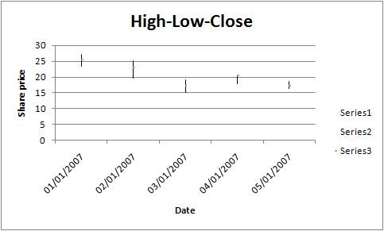

### <a name="scatter" class="anchor" href="#scatter"></a>SYNOPSIS

To create a simple Excel file with a Stock chart using WriteXLSX:

    require 'write_xlsx'

    workbook  = WriteXLSX.new('chart.xlsx')
    worksheet = workbook.add_worksheet

    chart     = workbook.add_chart(type: 'stock')

    # Add a series for each High-Low-Close.
    chart.add_series(
        categories: '=Sheet1!$A$2:$A$6',
        values:     '=Sheet1!$B$2:$B$6'
    )

    chart.add_series(
        categories: '=Sheet1!$A$2:$A$6',
        values:     '=Sheet1!$C$2:$C$6'
    )

    chart.add_series(
        categories: '=Sheet1!$A$2:$A$6',
        values:     '=Sheet1!$D$2:$D$6'
    )

    # Add the worksheet data the chart refers to.
    # ... See the full example below.

    .........

    workbook.close

### <a name="description" class="anchor" href="#description"></a>DESCRIPTION

This module implements Stock charts for [WriteXLSX][].
The chart object is created via the Workbook `add_chart()` method:

    chart = workbook.add_chart(type: 'stock')

Once the object is created it can be configured via the following methods
that are common to all chart classes:

    chart.add_series
    chart.set_x_axis
    chart.set_y_axis
    chart.set_title

These methods are explained in detail in [Chart][].
Class specific methods or settings, if any, are explained below.

### <a name="column_chart_methods" class="anchor" href="#column_chart_methods"></a>Column Chart Methods

There aren't currently any stock chart specific methods.

The default Stock chart is a High-Low-Close chart. A series must be added for each of these data sources.

### <a name="example" class="anchor" href="#example"></a>EXAMPLE

Here is a comlete example that demonstrates most of the available feature
when creating a chart.

    require 'write_xlsx'

    workbook    = WriteXLSX.new('chart_stock.xlsx')
    worksheet   = workbook.add_worksheet
    bold        = workbook.add_format(bold: 1)
    date_format = workbook.add_format(num_format: 'dd/mm/yyyy')
    chart       = workbook.add_chart(type: 'stock', embedded: 1)

    # Add the worksheet data that the charts will refer to.
    headings = [ 'Date', 'High', 'Low', 'Close' ]
    data = [
        [ '2007-01-01T', '2007-01-02T', '2007-01-03T', '2007-01-04T', '2007-01-05T' ],
        [ 27.2,  25.03, 19.05, 20.34, 18.5 ],
        [ 23.49, 19.55, 15.12, 17.84, 16.34 ],
        [ 25.45, 23.05, 17.32, 20.45, 17.34 ]
    ]

    worksheet.write('A1', headings, bold)

    (0..4).each do |row|
      worksheet.write_date_time(row+1, 0, data[0][row], date_format )
      worksheet.write( row+1, 1, data[1][row] )
      worksheet.write( row+1, 2, data[2][row] )
      worksheet.write( row+1, 3, data[3][row] )
    end

    worksheet.set_column('A:D', 11)

    # Add a series for each of the High-Low-Close columns.
    chart.add_series(
        categories: '=Sheet1!$A$2:$A$6',
        values:     '=Sheet1!$B$2:$B$6'
    )

    chart.add_series(
        categories: '=Sheet1!$A$2:$A$6',
        values:     '=Sheet1!$C$2:$C$6'
    )

    chart.add_series(
        categories: '=Sheet1!$A$2:$A$6',
        values:     '=Sheet1!$D$2:$D$6'
    )

    # Add a chart title and some axis labels.
    chart.set_title (name: 'High-Low-Close')
    chart.set_x_axis(name: 'Date')
    chart.set_y_axis(name: 'Share price')

    worksheet.insert_chart('E9', chart)

    workbook.close

This will produce a chart that looks like this:

[WriteXLSX]: index.html
[Chart]: chart.html#chart
