
#### <a name="a_simple" class="anchor" href="#s_simple"></a>a_simple
A simple demo of some of the features.

#### <a name="demo" class="anchor" href="#demo"></a>demo
A demo of some of the available features.

#### <a name="formats" class="anchor" href="#formats"></a>formats
All the available formatting on several worksheets.
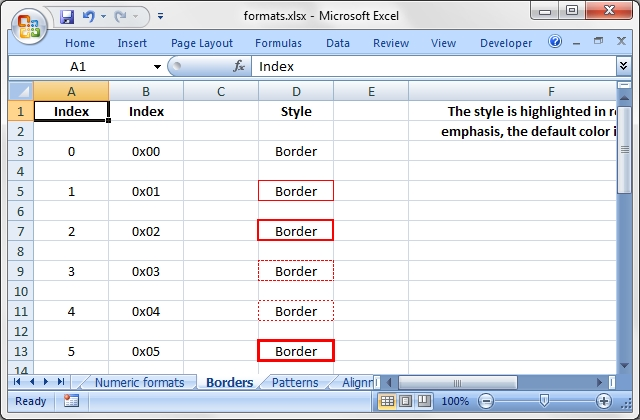

#### <a name="regions" class="anchor" href="#regions"></a>regions
A simple example of multiple worksheets.

#### <a name="stats" class="anchor" href="#stats"></a>stats
Basic formulas and functions.
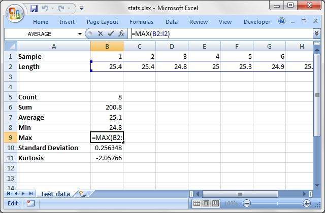

#### <a name="autofilter" class="anchor" href="#autofilter"></a>autofilter
Examples of worksheet autofilters.

#### <a name="array_formula" class="anchor" href="#array_formula"></a>array_formula
Examples of how to write array formulas.
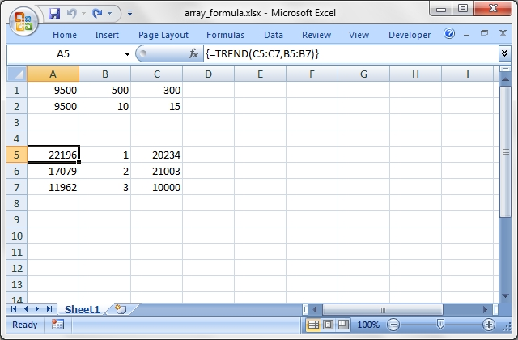

#### <a name="chart_area" class="anchor" href="#chart_area"></a>chart_area
A demo of area style charts.
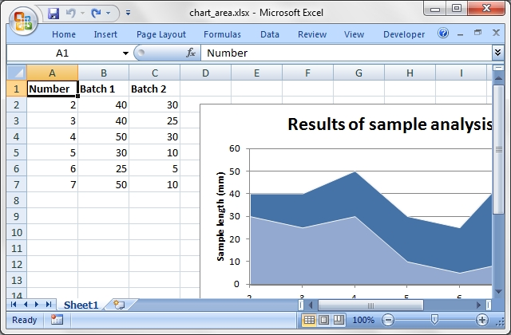

#### <a name="chart_bar" class="anchor" href="#chart_bar"></a>chart_bar
A demo of bar (vertical histogram) style charts.
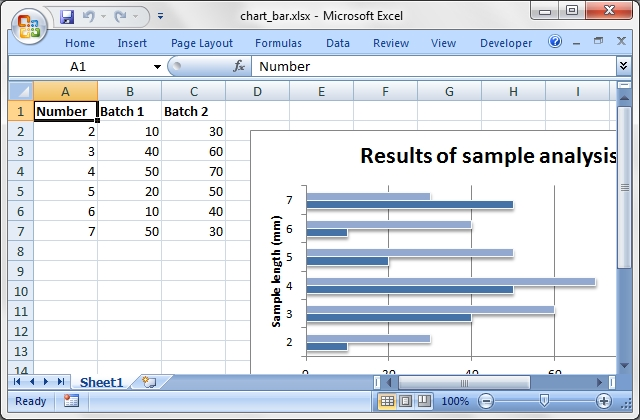

#### <a name="chart_column" class="anchor" href="#chart_column"></a>chart_column
A demo of column (histogram) style charts.

#### <a name="chart_line" class="anchor" href="#chart_line"></a>chart_line
A demo of line style charts.

#### <a name="chart_pie" class="anchor" href="#chart_pie"></a>chart_pie
A demo of pie style charts.

#### <a name="chart_radar" class="anchor" href="#chart_radar"></a>chart_radar
A demo of radar style charts.

#### <a name="chart_scatter" class="anchor" href="#chart_scatter"></a>chart_scatter
A demo of scatter style charts.
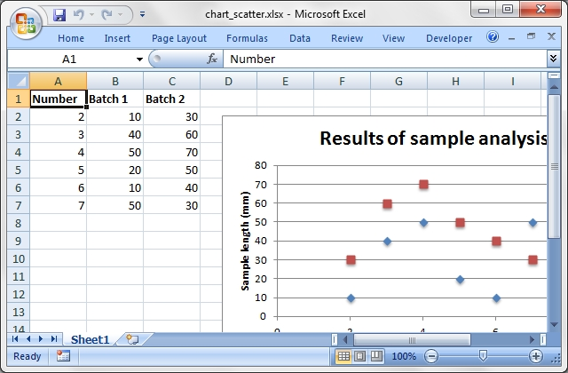

#### <a name="chart_secondary_axis" class="anchor" href="#chart_secondary_axis"></a>chart_secondary_axis
A demo of line chart with a secondary axis.
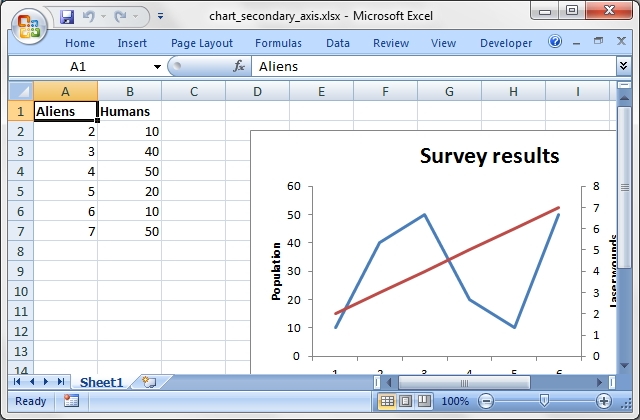

#### <a name="chart_stock" class="anchor" href="#chart_stock"></a>chart_stock
A demo of stock style charts.
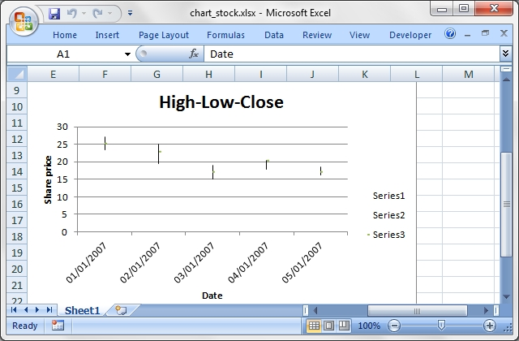

#### <a name="chart_data_table" class="anchor" href="#chart_data_table"></a>chart_data_table
A demo of a chart with a data table on the axis.
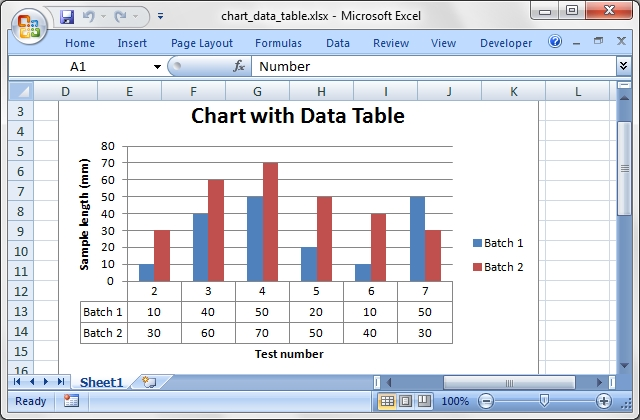

#### <a name="chart_data_tools" class="anchor" href="#chart_data_tools"></a>chart_data_tools
A demo of charts with data highlighting options.

#### <a name="colors" class="anchor" href="#colors"></a>colors
A demo of the color palette and named colors.
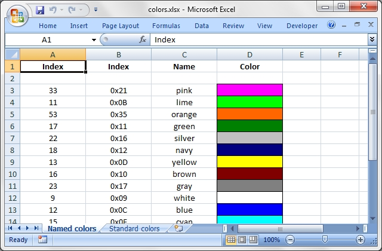

#### <a name="comments1" class="anchor" href="#comments1"></a>comments1
Add comments to worksheet cells.
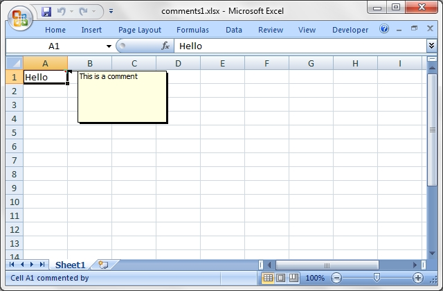

#### <a name="comments2" class="anchor" href="#comments2"></a>comments2
Add comments with advanced options.
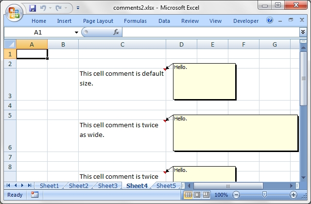

#### <a name="conditional_format" class="anchor" href="#conditional_format"></a>condirional_format
Add conditional formats to a range of cells.

#### <a name="data_validate" class="anchor" href="#data_validate"></a>data_validate
An example of data validation and dropdown lists.
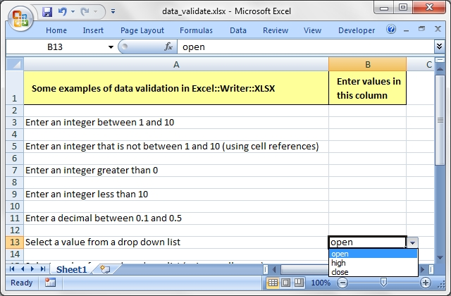

#### <a name="date_time" class="anchor" href="#date_time"></a>date_time
Write dates and times with write_date_time().

#### <a name="defined_name" class="anchor" href="#defined_name"></a>defined_name
Example of how to create defined names.

#### <a name="diag_border" class="anchor" href="#diag_border"></a>diag_border
A simple example of diagonal cell borders.

#### <a name="headers" class="anchor" href="#headers"></a>headers
Examples of worksheet headers and footers.
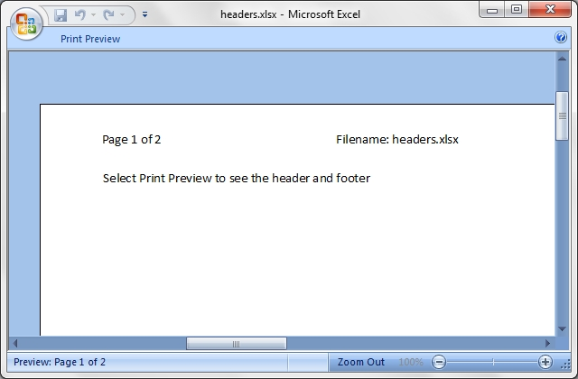

#### <a name="hide_row_col" class="anchor" href="#hide_row_col"></a>hide_row_col
Example of hiding rows and columns.
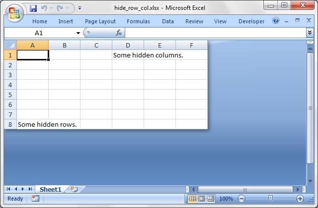

#### <a name="hide_sheet" class="anchor" href="#hide_sheet"></a>hide_sheet
Simple example of hiding a worksheet.

#### <a name="hyperlink1" class="anchor" href="#hyperlink1"></a>hyperlink1
Shows how to create web hyperlinks.

#### <a name="indent" class="anchor" href="#indent"></a>indent
An example of cell indentation.

#### <a name="macros" class="anchor" href="#macros"></a>macros
An example of adding macros from an existing file.

#### <a name="merge1" class="anchor" href="#merge1"></a>merge1
A simple example of cell merging.

#### <a name="merge2" class="anchor" href="#merge2"></a>merge2
A simple example of cell merging with formatting.

#### <a name="merge3" class="anchor" href="#merge3"></a>merge3
Add hyperlinks to merged cells.

#### <a name="merge4" class="anchor" href="#merge4"></a>merge4
An advanced example of cell merging with formatting.

#### <a name="merge5" class="anchor" href="#merge5"></a>merge5
An advanced example of cell merging with formatting.

#### <a name="merge6" class="anchor" href="#merge6"></a>merge6
An example of merging with Unicode strings.

#### <a name="outline" class="anchor" href="#outline"></a>outline
An example of outlines and grouping.
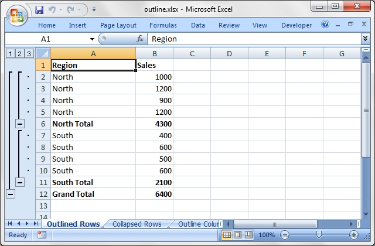

#### <a name="outline_collapsed" class="anchor" href="#outline_collapsed"></a>outline_collapsed
An example of collapsed outlines.

#### <a name="panes" class="anchor" href="#panes"></a>panes
An example of how to create panes.
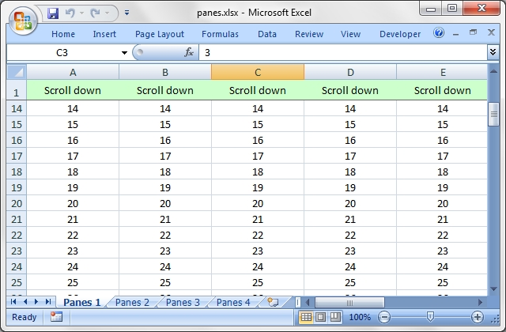

#### <a name="properties" class="anchor" href="#properties"></a>properties
Add document properties to a workbook.
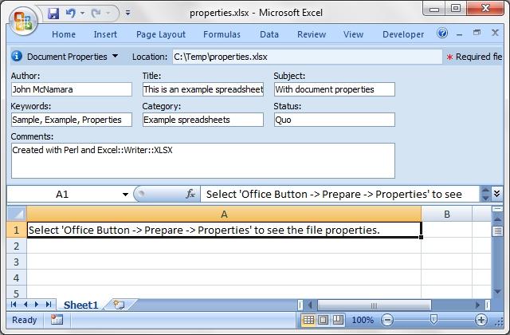

#### <a name="protection" class="anchor" href="#protection"></a>protection
Example of cell locking and formula hiding.
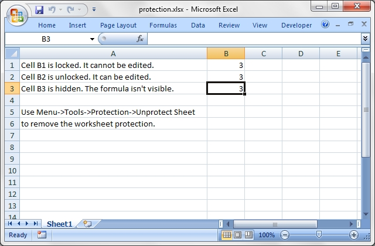

#### <a name="rich_strings" class="anchor" href="#rich_strings"></a>rich_strings
Example of strings with multiple formats.
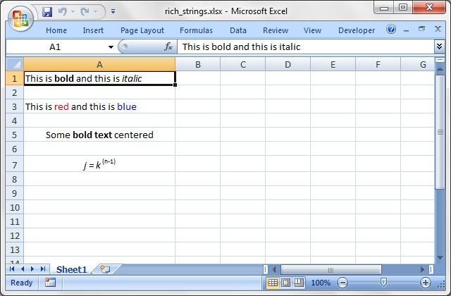

#### <a name="right_to_left" class="anchor" href="#right_to_left"></a>right_to_left
Change default sheet direction to right to left.
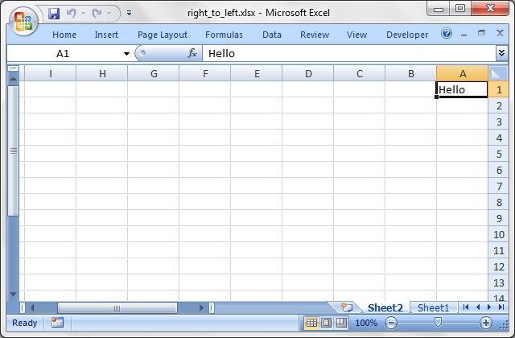

#### <a name="sales" class="anchor" href="#sales"></a>sales
An example of a simple sales spreadsheet.
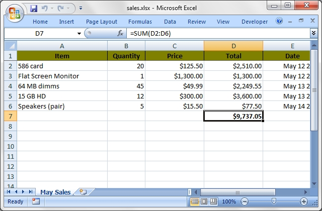

#### <a name="shape1" class="anchor" href="#shape1"></a>shape1
Insert shapes in worksheet.

#### <a name="shape2" class="anchor" href="#shape2"></a>shape2
Insert shapes in worksheet. With properties.
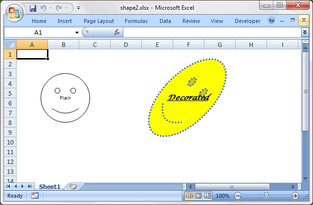

#### <a name="shape3" class="anchor" href="#shape3"></a>shape3
Insert shapes in worksheet. Scaled.
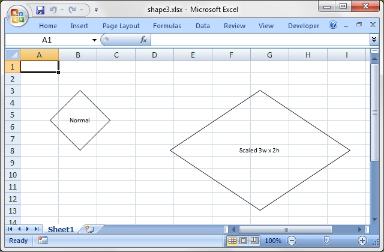

#### <a name="shape4" class="anchor" href="#shape4"></a>shape4
Insert shapes in worksheet. With modification.

#### <a name="shape5" class="anchor" href="#shape5"></a>shape5
Insert shapes in worksheet. With connections.
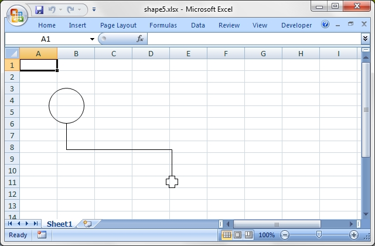

#### <a name="shape6" class="anchor" href="#shape6"></a>shape6
Insert shapes in worksheet. With connections.
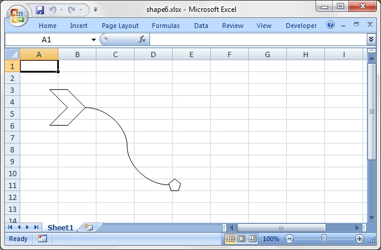

#### <a name="shape7" class="anchor" href="#shape7"></a>shape7
Insert shapes in worksheet. One to many connections.

#### <a name="shape8" class="anchor" href="#shape8"></a>shape8
Insert shapes in worksheet. One to many connections.

#### <a name="shape_all" class="anchor" href="#shape_all"></a>shape_all
Demo of all the available shape and connector types.
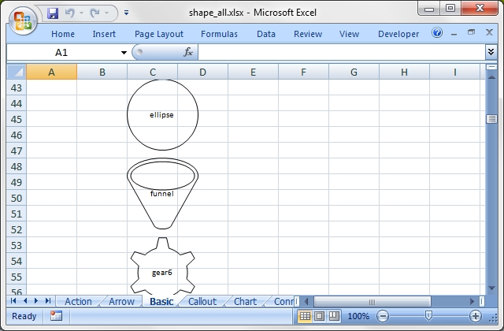

#### <a name="sparklines1" class="anchor" href="#sparklines1"></a>sparklines1
Simple sparklines demo.
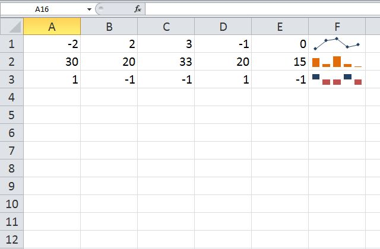

#### <a name="sparklines2" class="anchor" href="#sparklines2"></a>sparklines2
Sparklines demo showing formatting options.
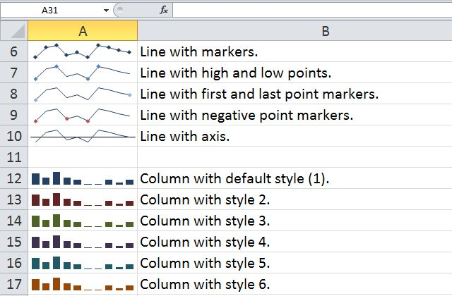

#### <a name="stats_ext" class="anchor" href="#stats_ext"></a>stats_ext
Same as stats.rb with external references.
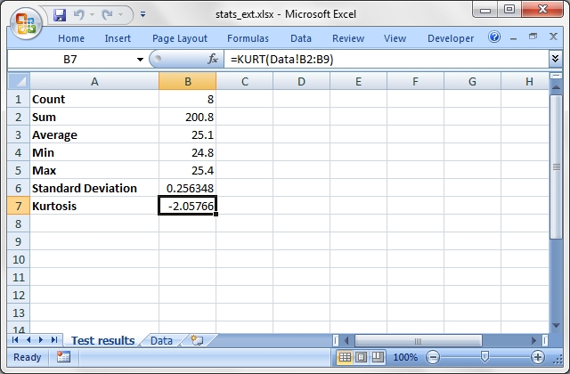

#### <a name="stocks" class="anchor" href="#stocks"></a>stocks
Demonstrates conditional formatting.
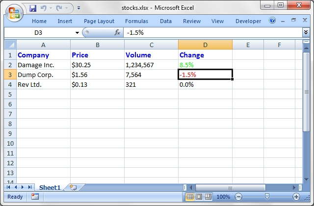

#### <a name="tab_colors" class="anchor" href="#tab_colors"></a>tab_colors
Example of how to set worksheet tab colors.

#### <a name="tables" class="anchor" href="#tables"></a>tables
Add Excel tables to a worksheet.
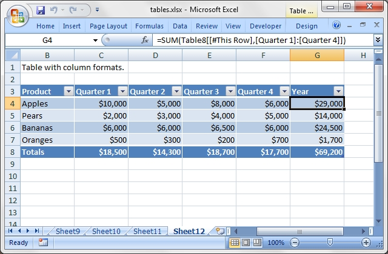
